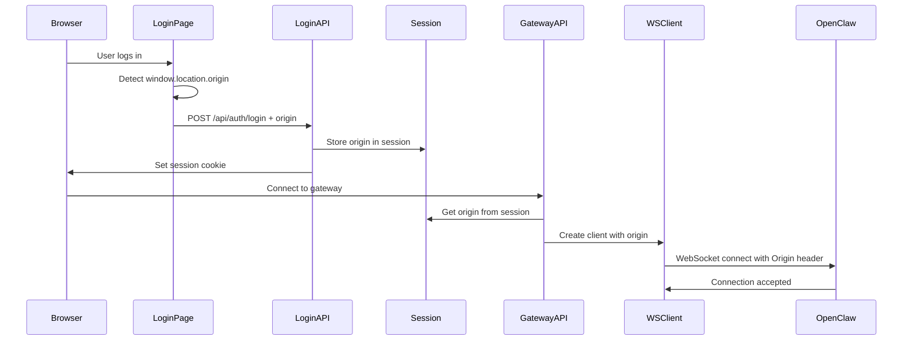

# Client-Side Origin Detection & WebSocket Integration Plan

## Overview

This document outlines the implementation plan for detecting the client's browser origin and passing it through the ClawAgentHub system to the WebSocket client for OpenClaw gateway connections.

## Architecture Flow



## Implementation Steps

### Step 1: Extend Session Schema to Store Origin

**File:** `lib/db/migrations/008_add_session_origin.sql`

```sql
-- Add origin column to sessions table
ALTER TABLE sessions ADD COLUMN origin TEXT;

-- Add index for faster lookups
CREATE INDEX idx_sessions_origin ON sessions(origin);
```

**File:** `lib/db/schema.d.ts`

```typescript
export interface Session {
  id: string
  user_id: string
  token: string
  expires_at: string
  created_at: string
  current_workspace_id: string | null
  origin: string | null  // ✅ Add this field
}
```

### Step 2: Update Login API to Accept and Store Origin

**File:** `app/api/auth/login/route.ts`

```typescript
export async function POST(request: NextRequest) {
  const timestamp = new Date().toISOString()
  console.log(`\n🔐 [LOGIN API ${timestamp}] POST /api/auth/login`)

  try {
    ensureDatabase()
    const db = getDatabase()

    const body = await request.json()
    const { email, password, origin } = body  // ✅ Accept origin from client

    console.log(`   📧 Email: ${email}`)
    console.log(`   🌐 Origin: ${origin || 'not provided'}`)

    // ... existing validation code ...

    // Create session with origin
    console.log(`   ✅ Creating session for user: ${user.id}`)
    const session = createSession(user.id, origin)  // ✅ Pass origin
    console.log(`   ✅ Session created with origin: ${origin}`)

    // ... rest of the code ...
  } catch (error) {
    // ... error handling ...
  }
}
```

### Step 3: Update Session Creation to Store Origin

**File:** `lib/auth/session.ts`

```typescript
export function createSession(userId: string, origin?: string | null): Session {
  const db = getDatabase()
  const sessionId = generateUserId()
  const token = generateSessionToken()
  const expiresAt = new Date(Date.now() + 7 * 24 * 60 * 60 * 1000) // 7 days

  // Store session with origin
  db.prepare(
    `INSERT INTO sessions (id, user_id, token, expires_at, origin) 
     VALUES (?, ?, ?, ?, ?)`
  ).run(sessionId, userId, token, expiresAt.toISOString(), origin || null)

  return {
    id: sessionId,
    user_id: userId,
    token,
    expires_at: expiresAt.toISOString(),
    created_at: new Date().toISOString(),
    current_workspace_id: null,
    origin: origin || null
  }
}

/**
 * Get origin from session token
 */
export function getSessionOrigin(sessionToken: string): string | null {
  const db = getDatabase()
  const session = db
    .prepare(
      `SELECT origin FROM sessions WHERE token = ? AND expires_at > datetime('now')`
    )
    .get(sessionToken) as { origin: string | null } | undefined

  return session?.origin || null
}
```

### Step 4: Update Login Form to Detect and Send Origin

**File:** `components/auth/login-form.tsx`

```typescript
'use client'

import { useState } from 'react'
import { Button } from '@/components/ui/button'
import { Input } from '@/components/ui/input'
import { Label } from '@/components/ui/label'

interface LoginFormProps {
  onSubmit: (email: string, password: string, origin: string) => Promise<void>
  isLoading?: boolean
  error?: string | null
}

export function LoginForm({ onSubmit, isLoading, error }: LoginFormProps) {
  const [email, setEmail] = useState('')
  const [password, setPassword] = useState('')

  const handleSubmit = async (e: React.FormEvent) => {
    e.preventDefault()
    
    // ✅ Detect client-side origin
    const origin = typeof window !== 'undefined' 
      ? window.location.origin 
      : 'http://localhost:7777'
    
    console.log('[LoginForm] Detected origin:', origin)
    
    await onSubmit(email, password, origin)
  }

  return (
    <form onSubmit={handleSubmit} className="space-y-4">
      {/* ... existing form fields ... */}
    </form>
  )
}
```

### Step 5: Update Login Page to Pass Origin

**File:** `app/login/page.tsx`

```typescript
'use client'

import { useRouter } from 'next/navigation'
import { LoginForm } from '@/components/auth/login-form'
import { useLogin } from '@/lib/query/hooks'

export default function LoginPage() {
  const router = useRouter()
  const loginMutation = useLogin()

  const handleLogin = async (email: string, password: string, origin: string) => {
    console.log('\n🔐 [CLIENT LOGIN] Starting login process...')
    console.log(`   📧 Email: ${email}`)
    console.log(`   🌐 Origin: ${origin}`)

    try {
      // ✅ Pass origin to login mutation
      const result = await loginMutation.mutateAsync({ email, password, origin })

      console.log('✅ [CLIENT LOGIN] Login successful!')
      console.log(`   👤 User: ${result.user.email}`)
      console.log(`   🌐 Origin stored: ${origin}`)

      if (result.mustChangePassword) {
        router.push('/profile?changePassword=true')
      } else {
        router.push('/dashboard')
      }
    } catch (error) {
      console.error('❌ [CLIENT LOGIN] Login failed:', error)
    }
  }

  return (
    <div className="flex min-h-screen items-center justify-center">
      <LoginForm
        onSubmit={handleLogin}
        isLoading={loginMutation.isPending}
        error={loginMutation.error?.message}
      />
    </div>
  )
}
```

### Step 6: Update Login Hook to Accept Origin

**File:** `lib/query/hooks/useLogin.ts`

```typescript
import { useMutation, useQueryClient } from '@tanstack/react-query'
import { queryKeys } from '../keys'

interface LoginCredentials {
  email: string
  password: string
  origin?: string  // ✅ Add origin parameter
}

interface LoginResponse {
  user: {
    id: string
    email: string
    name: string
    is_superuser: boolean
    first_password_changed: boolean
  }
  mustChangePassword: boolean
}

async function loginUser(credentials: LoginCredentials): Promise<LoginResponse> {
  const response = await fetch('/api/auth/login', {
    method: 'POST',
    headers: {
      'Content-Type': 'application/json',
    },
    body: JSON.stringify({
      email: credentials.email,
      password: credentials.password,
      origin: credentials.origin  // ✅ Send origin to API
    }),
    credentials: 'include',
  })

  if (!response.ok) {
    const error = await response.json()
    throw new Error(error.message || 'Login failed')
  }

  return response.json()
}

export function useLogin() {
  const queryClient = useQueryClient()

  return useMutation({
    mutationFn: loginUser,
    onSuccess: (data) => {
      queryClient.invalidateQueries({ queryKey: queryKeys.user.me })
    },
  })
}
```

### Step 7: Update Gateway API Routes to Use Session Origin

**File:** `app/api/gateways/pair/route.ts`

```typescript
import { NextRequest, NextResponse } from 'next/server'
import { cookies } from 'next/headers'
import { ensureDatabase } from '@/lib/db/middleware.js'
import { getUserFromSession, getSessionOrigin } from '@/lib/auth/session.js'
import { getDatabase } from '@/lib/db/index.js'
import { getGatewayManager } from '@/lib/gateway/manager.js'
import type { Gateway } from '@/lib/db/schema.js'

export async function POST(request: NextRequest) {
  try {
    ensureDatabase()
    const db = getDatabase()

    const cookieStore = await cookies()
    const sessionToken = cookieStore.get('session_token')?.value

    if (!sessionToken) {
      return NextResponse.json(
        { message: 'Unauthorized - No session found' },
        { status: 401 }
      )
    }

    const user = getUserFromSession(sessionToken)
    if (!user) {
      return NextResponse.json(
        { message: 'Unauthorized - Invalid session' },
        { status: 401 }
      )
    }

    // ✅ Get origin from session
    const origin = getSessionOrigin(sessionToken)
    console.log('[API:Pair] Session origin:', origin)

    const body = await request.json()
    const { gatewayId } = body

    // ... get gateway from database ...

    try {
      db.prepare(
        'UPDATE gateways SET status = ?, updated_at = ? WHERE id = ?'
      ).run('connecting', new Date().toISOString(), gatewayId)

      // ✅ Pass origin to gateway manager
      const manager = getGatewayManager()
      await manager.connectGateway(gateway, origin)

      // ... rest of the code ...
    } catch (error) {
      // ... error handling ...
    }
  } catch (error) {
    // ... error handling ...
  }
}
```

### Step 8: Update Gateway Manager to Accept and Use Origin

**File:** `lib/gateway/manager.ts`

```typescript
import { GatewayClient } from './client.js'
import type { Gateway } from '../db/schema.js'
import { getDatabase } from '../db/index.js'

interface ConnectionStatus {
  connected: boolean
  error?: string
}

export class GatewayManager {
  private connections: Map<string, GatewayClient> = new Map()
  private statuses: Map<string, ConnectionStatus> = new Map()

  /**
   * Connect to a gateway with optional origin override
   */
  async connectGateway(gateway: Gateway, origin?: string | null): Promise<void> {
    console.log('[GatewayManager] Connecting to gateway', {
      gatewayId: gateway.id,
      url: gateway.url,
      hasAuthToken: !!gateway.auth_token,
      hasDeviceId: !!gateway.device_id,
      origin: origin || 'auto-detect'
    })

    this.disconnectGateway(gateway.id)

    const client = new GatewayClient(gateway.url, {
      authToken: gateway.auth_token ?? undefined,
      deviceId: gateway.device_id ?? undefined,
      devicePublicKey: gateway.device_public_key ?? undefined,
      devicePrivateKey: gateway.device_private_key ?? undefined,
      origin: origin ?? undefined  // ✅ Pass origin to client
    })

    // ... rest of the method ...
  }

  // ... rest of the class ...
}
```

### Step 9: Update WebSocket Client to Use Origin

**File:** `lib/gateway/client.ts`

```typescript
import WebSocket from 'ws'
import { EventEmitter } from 'events'
import { generateKeyPairSync, createHash } from 'crypto'
import { signDevicePayload } from './device-identity.js'

export class GatewayClient extends EventEmitter {
  private url: string
  private ws: WebSocket | null = null
  private authToken?: string
  private deviceId: string
  private devicePublicKey: string
  private devicePrivateKey: string
  private origin?: string  // ✅ Store origin
  private pendingRequests: Map<string, any> = new Map()

  constructor(url = 'ws://127.0.0.1:18789', opts?: { 
    authToken?: string
    deviceId?: string
    devicePublicKey?: string
    devicePrivateKey?: string
    origin?: string  // ✅ Accept origin parameter
  }) {
    super()
    this.url = url
    this.authToken = opts?.authToken
    this.origin = opts?.origin  // ✅ Store origin

    // ... rest of constructor ...
  }

  async connect(): Promise<void> {
    return new Promise((resolve, reject) => {
      try {
        // ✅ Determine origin to use
        const origin = this.origin || this.determineOrigin()
        
        console.log('[GatewayClient] Connecting with origin:', origin)

        // ✅ Create WebSocket with Origin header
        this.ws = new WebSocket(this.url, {
          maxPayload: 25 * 1024 * 1024,
          headers: {
            'Origin': origin  // ✅ Set Origin header
          }
        })

        // ... rest of connect logic ...
      } catch (error) {
        reject(error)
      }
    })
  }

  /**
   * Determine origin to use for WebSocket connection
   * Priority: explicit option > environment variable > auto-detect from URL
   */
  private determineOrigin(): string {
    // Use environment variable if set
    if (process.env.CLAWHUB_ORIGIN) {
      return process.env.CLAWHUB_ORIGIN
    }

    // Parse gateway URL to construct matching origin
    const gatewayUrl = new URL(this.url)
    const protocol = gatewayUrl.protocol === 'wss:' ? 'https:' : 'http:'

    // If connecting to localhost, use localhost origin
    if (gatewayUrl.hostname === 'localhost' || gatewayUrl.hostname === '127.0.0.1') {
      return `${protocol}//localhost:18789`
    }

    // For remote connections, use the gateway host
    return `${protocol}//${gatewayUrl.host}`
  }

  // ... rest of the class ...
}
```

### Step 10: Run Database Migration

**Create migration script:**

```bash
# File: scripts/migrate-add-session-origin.ts
import { getDatabase } from '../lib/db/index.js'

const db = getDatabase()

console.log('🔄 Running migration: Add session origin...')

try {
  db.exec(`
    ALTER TABLE sessions ADD COLUMN origin TEXT;
    CREATE INDEX IF NOT EXISTS idx_sessions_origin ON sessions(origin);
  `)
  
  console.log('✅ Migration completed successfully')
} catch (error) {
  console.error('❌ Migration failed:', error)
  process.exit(1)
}
```

**Run it:**

```bash
cd githubprojects/clawhub
tsx scripts/migrate-add-session-origin.ts
```

## Testing Plan

### Test 1: Origin Detection on Login

1. Open ClawAgentHub in browser: `http://YOUR_SERVER_HOST:7777`
2. Open browser console
3. Log in with credentials
4. Verify console shows: `[LoginForm] Detected origin: http://YOUR_SERVER_HOST:7777`
5. Check API logs show origin was received

### Test 2: Origin Stored in Session

```bash
# Check database
sqlite3 ~/.clawhub/clawhub.db "SELECT token, origin FROM sessions ORDER BY created_at DESC LIMIT 1;"
```

Should show your origin stored in the session.

### Test 3: WebSocket Connection with Origin

1. Navigate to Gateways page
2. Try to connect to a gateway
3. Check browser console for: `[GatewayClient] Connecting with origin: http://YOUR_SERVER_HOST:7777`
4. Check OpenClaw gateway logs: `openclaw gateway logs --follow`
5. Should see successful connection, not "origin not allowed" error

### Test 4: Multiple Origins

1. Access ClawAgentHub via `http://localhost:7777`
2. Log in (should store `http://localhost:7777` as origin)
3. Connect to gateway (should use localhost origin)
4. Log out
5. Access via `http://YOUR_SERVER_HOST:7777`
6. Log in (should store IP origin)
7. Connect to gateway (should use IP origin)

## Environment Variables (Optional)

Add to `.env.local` for override capability:

```bash
# Override origin for all WebSocket connections
# Useful for development/testing
CLAWHUB_PUBLIC_HOST=YOUR_SERVER_HOST
CLAWHUB_ORIGIN=http://YOUR_SERVER_HOST:7777
```

## Fallback Strategy

If origin detection fails, the system will:

1. Try to use `CLAWHUB_ORIGIN` environment variable
2. Auto-detect from gateway URL
3. Default to `http://localhost:18789` for localhost gateways

## Security Considerations

### Origin Validation

The stored origin should match one of the allowed origins in OpenClaw config:

```json
{
  "gateway": {
    "controlUi": {
      "allowedOrigins": [
        "http://localhost:7777",
        "http://127.0.0.1:7777",
        "http://YOUR_SERVER_HOST:7777"
      ]
    }
  }
}
```

### Session Security

- Origin is stored per-session, not per-user
- Different browser tabs/windows can have different origins
- Origin is cleared when session expires
- Origin is not exposed to client-side JavaScript (stored server-side only)

## Implementation Checklist

- [ ] Create migration file `008_add_session_origin.sql`
- [ ] Update `Session` interface in `schema.d.ts`
- [ ] Update `createSession()` to accept and store origin
- [ ] Add `getSessionOrigin()` helper function
- [ ] Update login API to accept origin parameter
- [ ] Update `LoginForm` component to detect origin
- [ ] Update `LoginPage` to pass origin
- [ ] Update `useLogin` hook to send origin
- [ ] Update gateway API routes to get origin from session
- [ ] Update `GatewayManager` to accept origin parameter
- [ ] Update `GatewayClient` to use origin in WebSocket connection
- [ ] Run database migration
- [ ] Test origin detection on login
- [ ] Test WebSocket connection with origin
- [ ] Verify in OpenClaw gateway logs
- [ ] Test with multiple origins (localhost vs IP)

## Rollback Plan

If issues occur:

1. **Remove origin from WebSocket:**
   ```typescript
   this.ws = new WebSocket(this.url, {
     maxPayload: 25 * 1024 * 1024,
     // Remove headers
   })
   ```

2. **Use environment variable temporarily:**
   ```bash
   CLAWHUB_ORIGIN=http://localhost:7777 npm run dev
   ```

3. **Revert database migration:**
   ```sql
   ALTER TABLE sessions DROP COLUMN origin;
   DROP INDEX IF EXISTS idx_sessions_origin;
   ```

## Next Steps After Implementation

1. Monitor OpenClaw gateway logs for connection success
2. Add origin to user profile page (show current session origin)
3. Add origin management UI (allow users to see/manage allowed origins)
4. Consider adding origin to audit logs
5. Document setup for team members

## References

- [WebSocket Origin Header](https://developer.mozilla.org/en-US/docs/Web/API/WebSocket)
- [OpenClaw Control UI Docs](https://docs.openclaw.ai/web/control-ui)
- [CORS and WebSocket](https://developer.mozilla.org/en-US/docs/Web/HTTP/CORS)
