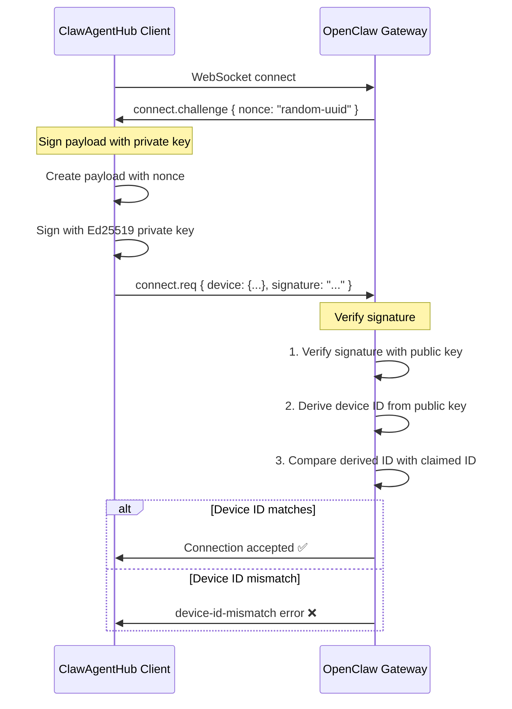

# OpenClaw Device Identity - Complete Explanation

## What is Device Identity?

Device Identity is OpenClaw's security mechanism to ensure only authorized devices can connect to the gateway. It works similar to SSH key-based authentication.

## How Device Identity Works

### 1. Key Generation (Ed25519)

When you add a gateway in ClawAgentHub, the system generates an **Ed25519 cryptographic key pair**:

```typescript
const { publicKey, privateKey } = generateKeyPairSync('ed25519', {
  publicKeyEncoding: { type: 'spki', format: 'der' },
  privateKeyEncoding: { type: 'pkcs8', format: 'der' }
})
```

- **Public Key**: Shared with the gateway (stored in database)
- **Private Key**: Kept secret by ClawAgentHub (stored in database, never transmitted)

### 2. Device ID Derivation

The **Device ID** is derived from the public key using SHA256:

```typescript
const hash = createHash('sha256')
hash.update(publicKey)  // Raw public key bytes
const deviceId = hash.digest('hex')  // 64-character hex string
```

**Example Device ID**: `b87b70ad571407ef742b39481ab459075b32ea6f11d53b981fc55769dc793571`

### 3. Challenge-Response Authentication Flow



### 4. Signature Payload Format (Protocol V3)

The client must sign this exact JSON structure:

```json
{
  "deviceId": "64-char-hex-device-id",
  "clientId": "cli",
  "clientMode": "cli",
  "role": "operator",
  "scopes": ["operator.admin"],
  "signedAtMs": 1234567890,
  "token": "gateway-auth-token-or-null",
  "nonce": "challenge-nonce-from-gateway",
  "platform": "node",
  "deviceFamily": null
}
```

The signature is created using Ed25519:

```typescript
const signature = sign(privateKey, payloadBytes)
// Returns base64url-encoded signature
```

### 5. Gateway Verification Process

When the gateway receives a connection request, it:

1. **Extracts the public key** from the device payload
2. **Derives the device ID** from the public key:
   ```typescript
   const derivedId = sha256(publicKey).hex()
   ```
3. **Compares** the derived ID with the claimed `device.id`
4. **Verifies the signature** using the public key
5. **Checks if device is paired** (approved in gateway's device list)

If any step fails, the connection is rejected.

## Your Current Error: "device-id-mismatch"

### What's Happening

From your logs:
```
[GatewayClient] Sending connect request {
  deviceId: 'b87b70ad571407ef742b39481ab459075b32ea6f11d53b981fc55769dc793571',
  ...
}
[GatewayClient] Response error: {
  error: {
    code: 'INVALID_REQUEST',
    message: 'device identity mismatch',
    details: {
      code: 'DEVICE_AUTH_DEVICE_ID_MISMATCH',
      reason: 'device-id-mismatch'
    }
  }
}
```

This means:
- ClawAgentHub is sending device ID: `b87b70ad571407ef...`
- Gateway derives device ID from the public key: `something-different`
- They don't match → Connection rejected

### Root Cause

Looking at your [`OPENCLAW_GATEWAY_CONNECTION_ANALYSIS.md`](./OPENCLAW_GATEWAY_CONNECTION_ANALYSIS.md), the issue is that ClawAgentHub's `deriveDeviceId()` function might not be extracting the raw public key correctly before hashing.

## How to Fix

### Option 1: Verify Device ID Generation (Recommended)

Check [`lib/gateway/device-identity.ts`](../lib/gateway/device-identity.ts) and ensure:

1. **Extract raw public key** from DER-encoded SPKI format:
   ```typescript
   function extractRawPublicKey(publicKeyDer: Buffer): Buffer {
     // SPKI format has a header, need to extract the raw 32-byte key
     // For Ed25519, the raw key is the last 32 bytes
     return publicKeyDer.slice(-32)
   }
   ```

2. **Derive device ID** from raw key:
   ```typescript
   export function deriveDeviceId(publicKeyDer: Buffer): string {
     const rawKey = extractRawPublicKey(publicKeyDer)
     return createHash('sha256').update(rawKey).digest('hex')
   }
   ```

### Option 2: Use Token-Only Auth (Quick Workaround)

Since you have `allowInsecureAuth: true` in your OpenClaw config, you can bypass device identity validation:

1. **Delete the current gateway** from ClawAgentHub
2. **Re-add the gateway** with just the token
3. **Connect using token-only mode**

With `allowInsecureAuth: true`, OpenClaw will accept connections without validating device identity on localhost.

### Option 3: Disable Device Auth Temporarily

Add to your OpenClaw config:

```json
{
  "gateway": {
    "controlUi": {
      "dangerouslyDisableDeviceAuth": true
    }
  }
}
```

⚠️ **WARNING**: This is insecure and should only be used for testing!

## Why Device Identity Matters

### Security Benefits

1. **Prevents unauthorized access**: Even if someone gets your gateway token, they can't connect without the private key
2. **Device tracking**: Gateway knows which specific devices are connected
3. **Revocation**: You can revoke specific devices without changing the gateway token
4. **Audit trail**: Gateway logs which device IDs connected

### When It's Optional

Device identity can be bypassed when:
- `gateway.controlUi.allowInsecureAuth: true` (localhost only)
- `gateway.controlUi.dangerouslyDisableDeviceAuth: true` (all connections)
- Using token-only mode with insecure auth enabled

## Debugging Device Identity Issues

### Check Device ID in Database

```bash
sqlite3 ~/.clawhub/clawhub.db "SELECT id, name, device_id, device_public_key FROM gateways;"
```

### Manually Derive Device ID

```bash
# In ClawAgentHub directory
node -e "
const crypto = require('crypto');
const publicKeyBase64 = 'YOUR_PUBLIC_KEY_FROM_DB';
const publicKeyDer = Buffer.from(publicKeyBase64, 'base64');
const rawKey = publicKeyDer.slice(-32);  // Last 32 bytes for Ed25519
const deviceId = crypto.createHash('sha256').update(rawKey).digest('hex');
console.log('Device ID:', deviceId);
"
```

### Compare with OpenClaw's Expectation

Check OpenClaw gateway logs:
```bash
openclaw gateway logs | grep -i "device"
```

Look for messages about device ID validation.

## Summary

**Device Identity** = SSH-like authentication using Ed25519 keys

**Your Issue**: The device ID ClawAgentHub generates doesn't match what OpenClaw expects

**Solution**: Fix the `deriveDeviceId()` function to properly extract the raw public key before hashing, as documented in [`OPENCLAW_GATEWAY_CONNECTION_ANALYSIS.md`](./OPENCLAW_GATEWAY_CONNECTION_ANALYSIS.md)

**Quick Workaround**: Use token-only auth with `allowInsecureAuth: true` (already enabled in your config)

## Next Steps

1. Read [`OPENCLAW_GATEWAY_CONNECTION_ANALYSIS.md`](./OPENCLAW_GATEWAY_CONNECTION_ANALYSIS.md) for the complete fix
2. Or use the token-only workaround for immediate testing
3. Once device identity is fixed, both origin and device auth will work together

The **origin issue is completely fixed** - you can see in your logs that `http://localhost:7777` is being passed correctly through the system!
