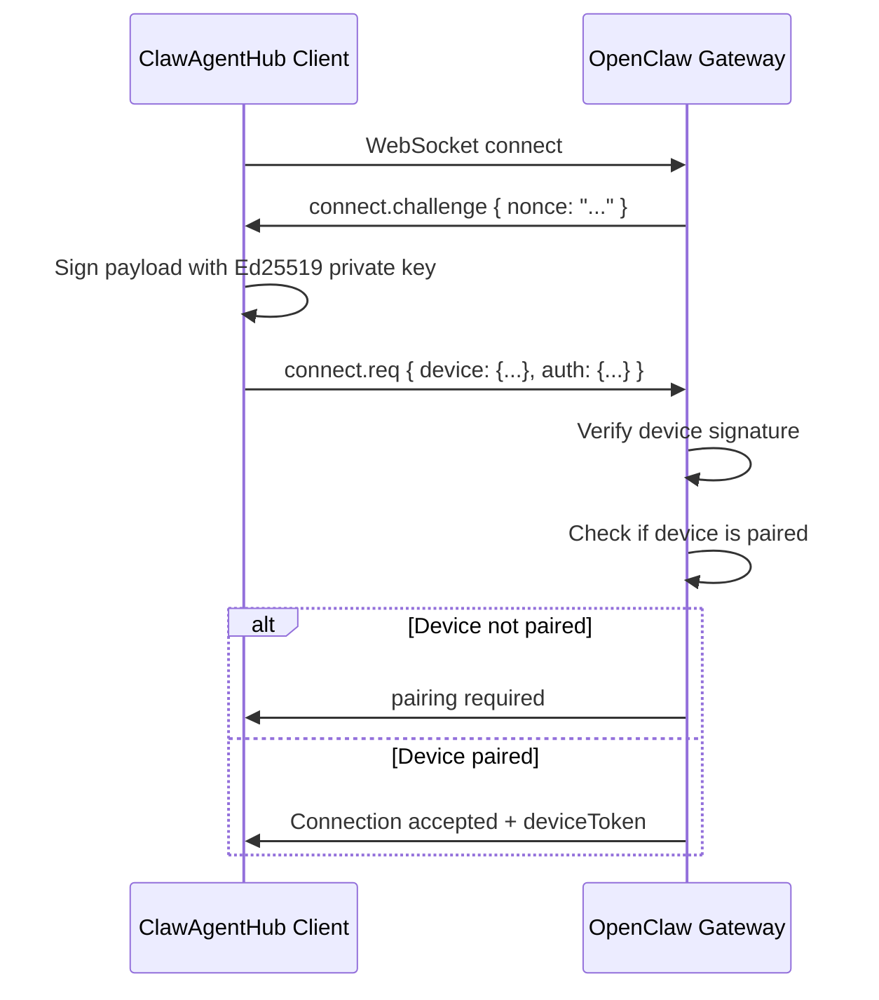

# OpenClaw Gateway Connection Analysis & Fix Plan

## Executive Summary

Your ClawAgentHub project has a **device identity mismatch** issue when connecting to OpenClaw gateways. This document explains the root cause and provides a detailed fix plan.

## Root Cause: Device ID Generation Mismatch

### The Problem

Your code has **inconsistent device ID generation** between different parts of the system:

1. **In `lib/gateway/client.ts` (lines 92-109)**:
   ```typescript
   private generateDeviceIdentity(): { deviceId: string; publicKey: string; privateKey: string } {
     // Generate Ed25519 key pair
     const { publicKey, privateKey } = generateKeyPairSync('ed25519', {
       publicKeyEncoding: { type: 'spki', format: 'der' },
       privateKeyEncoding: { type: 'pkcs8', format: 'der' }
     })
     
     // Generate device ID from public key
     const hash = createHash('sha256')
     hash.update(publicKey)
     const deviceId = 'clawhub-' + hash.digest('hex').substring(0, 16)  // ❌ WRONG!
   ```

2. **In `app/api/gateways/add/route.ts` (line 97)**:
   ```typescript
   const deviceId = deriveDeviceId(publicKey)  // ✅ CORRECT
   ```

3. **OpenClaw's expected format** (`src/infra/device-identity.ts`):
   ```typescript
   function fingerprintPublicKey(publicKeyPem: string): string {
     const raw = derivePublicKeyRaw(publicKeyPem);
     return crypto.createHash("sha256").update(raw).digest("hex");  // Full 64-char SHA256
   }
   ```

### Why This Causes "device-id-mismatch" Error

When OpenClaw receives a connection request, it:
1. Extracts the `device.id` and `device.publicKey` from the connect request
2. Derives the device ID from the public key using `deriveDeviceIdFromPublicKey()`
3. Compares the derived ID with the claimed `device.id`
4. **If they don't match, it rejects with "device-id-mismatch"**

From `message-handler.ts`:
```typescript
const derivedId = deriveDeviceIdFromPublicKey(device.publicKey);
if (!derivedId || derivedId !== device.id) {
  rejectDeviceAuthInvalid("device-id-mismatch", "device identity mismatch");
  return;
}
```

Your `client.ts` generates device IDs like:
- `clawhub-a1b2c3d4e5f6g7h8` (18 chars with prefix)

But OpenClaw expects:
- `a1b2c3d4e5f6...` (64 hex characters, full SHA256)

## How OpenClaw Authentication Works

### Authentication Flow



### Connect Request Payload Structure

```typescript
{
  type: "req",
  id: "uuid",
  method: "connect",
  params: {
    minProtocol: 3,
    maxProtocol: 3,
    client: {
      id: "cli",           // or "control-ui"
      displayName: "ClawAgentHub Dashboard",
      version: "1.0.0",
      platform: "node",
      mode: "cli",         // or "control-ui"
    },
    caps: [],
    auth: {
      token: "gateway-auth-token",  // Optional: gateway.auth.token
    },
    role: "operator",
    scopes: ["operator.admin"],
    device: {
      id: "64-char-hex-device-id",
      publicKey: "base64-encoded-spki-key",
      signedAt: 1234567890,     // timestamp in ms
      nonce: "challenge-nonce", // from connect.challenge
      signature: "base64url-signature",
    },
  }
}
```

### Signature Payload Format (V3)

The signature must be over this exact JSON string:
```json
{"deviceId":"64-char-hex","clientId":"cli","clientMode":"cli","role":"operator","scopes":["operator.admin"],"signedAtMs":1234567890,"token":"gateway-token","nonce":"challenge-nonce","platform":"node","deviceFamily":null}
```

## Understanding OpenClaw Control UI Token Auth

You mentioned wanting to connect like the OpenClaw Control UI at `http://<host>:18789/` where you enter a token. Here's how that works:

### Control UI Authentication Modes

1. **Token + Device Identity (Full Security)**
   - Requires gateway.auth.token to be set
   - Still requires device pairing (unless allowInsecureAuth is enabled)

2. **Allow Insecure Auth (Development Only)**
   - Set `gateway.controlUi.allowInsecureAuth: true` in openclaw.json
   - Allows Control UI to connect without device pairing on localhost
   - **Not recommended for production**

3. **The URL Token Method**
   - When you open `http://<host>:18789/?token=xxx`
   - The Control UI extracts the token from the URL
   - Still requires device identity but may bypass pairing for local connections

### Gateway Configuration for Token Auth

```json
{
  "gateway": {
    "auth": {
      "token": "your-secure-gateway-token"
    },
    "controlUi": {
      "allowedOrigins": ["http://your-domain.com"],
      "allowInsecureAuth": false
    }
  }
}
```

## The Fix Plan

### 1. Fix Device ID Generation in client.ts

Change from:
```typescript
const deviceId = 'clawhub-' + hash.digest('hex').substring(0, 16)
```

To:
```typescript
const deviceId = hash.digest('hex')  // Full 64-character SHA256
```

### 2. Update GatewayClient Constructor

Ensure the client always uses the stored device identity from the database, not generating new ones:

```typescript
constructor(url = 'ws://127.0.0.1:18789', opts?: { 
  authToken?: string; 
  deviceId?: string; 
  devicePublicKey?: string; 
  devicePrivateKey?: string;
}) {
  this.url = url
  this.authToken = opts?.authToken
  
  // MUST use provided device identity - never generate new ones for existing gateways
  if (!opts?.deviceId || !opts?.devicePublicKey || !opts?.devicePrivateKey) {
    throw new Error('Device identity required for gateway connection')
  }
  
  this.deviceId = opts.deviceId
  this.devicePublicKey = opts.devicePublicKey
  this.devicePrivateKey = opts.devicePrivateKey
}
```

### 3. Implement Proper Signature Payload

Update the `signDevicePayload` function to match OpenClaw's V3 format exactly:

```typescript
private signDevicePayload(nonce: string, signedAt: number): string {
  const payload = JSON.stringify({
    deviceId: this.deviceId,
    clientId: 'cli',
    clientMode: 'cli',
    role: 'operator',
    scopes: ['operator.admin'],
    signedAtMs: signedAt,
    token: this.authToken ?? null,
    nonce: nonce,
    platform: 'node',
    deviceFamily: null,
  })
  
  // Sign with Ed25519
  const privateKeyBuffer = Buffer.from(this.devicePrivateKey, 'base64')
  return signDevicePayload(privateKeyBuffer, payload)
}
```

### 4. Support Token-Only Mode (Skip Pairing)

For your use case of connecting multiple workspaces with tokens, you need to:

1. **Store the gateway auth token** when adding the gateway
2. **Use the token in connect.auth.token**
3. **Still provide device identity** (OpenClaw requires this)
4. **Configure gateway to auto-approve pairing** for trusted devices

### 5. Database Updates

Ensure the gateways table stores:
- `auth_token` - the gateway's auth token (gateway.auth.token)
- `device_id` - the 64-char device ID
- `device_public_key` - base64 DER-encoded SPKI public key
- `device_private_key` - base64 DER-encoded PKCS8 private key

### 6. API Updates

Update the connect flow:
1. `POST /api/gateways/add` - Store device identity + gateway token
2. `POST /api/gateways/pair` - Use stored device identity to connect
3. `POST /api/gateways/connect-with-token` - New endpoint for token-only connection

## Implementation Checklist

### Phase 1: Fix Device Identity
- [ ] Fix `generateDeviceIdentity()` in `lib/gateway/client.ts`
- [ ] Update `deriveDeviceId()` in `lib/gateway/device-identity.ts` if needed
- [ ] Regenerate device identities for existing gateways (migration)

### Phase 2: Update Connection Logic
- [ ] Modify `GatewayClient` to require device identity
- [ ] Update `signDevicePayload()` to use correct V3 format
- [ ] Fix `sendConnectRequest()` to include all required fields

### Phase 3: Token-Based Authentication
- [ ] Add `connect-with-token` API endpoint
- [ ] Update UI to support token entry
- [ ] Implement auto-pairing approval for trusted connections

### Phase 4: Testing
- [ ] Test connection with fresh gateway
- [ ] Test connection with existing paired gateway
- [ ] Test token-only mode
- [ ] Test multi-workspace scenarios

## Key Code Changes Required

### File: `lib/gateway/client.ts`

```typescript
// 1. Fix device ID generation
private generateDeviceIdentity(): { deviceId: string; publicKey: string; privateKey: string } {
  const { publicKey, privateKey } = generateKeyPairSync('ed25519', {
    publicKeyEncoding: { type: 'spki', format: 'der' },
    privateKeyEncoding: { type: 'pkcs8', format: 'der' }
  })
  
  const hash = createHash('sha256')
  hash.update(publicKey)
  const deviceId = hash.digest('hex')  // ✅ Full 64 chars, no prefix
  
  return {
    deviceId,
    publicKey: publicKey.toString('base64'),
    privateKey: privateKey.toString('base64')
  }
}

// 2. Fix signature payload
private signDevicePayload(nonce: string, signedAt: number): string {
  const payload = JSON.stringify({
    deviceId: this.deviceId,
    clientId: 'cli',
    clientMode: 'cli',
    role: 'operator',
    scopes: ['operator.admin'],
    signedAtMs: signedAt,
    token: this.authToken ?? null,
    nonce: nonce,
    platform: 'node',
    deviceFamily: null,
  })
  
  const privateKeyBuffer = Buffer.from(this.devicePrivateKey, 'base64')
  return signDevicePayload(privateKeyBuffer, payload)
}
```

### File: `lib/gateway/device-identity.ts`

Ensure `deriveDeviceId()` returns full SHA256:

```typescript
export function deriveDeviceId(publicKeyDer: Buffer): string {
  const rawKey = extractRawPublicKey(publicKeyDer)
  return createHash('sha256').update(rawKey).digest('hex')  // 64 chars
}
```

## References

- OpenClaw Device Identity: https://github.com/openclaw/openclaw/blob/main/src/infra/device-identity.ts
- OpenClaw Message Handler: https://github.com/openclaw/openclaw/blob/main/src/gateway/server/ws-connection/message-handler.ts
- OpenClaw Protocol Docs: https://docs.openclaw.ai/gateway/protocol
- OpenClaw Troubleshooting: https://docs.openclaw.ai/gateway/troubleshooting
