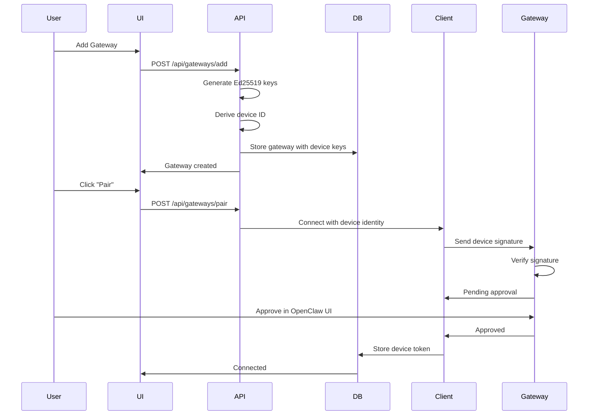
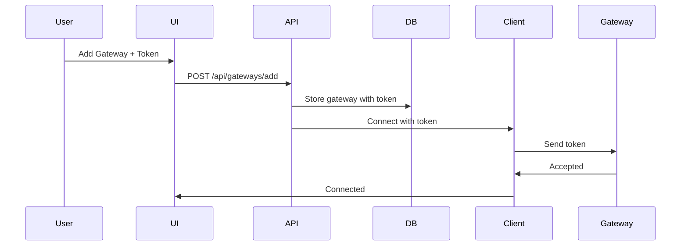

# Remove Device Pairing System - Refactoring Plan

## Overview

This plan removes the complex device identity/pairing system and replaces it with simple token-based authentication.

**Goal**: Add gateway → Enter token → Connect. No device approval, no pairing flow, no device identity.

---

## Current System (Complex)



## New System (Simple)



---

## Files to Modify

### 1. Database Schema Changes

**Remove these fields from gateways table**:
- `device_id` - No longer needed
- `device_key` - Deprecated
- `device_public_key` - No longer needed
- `device_private_key` - No longer needed
- `pairing_status` - No longer needed

**Keep these fields**:
- `id`, `workspace_id`, `name`, `url` - Core fields
- `auth_token` - The only auth mechanism
- `status` - Connection status (disconnected/connecting/connected/error)
- `last_connected_at`, `last_error` - Status tracking
- `created_at`, `updated_at` - Timestamps

**Migration**: `lib/db/migrations/009_remove_device_pairing.sql`

```sql
-- Remove device identity and pairing columns
ALTER TABLE gateways DROP COLUMN device_id;
ALTER TABLE gateways DROP COLUMN device_key;
ALTER TABLE gateways DROP COLUMN device_public_key;
ALTER TABLE gateways DROP COLUMN device_private_key;
ALTER TABLE gateways DROP COLUMN pairing_status;

-- Update any gateways with NULL tokens to have a placeholder
-- (Users will need to update these)
UPDATE gateways 
SET auth_token = 'PLEASE_UPDATE_TOKEN' 
WHERE auth_token IS NULL;
```

### 2. Remove Device Identity Module

**Delete**: `lib/gateway/device-identity.ts`

This entire file is no longer needed. All device identity generation, signing, and verification logic can be removed.

### 3. Simplify GatewayClient

**File**: `lib/gateway/client.ts`

**Changes**:

```typescript
// REMOVE these properties:
private deviceId: string
private devicePublicKey: string
private devicePrivateKey: string

// REMOVE these methods:
private generateDeviceIdentity()
getDeviceId()
getDevicePublicKey()
getDevicePrivateKey()
private signDevicePayload()

// REMOVE device-related event handling:
client.on('deviceToken', ...)
client.on('pairingPending', ...)

// SIMPLIFY constructor:
constructor(url = 'ws://127.0.0.1:18789', opts?: { authToken?: string; origin?: string }) {
  this.url = url
  this.authToken = opts?.authToken
  this.origin = opts?.origin
  
  console.log('[GatewayClient] Initializing with token auth', {
    url: this.url,
    hasAuthToken: !!this.authToken
  })
}

// SIMPLIFY sendConnectRequest:
private sendConnectRequest(nonce?: string, connectTimeout?: ReturnType<typeof setTimeout>): void {
  const id = randomUUID()
  
  if (!this.authToken) {
    this.connectReject?.(new Error('No auth token provided'))
    return
  }
  
  console.log('[GatewayClient] Sending connect request with token')
  
  const frame: RequestFrame = {
    type: 'req',
    id,
    method: 'connect',
    params: {
      minProtocol: 3,
      maxProtocol: 3,
      client: {
        id: 'openclaw-control-ui',
        displayName: 'ClawAgentHub Dashboard',
        version: '1.0.0',
        platform: 'web',
        mode: 'webchat',
      },
      caps: [],
      auth: { token: this.authToken },
      role: 'operator',
      scopes: ['operator.admin'],
    },
  }

  // Register pending for the connect response
  const pending: PendingRequest = {
    resolve: () => {
      if (connectTimeout) clearTimeout(connectTimeout)
      this.authenticated = true
      this.connectResolve?.()
    },
    reject: (err: unknown) => {
      if (connectTimeout) clearTimeout(connectTimeout)
      this.connectReject?.(err instanceof Error ? err : new Error(String(err)))
    },
    timeout: setTimeout(() => {
      this.pendingRequests.delete(id)
      this.connectReject?.(new Error('Connect handshake timeout'))
    }, 10000),
  }

  this.pendingRequests.set(id, pending)
  this.ws?.send(JSON.stringify(frame))
}
```

### 4. Simplify GatewayManager

**File**: `lib/gateway/manager.ts`

**Changes**:

```typescript
// REMOVE device token event listener:
// client.on('deviceToken', ...) - DELETE THIS

// REMOVE pairing pending event listener:
// client.on('pairingPending', ...) - DELETE THIS

// SIMPLIFY connectGateway:
async connectGateway(gateway: Gateway, origin?: string | null): Promise<void> {
  console.log('[GatewayManager] Connecting to gateway', {
    gatewayId: gateway.id,
    url: gateway.url,
    hasAuthToken: !!gateway.auth_token,
    origin: origin || 'auto-detect'
  })
  
  if (!gateway.auth_token) {
    throw new Error('Gateway auth token is required')
  }
  
  // Disconnect existing connection if any
  this.disconnectGateway(gateway.id)

  const client = new GatewayClient(gateway.url, {
    authToken: gateway.auth_token,
    origin: origin ?? undefined,
  })

  try {
    await client.connect()
    this.connections.set(gateway.id, client)
    this.statuses.set(gateway.id, {
      connected: true,
      lastChecked: new Date(),
    })
    console.log('[GatewayManager] Gateway connected successfully', {
      gatewayId: gateway.id
    })
  } catch (error) {
    const errorMessage = error instanceof Error ? error.message : String(error)
    console.error('[GatewayManager] Failed to connect gateway', {
      gatewayId: gateway.id,
      error: errorMessage
    })
    this.statuses.set(gateway.id, {
      connected: false,
      error: errorMessage,
      lastChecked: new Date(),
    })
    throw error
  }
}
```

### 5. Simplify Add Gateway API

**File**: `app/api/gateways/add/route.ts`

**Changes**:

```typescript
// REMOVE all device identity generation:
// - Remove generateKeyPairSync import
// - Remove deriveDeviceId import
// - Remove key generation code
// - Remove device ID derivation

export async function POST(request: NextRequest) {
  try {
    await ensureDatabase()

    const cookieStore = await cookies()
    const sessionToken = cookieStore.get('session_token')?.value

    if (!sessionToken) {
      return NextResponse.json(
        { message: 'Unauthorized - No session found' },
        { status: 401 }
      )
    }

    const user = getUserFromSession(sessionToken)

    if (!user) {
      return NextResponse.json(
        { message: 'Unauthorized - Invalid session' },
        { status: 401 }
      )
    }

    const db = getDatabase()

    // Get current workspace from session
    const session = db
      .prepare('SELECT current_workspace_id FROM sessions WHERE token = ?')
      .get(sessionToken) as { current_workspace_id: string | null } | undefined

    if (!session?.current_workspace_id) {
      return NextResponse.json(
        { message: 'No workspace selected' },
        { status: 400 }
      )
    }

    // Parse request body
    const body = await request.json()
    const { name, url, authToken } = body

    // Validate inputs
    if (!name || typeof name !== 'string' || name.trim().length === 0) {
      return NextResponse.json(
        { message: 'Gateway name is required' },
        { status: 400 }
      )
    }

    if (!url || typeof url !== 'string' || url.trim().length === 0) {
      return NextResponse.json(
        { message: 'Gateway URL is required' },
        { status: 400 }
      )
    }

    // Validate auth token
    if (!authToken || typeof authToken !== 'string' || authToken.trim().length === 0) {
      return NextResponse.json(
        { message: 'Gateway auth token is required' },
        { status: 400 }
      )
    }

    // Basic URL validation
    try {
      new URL(url)
    } catch {
      return NextResponse.json(
        { message: 'Invalid gateway URL format' },
        { status: 400 }
      )
    }

    // Check if URL starts with ws:// or wss://
    if (!url.startsWith('ws://') && !url.startsWith('wss://')) {
      return NextResponse.json(
        { message: 'Gateway URL must start with ws:// or wss://' },
        { status: 400 }
      )
    }

    // Create gateway
    const gatewayId = nanoid()
    const now = new Date().toISOString()

    db.prepare(
      `INSERT INTO gateways (id, workspace_id, name, url, auth_token, status, created_at, updated_at)
       VALUES (?, ?, ?, ?, ?, 'disconnected', ?, ?)`
    ).run(
      gatewayId,
      session.current_workspace_id,
      name.trim(),
      url.trim(),
      authToken.trim(),
      now,
      now
    )

    // Fetch the created gateway
    const gateway = db
      .prepare('SELECT * FROM gateways WHERE id = ?')
      .get(gatewayId)

    return NextResponse.json({ gateway }, { status: 201 })
  } catch (error) {
    console.error('Error adding gateway:', error)
    return NextResponse.json(
      { message: 'Internal server error' },
      { status: 500 }
    )
  }
}
```

### 6. Replace Pair API with Simple Connect API

**Delete**: `app/api/gateways/pair/route.ts`

**Create**: `app/api/gateways/[id]/connect/route.ts`

```typescript
import { NextRequest, NextResponse } from 'next/server'
import { cookies } from 'next/headers'
import { ensureDatabase } from '@/lib/db/middleware.js'
import { getUserFromSession, getSessionOrigin } from '@/lib/auth/session.js'
import { getDatabase } from '@/lib/db/index.js'
import { getGatewayManager } from '@/lib/gateway/manager.js'
import type { Gateway } from '@/lib/db/schema.js'

export async function POST(
  request: NextRequest,
  { params }: { params: { id: string } }
) {
  try {
    await ensureDatabase()

    const cookieStore = await cookies()
    const sessionToken = cookieStore.get('session_token')?.value

    if (!sessionToken) {
      return NextResponse.json(
        { message: 'Unauthorized - No session found' },
        { status: 401 }
      )
    }

    const user = getUserFromSession(sessionToken)

    if (!user) {
      return NextResponse.json(
        { message: 'Unauthorized - Invalid session' },
        { status: 401 }
      )
    }

    const db = getDatabase()

    // Get current workspace from session
    const session = db
      .prepare('SELECT current_workspace_id FROM sessions WHERE token = ?')
      .get(sessionToken) as { current_workspace_id: string | null } | undefined

    if (!session?.current_workspace_id) {
      return NextResponse.json(
        { message: 'No workspace selected' },
        { status: 400 }
      )
    }

    const gatewayId = params.id

    // Get gateway from database
    const gateway = db
      .prepare(
        'SELECT * FROM gateways WHERE id = ? AND workspace_id = ?'
      )
      .get(gatewayId, session.current_workspace_id) as Gateway | undefined

    if (!gateway) {
      return NextResponse.json(
        { message: 'Gateway not found' },
        { status: 404 }
      )
    }

    if (!gateway.auth_token) {
      return NextResponse.json(
        { message: 'Gateway auth token not configured' },
        { status: 400 }
      )
    }

    // Get origin from session
    const origin = getSessionOrigin(sessionToken)
    console.log('[API:Connect] Session origin:', origin)

    // Attempt to connect
    const manager = getGatewayManager()
    
    try {
      // Update status to connecting
      db.prepare(
        'UPDATE gateways SET status = ?, updated_at = ? WHERE id = ?'
      ).run('connecting', new Date().toISOString(), gatewayId)

      await manager.connectGateway(gateway, origin)

      // Update status to connected
      db.prepare(
        'UPDATE gateways SET status = ?, last_connected_at = ?, last_error = NULL, updated_at = ? WHERE id = ?'
      ).run('connected', new Date().toISOString(), new Date().toISOString(), gatewayId)

      return NextResponse.json({
        message: 'Gateway connected successfully',
        status: 'connected'
      })
    } catch (error) {
      const errorMessage = error instanceof Error ? error.message : String(error)
      
      // Update status to error
      db.prepare(
        'UPDATE gateways SET status = ?, last_error = ?, updated_at = ? WHERE id = ?'
      ).run('error', errorMessage, new Date().toISOString(), gatewayId)

      return NextResponse.json(
        {
          message: 'Failed to connect to gateway',
          error: errorMessage,
          status: 'error'
        },
        { status: 500 }
      )
    }
  } catch (error) {
    console.error('Error connecting gateway:', error)
    return NextResponse.json(
      { message: 'Internal server error' },
      { status: 500 }
    )
  }
}
```

### 7. Remove Pairing-Related APIs

**Delete these files**:
- `app/api/gateways/check-paired/route.ts`
- `app/api/gateways/[id]/pairing-status/route.ts`

**Keep and simplify**:
- `app/api/gateways/connect-with-token/route.ts` - Rename to `update-token` for updating existing gateway tokens

### 8. Update Database Schema Types

**File**: `lib/db/schema.ts`

```typescript
export interface Gateway {
  id: string
  workspace_id: string
  name: string
  url: string
  auth_token: string  // Make required, not nullable
  status: 'disconnected' | 'connecting' | 'connected' | 'error'
  last_connected_at: string | null
  last_error: string | null
  created_at: string
  updated_at: string
}
```

### 9. Simplify UI Components

**Add Gateway Form** - Make token required:

```typescript
<form onSubmit={handleSubmit}>
  <input
    name="name"
    placeholder="Gateway Name"
    required
  />
  
  <input
    name="url"
    placeholder="ws://127.0.0.1:18789"
    required
  />
  
  <input
    name="authToken"
    placeholder="Gateway Token"
    required
    type="password"
  />
  
  <p className="text-sm text-gray-600">
    Find your token in OpenClaw config: gateway.auth.token
  </p>
  
  <button type="submit">Add Gateway</button>
</form>
```

**Gateway List** - Remove pairing status, show only connection status:

```typescript
<div className="gateway-card">
  <h3>{gateway.name}</h3>
  <p>{gateway.url}</p>
  
  <div className="status">
    {gateway.status === 'connected' && <span className="badge-success">Connected</span>}
    {gateway.status === 'disconnected' && <span className="badge-gray">Disconnected</span>}
    {gateway.status === 'connecting' && <span className="badge-blue">Connecting...</span>}
    {gateway.status === 'error' && <span className="badge-error">Error</span>}
  </div>
  
  {gateway.status === 'disconnected' && (
    <button onClick={() => connectGateway(gateway.id)}>
      Connect
    </button>
  )}
  
  {gateway.status === 'connected' && (
    <button onClick={() => disconnectGateway(gateway.id)}>
      Disconnect
    </button>
  )}
  
  {gateway.last_error && (
    <p className="text-red-600 text-sm">{gateway.last_error}</p>
  )}
</div>
```

### 10. Remove Device-Related Scripts

**Delete these files**:
- `scripts/migrate-device-identities.ts`
- `scripts/fix-device-identity.ts`
- `scripts/apply-migration-005.ts`
- `scripts/apply-migration-006.ts`
- `scripts/apply-migration-007.ts`

---

## Implementation Steps

### Phase 1: Database Migration

1. Create migration `009_remove_device_pairing.sql`
2. Run migration to remove device columns
3. Update all gateways to have valid tokens

### Phase 2: Backend Refactoring

1. Simplify `GatewayClient` - remove all device identity code
2. Simplify `GatewayManager` - remove device event handlers
3. Update `add/route.ts` - remove device generation, require token
4. Create `[id]/connect/route.ts` - simple connect endpoint
5. Delete pairing-related endpoints
6. Update schema types

### Phase 3: Frontend Updates

1. Update add gateway form - make token required
2. Simplify gateway list - remove pairing status
3. Update gateway detail page - show only connect/disconnect
4. Remove pairing-related UI components

### Phase 4: Testing

1. Test adding new gateway with token
2. Test connecting to gateway
3. Test disconnecting from gateway
4. Test error handling
5. Verify no device-related code remains

### Phase 5: Cleanup

1. Delete unused files
2. Remove unused imports
3. Update documentation
4. Remove device-related environment variables

---

## Migration Guide for Existing Users

### For Users with Existing Gateways

**Option 1: Update tokens in database**

```bash
sqlite3 ~/.clawhub/clawhub.db

# View current gateways
SELECT id, name, auth_token FROM gateways;

# Update token for each gateway
UPDATE gateways SET auth_token = 'your-token-here' WHERE id = 'gateway-id';

# Verify
SELECT id, name, auth_token FROM gateways;
```

**Option 2: Delete and re-add gateways**

1. Delete existing gateways
2. Add them again with tokens

### OpenClaw Configuration Required

Your `.openclaw/openclaw.json` must have:

```json
{
  "gateway": {
    "auth": {
      "mode": "token",
      "token": "your-secret-token"
    },
    "controlUi": {
      "allowInsecureAuth": true,
      "allowedOrigins": [
        "http://localhost:7777"
      ]
    }
  }
}
```

---

## Benefits of This Refactoring

1. **Simpler**: No device keys, no signatures, no pairing approval
2. **Faster**: Connect immediately with token
3. **Easier to understand**: Token auth is familiar to developers
4. **Less code**: Remove ~1000+ lines of device identity code
5. **Fewer bugs**: Less complexity = fewer edge cases
6. **Better UX**: Add gateway → Enter token → Connect (3 steps instead of 7)

---

## Testing Checklist

After refactoring:

- [ ] Can add new gateway with token
- [ ] Can connect to gateway immediately
- [ ] Can disconnect from gateway
- [ ] Error messages are clear
- [ ] No device-related code in logs
- [ ] No device-related fields in database
- [ ] No pairing-related UI elements
- [ ] Token validation works
- [ ] Origin detection still works
- [ ] Multiple gateways work
- [ ] Reconnection works after server restart

---

## Rollback Plan

If issues arise:

1. Keep old migrations in place
2. Don't delete old code immediately - comment it out
3. Test thoroughly in development first
4. Have database backup before migration
5. Can revert migration if needed

---

## Timeline

- **Phase 1 (Database)**: 1 hour
- **Phase 2 (Backend)**: 2-3 hours
- **Phase 3 (Frontend)**: 2 hours
- **Phase 4 (Testing)**: 1-2 hours
- **Phase 5 (Cleanup)**: 1 hour

**Total**: 7-9 hours of focused work

---

## Next Steps

1. Review this plan
2. Confirm approach
3. Switch to Code mode to implement
4. Start with Phase 1 (database migration)
5. Test each phase before moving to next
