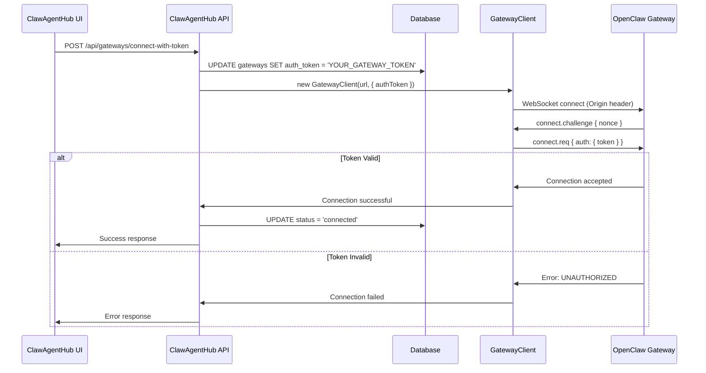

# Token-Only Authentication Plan

## Problem Summary

Your ClawAgentHub gateway connection is failing with `DEVICE_IDENTITY_REQUIRED` error because:

1. **Missing Token**: The gateway record in your database doesn't have the auth token stored
2. **Current Logs Show**: `hasToken: false` - meaning no token is being passed to OpenClaw
3. **OpenClaw Config**: Has `allowInsecureAuth: true` and token `"YOUR_GATEWAY_TOKEN"`
4. **Client Already Ready**: Your [`client.ts`](../lib/gateway/client.ts) is already configured for token-only auth (lines 81-85)

## Why This Happens

When OpenClaw receives a connection with `allowInsecureAuth: true`, it accepts connections in two modes:
- **Token-only mode**: Client provides auth token, no device identity needed
- **Device identity mode**: Client provides device keys and signature

Your client is trying token-only mode but without the token, so OpenClaw rejects it.

## Solution Options

### Option 1: Quick Database Update (Fastest) ⚡

**Best for**: Immediate fix without code changes

Update your existing gateway record to include the token:

```bash
# Connect to your ClawAgentHub database
sqlite3 ~/.clawhub/clawhub.db

# Find your gateway ID
SELECT id, name, url, auth_token FROM gateways;

# Update with your token (replace GATEWAY_ID with actual ID)
UPDATE gateways 
SET auth_token = 'YOUR_GATEWAY_TOKEN', 
    updated_at = datetime('now') 
WHERE id = 'GATEWAY_ID';

# Verify the update
SELECT id, name, auth_token FROM gateways WHERE id = 'GATEWAY_ID';

# Exit
.quit
```

Then restart your ClawAgentHub server and try connecting again.

---

### Option 2: Use Connect-with-Token API (Recommended) ✅

**Best for**: Proper implementation with UI support

You already have a [`/api/gateways/connect-with-token`](../app/api/gateways/connect-with-token/route.ts) endpoint that handles this!

**Implementation Steps**:

#### Step 1: Create a Token Input UI Component

Create a new component to allow users to enter the gateway token:

```typescript
// app/components/GatewayTokenInput.tsx
'use client'

import { useState } from 'react'

interface GatewayTokenInputProps {
  gatewayId: string
  onSuccess: () => void
}

export function GatewayTokenInput({ gatewayId, onSuccess }: GatewayTokenInputProps) {
  const [token, setToken] = useState('')
  const [loading, setLoading] = useState(false)
  const [error, setError] = useState<string | null>(null)

  const handleSubmit = async (e: React.FormEvent) => {
    e.preventDefault()
    setLoading(true)
    setError(null)

    try {
      const response = await fetch('/api/gateways/connect-with-token', {
        method: 'POST',
        headers: { 'Content-Type': 'application/json' },
        body: JSON.stringify({ gatewayId, gatewayToken: token })
      })

      if (!response.ok) {
        const data = await response.json()
        throw new Error(data.message || 'Failed to connect')
      }

      onSuccess()
    } catch (err) {
      setError(err instanceof Error ? err.message : 'Connection failed')
    } finally {
      setLoading(false)
    }
  }

  return (
    <form onSubmit={handleSubmit} className="space-y-4">
      <div>
        <label htmlFor="token" className="block text-sm font-medium">
          Gateway Token
        </label>
        <input
          id="token"
          type="text"
          value={token}
          onChange={(e) => setToken(e.target.value)}
          placeholder="Enter your OpenClaw gateway token"
          className="mt-1 block w-full rounded-md border border-gray-300 px-3 py-2"
          required
        />
        <p className="mt-1 text-sm text-gray-500">
          Find this in your OpenClaw config: gateway.auth.token
        </p>
      </div>

      {error && (
        <div className="rounded-md bg-red-50 p-3 text-sm text-red-800">
          {error}
        </div>
      )}

      <button
        type="submit"
        disabled={loading || !token}
        className="rounded-md bg-blue-600 px-4 py-2 text-white hover:bg-blue-700 disabled:opacity-50"
      >
        {loading ? 'Connecting...' : 'Connect with Token'}
      </button>
    </form>
  )
}
```

#### Step 2: Add Token Input to Gateway Management Page

Update your gateway management page to show the token input when needed:

```typescript
// In your gateway page component
import { GatewayTokenInput } from '@/components/GatewayTokenInput'

// Show this when gateway status is 'disconnected' or has error
{gateway.status === 'disconnected' && !gateway.auth_token && (
  <div className="mt-4 rounded-lg border border-gray-200 p-4">
    <h3 className="text-lg font-medium mb-2">Connect with Token</h3>
    <p className="text-sm text-gray-600 mb-4">
      This gateway needs an authentication token to connect.
    </p>
    <GatewayTokenInput 
      gatewayId={gateway.id} 
      onSuccess={() => {
        // Refresh gateway data
        router.refresh()
      }}
    />
  </div>
)}
```

#### Step 3: Update Add Gateway Form

Modify [`app/api/gateways/add/route.ts`](../app/api/gateways/add/route.ts) to accept token during creation:

The endpoint already accepts `authToken` in the request body (line 49), so just ensure your UI form includes it:

```typescript
// In your add gateway form
<input
  type="text"
  name="authToken"
  placeholder="Gateway Token (optional)"
  className="..."
/>
```

---

### Option 3: Delete and Re-add Gateway (Clean Slate) 🔄

**Best for**: Starting fresh if other options don't work

1. **Delete existing gateway**:
   ```bash
   # Via API
   DELETE /api/gateways/{gateway-id}
   
   # Or via database
   sqlite3 ~/.clawhub/clawhub.db
   DELETE FROM gateways WHERE id = 'GATEWAY_ID';
   .quit
   ```

2. **Re-add gateway with token**:
   ```bash
   # Via API
   POST /api/gateways/add
   {
     "name": "Local Gateway",
     "url": "ws://127.0.0.1:18789",
     "authToken": "YOUR_GATEWAY_TOKEN"
   }
   ```

---

## Implementation Plan

### Phase 1: Quick Fix (Immediate)
- [ ] Use Option 1 to manually update database with token
- [ ] Restart ClawAgentHub server
- [ ] Test connection
- [ ] Verify logs show `hasToken: true`

### Phase 2: Proper UI Implementation
- [ ] Create `GatewayTokenInput` component
- [ ] Add token input to gateway management page
- [ ] Update add gateway form to include token field
- [ ] Test end-to-end flow

### Phase 3: Documentation
- [ ] Document token-only authentication in user guide
- [ ] Add troubleshooting section for connection errors
- [ ] Create video/screenshots showing token setup

---

## How Token-Only Auth Works



### Key Points

1. **No Device Identity**: With token-only auth, no device keys or signatures are needed
2. **Origin Still Required**: The origin header is still validated against `allowedOrigins`
3. **Token Storage**: Token is stored in database and passed to client on each connection
4. **Security**: With `allowInsecureAuth: true`, OpenClaw accepts token-only auth on localhost

---

## Testing Checklist

After implementing the solution:

- [ ] Gateway record has `auth_token` populated in database
- [ ] Logs show `hasToken: true` when connecting
- [ ] Connection succeeds without `DEVICE_IDENTITY_REQUIRED` error
- [ ] Gateway status changes to `connected`
- [ ] Can list agents from gateway
- [ ] Can send messages to agents

---

## Troubleshooting

### Still Getting DEVICE_IDENTITY_REQUIRED?

1. **Check token in database**:
   ```sql
   SELECT id, name, auth_token FROM gateways;
   ```
   Should show `YOUR_GATEWAY_TOKEN`, not `NULL`

2. **Check logs for token passing**:
   ```
   [GatewayClient] Sending connect request (token-only auth) { hasToken: true }
   ```
   Should show `true`, not `false`

3. **Verify OpenClaw config**:
   ```json
   {
     "gateway": {
       "auth": {
         "mode": "token",
         "token": "YOUR_GATEWAY_TOKEN"
       },
       "controlUi": {
         "allowInsecureAuth": true
       }
     }
   }
   ```

### Connection Rejected with UNAUTHORIZED?

- Token mismatch: ClawAgentHub token doesn't match OpenClaw token
- Check both configs and ensure they match exactly

### Origin Still Not Allowed?

- This is a separate issue from token auth
- Verify origin is in `allowedOrigins` list
- Check that origin detection is working (see [`ORIGIN_NOT_ALLOWED_FIX.md`](./ORIGIN_NOT_ALLOWED_FIX.md))

---

## Next Steps

1. **Choose your solution**: Option 1 for quick fix, Option 2 for proper implementation
2. **Implement the fix**: Follow the steps for your chosen option
3. **Test thoroughly**: Use the testing checklist above
4. **Document for users**: Add instructions to your user guide

## Related Documentation

- [`DEVICE_IDENTITY_EXPLAINED.md`](./DEVICE_IDENTITY_EXPLAINED.md) - Understanding device identity (not needed for token-only auth)
- [`ORIGIN_NOT_ALLOWED_FIX.md`](./ORIGIN_NOT_ALLOWED_FIX.md) - Origin detection fix (already implemented)
- [`QUICK_FIX_GUIDE.md`](./QUICK_FIX_GUIDE.md) - General troubleshooting guide
