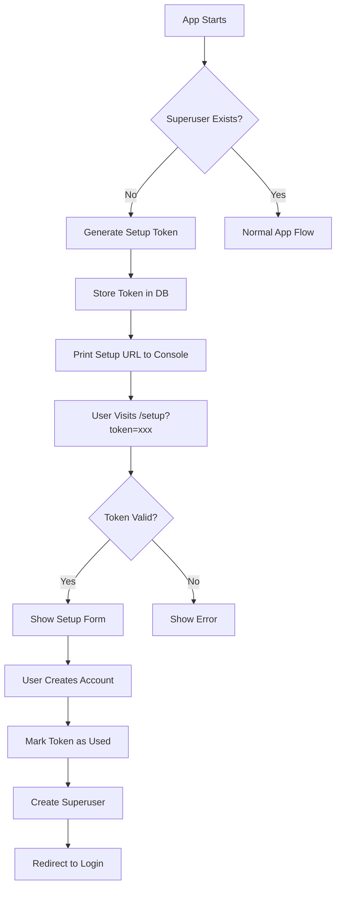
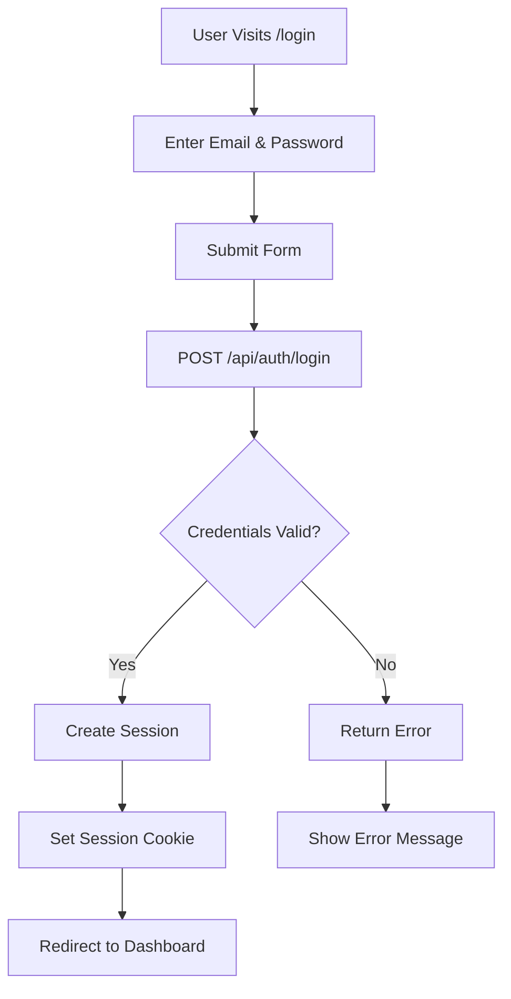

# ClawAgentHub Login System - Architecture Plan

## Project Overview

**Project Name**: ClawAgentHub  
**Framework**: Vinext (Next.js API on Vite + Cloudflare Workers)  
**Database**: SQLite  
**Styling**: Tailwind CSS  
**Code Quality**: ESLint + Prettier  
**First Phase**: Login page with PocketBase-style superuser setup

## Core Concept

Similar to PocketBase, when the project starts for the first time and no superuser exists, the system will:
1. Generate a secure one-time setup token
2. Display a setup URL in the console: `http://localhost:3000/setup?token=xxx`
3. User visits this URL to create the first superuser account
4. After superuser creation, the setup route becomes inaccessible

## Project Structure

```
clawhub/
├── app/
│   ├── layout.tsx                 # Root layout with Tailwind
│   ├── page.tsx                   # Home/redirect page
│   ├── login/
│   │   └── page.tsx              # Login page
│   ├── setup/
│   │   └── page.tsx              # First-time superuser setup
│   └── api/
│       ├── auth/
│       │   ├── login/
│       │   │   └── route.ts      # Login API endpoint
│       │   └── logout/
│       │       └── route.ts      # Logout API endpoint
│       └── setup/
│           ├── check/
│           │   └── route.ts      # Check if setup needed
│           └── create/
│               └── route.ts      # Create superuser
├── lib/
│   ├── db/
│   │   ├── index.ts              # Database connection
│   │   ├── schema.ts             # Database schema definitions
│   │   └── migrations/
│   │       └── 001_initial.sql   # Initial schema migration
│   ├── auth/
│   │   ├── session.ts            # Session management
│   │   ├── password.ts           # Password hashing utilities
│   │   └── token.ts              # Setup token generation
│   └── utils/
│       └── validation.ts         # Input validation helpers
├── components/
│   ├── ui/
│   │   ├── button.tsx            # Reusable button component
│   │   ├── input.tsx             # Reusable input component
│   │   └── card.tsx              # Reusable card component
│   └── auth/
│       ├── login-form.tsx        # Login form component
│       └── setup-form.tsx        # Setup form component
├── middleware.ts                  # Auth middleware
├── vite.config.ts                # Vinext + Cloudflare config
├── tailwind.config.ts            # Tailwind configuration
├── .eslintrc.json                # ESLint configuration
├── .prettierrc                   # Prettier configuration
├── package.json
└── README.md
```

## Database Schema

### Users Table
```sql
CREATE TABLE IF NOT EXISTS users (
  id TEXT PRIMARY KEY,
  email TEXT UNIQUE NOT NULL,
  password_hash TEXT NOT NULL,
  is_superuser BOOLEAN DEFAULT 0,
  created_at DATETIME DEFAULT CURRENT_TIMESTAMP,
  updated_at DATETIME DEFAULT CURRENT_TIMESTAMP
);

CREATE INDEX idx_users_email ON users(email);
```

### Sessions Table
```sql
CREATE TABLE IF NOT EXISTS sessions (
  id TEXT PRIMARY KEY,
  user_id TEXT NOT NULL,
  token TEXT UNIQUE NOT NULL,
  expires_at DATETIME NOT NULL,
  created_at DATETIME DEFAULT CURRENT_TIMESTAMP,
  FOREIGN KEY (user_id) REFERENCES users(id) ON DELETE CASCADE
);

CREATE INDEX idx_sessions_token ON sessions(token);
CREATE INDEX idx_sessions_user_id ON sessions(user_id);
```

### Setup Tokens Table
```sql
CREATE TABLE IF NOT EXISTS setup_tokens (
  id TEXT PRIMARY KEY,
  token TEXT UNIQUE NOT NULL,
  used BOOLEAN DEFAULT 0,
  expires_at DATETIME NOT NULL,
  created_at DATETIME DEFAULT CURRENT_TIMESTAMP
);

CREATE INDEX idx_setup_tokens_token ON setup_tokens(token);
```

## Technical Implementation Details

### 1. Database Layer ([`lib/db/index.ts`])

- Use `better-sqlite3` for SQLite operations
- Connection pooling for Cloudflare Workers compatibility
- Migration runner that executes SQL files in order
- Database initialization on first run

### 2. Authentication Flow

#### First-Time Setup Flow


#### Login Flow


### 3. Security Features

- **Password Hashing**: Use `bcrypt` or `argon2` for password hashing
- **Session Management**: 
  - Secure HTTP-only cookies
  - Session expiration (24 hours default)
  - CSRF protection
- **Setup Token**: 
  - Cryptographically secure random token
  - One-time use only
  - Expires after 1 hour
- **Rate Limiting**: Implement rate limiting on login endpoint
- **Input Validation**: Validate all inputs on both client and server

### 4. Middleware ([`middleware.ts`])

```typescript
// Protect routes that require authentication
// Redirect to /login if not authenticated
// Check for setup requirement on app start
```

### 5. UI Components with Tailwind

#### Login Page Design
- Clean, centered card layout
- Email and password inputs
- "Remember me" checkbox
- Submit button with loading state
- Error message display
- Responsive design (mobile-first)

#### Setup Page Design
- Similar to login but with:
  - Email input
  - Password input
  - Confirm password input
  - Clear instructions
  - One-time use notice

## Technology Stack

### Core Dependencies
```json
{
  "dependencies": {
    "vinext": "latest",
    "@cloudflare/vite-plugin": "latest",
    "react": "^19.0.0",
    "react-dom": "^19.0.0",
    "better-sqlite3": "^11.0.0",
    "bcryptjs": "^2.4.3",
    "nanoid": "^5.0.0",
    "zod": "^3.23.0"
  },
  "devDependencies": {
    "@types/react": "^19.0.0",
    "@types/react-dom": "^19.0.0",
    "@types/better-sqlite3": "^7.6.0",
    "@types/bcryptjs": "^2.4.6",
    "typescript": "^5.6.0",
    "tailwindcss": "^3.4.0",
    "autoprefixer": "^10.4.0",
    "postcss": "^8.4.0",
    "eslint": "^9.0.0",
    "eslint-config-next": "^15.0.0",
    "prettier": "^3.3.0",
    "prettier-plugin-tailwindcss": "^0.6.0"
  }
}
```

### ESLint Configuration
- Next.js recommended rules
- TypeScript support
- React hooks rules
- Prettier integration

### Prettier Configuration
- Tailwind CSS plugin for class sorting
- Single quotes
- 2-space indentation
- Trailing commas

## Migration System

### Migration Files Location
[`lib/db/migrations/`]

### Migration Naming Convention
- `001_initial.sql` - Initial schema
- `002_add_feature.sql` - Future migrations
- Sequential numbering ensures order

### Migration Runner
- Tracks applied migrations in a `migrations` table
- Runs pending migrations on app start
- Idempotent (safe to run multiple times)

## First-Time Setup Process

### Console Output Example
```
🚀 ClawAgentHub starting...
✓ Database initialized
✓ Migrations applied

⚠️  No superuser found!

📝 Create your first superuser account:
   http://localhost:3000/setup?token=abc123xyz789...

   This link expires in 1 hour and can only be used once.

✓ Server running on http://localhost:3000
```

### Setup Page Features
1. Token validation on page load
2. Form with email, password, confirm password
3. Client-side validation
4. Server-side validation
5. Password strength indicator
6. Success message with redirect to login

## Environment Variables

```env
# Database
DATABASE_PATH=./data/clawhub.db

# Session
SESSION_SECRET=your-secret-key-here
SESSION_DURATION=86400000  # 24 hours in ms

# Setup
SETUP_TOKEN_DURATION=3600000  # 1 hour in ms

# Development
NODE_ENV=development
```

## Development Workflow

1. **Initial Setup**
   ```bash
   npm install
   npm run dev
   ```

2. **First Run**
   - App detects no superuser
   - Generates setup token
   - Displays setup URL in console

3. **Create Superuser**
   - Visit setup URL
   - Fill in email and password
   - Submit form

4. **Login**
   - Visit `/login`
   - Enter credentials
   - Access protected routes

## Deployment Considerations

### Cloudflare Workers
- SQLite database stored in Durable Objects or R2
- Session management via KV store
- Environment variables via Cloudflare dashboard

### Database Persistence
- For development: Local SQLite file
- For production: Cloudflare D1 (SQLite on Workers)

## Security Checklist

- [ ] Password hashing with bcrypt/argon2
- [ ] Secure session cookies (httpOnly, secure, sameSite)
- [ ] CSRF protection
- [ ] Rate limiting on login endpoint
- [ ] Input validation (client + server)
- [ ] SQL injection prevention (parameterized queries)
- [ ] XSS prevention (React auto-escaping)
- [ ] Setup token expiration
- [ ] One-time use setup tokens
- [ ] Password strength requirements

## Future Enhancements (Post-MVP)

1. Password reset functionality
2. Email verification
3. Two-factor authentication
4. User management dashboard
5. Role-based access control
6. Audit logging
7. Account lockout after failed attempts
8. Remember me functionality
9. Social login integration
10. API key management

## Testing Strategy

1. **Unit Tests**
   - Password hashing/verification
   - Token generation
   - Input validation

2. **Integration Tests**
   - Login flow
   - Setup flow
   - Session management

3. **E2E Tests**
   - Complete user journey
   - Setup process
   - Login/logout

## Success Criteria

✅ User can create superuser on first run via setup link  
✅ Setup link is one-time use and expires  
✅ User can login with email/password  
✅ Sessions are secure and persistent  
✅ Database migrations run automatically  
✅ UI is responsive and accessible  
✅ Code follows ESLint/Prettier standards  
✅ All routes are properly protected
