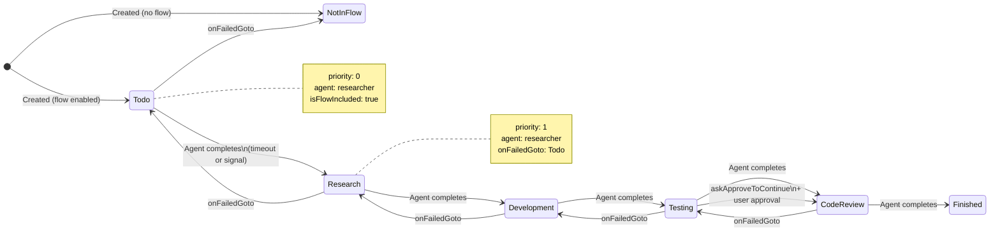
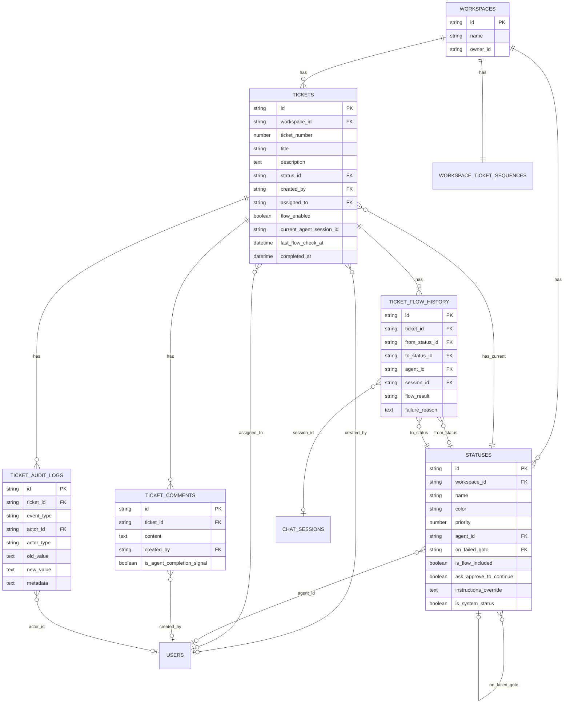
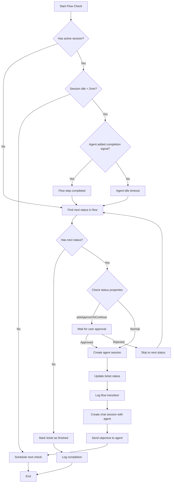

# Ticket System Architecture

## System Overview

```mermaid
graph TB
    subgraph "Frontend - Next.js App"
        Dashboard[Ticket Dashboard]
        Modal[Ticket Modal]
        FlowBuilder[Status Flow Builder]
        AuditPanel[Audit Log Panel]
        Comments[Comments Section]
    end
    
    subgraph "API Routes"
        TicketAPI[/api/tickets/*]
        CommentAPI[/api/ticketcomments/*]
        FlowAPI[/api/ticketflows/*]
        StatusAPI[/api/statuses/*]
    end
    
    subgraph "Database Layer"
        DB[(SQLite Database)]
        Tickets[tickets table]
        Comments[ticket_comments table]
        Audit[ticket_audit_logs table]
        FlowHistory[ticket_flow_history table]
        Statuses[statuses table]
    end
    
    subgraph "Services"
        FlowProcessor[Flow Processor]
        IdleDetector[Idle Timeout Detector]
        AgentIntegrator[Agent Integrator]
    end
    
    subgraph "External - OpenClaw Gateway"
        Gateway[WebSocket Gateway]
        Agents[AI Agents]
    end
    
    Dashboard --> TicketAPI
    Modal --> TicketAPI
    Modal --> CommentAPI
    FlowBuilder --> StatusAPI
    AuditPanel --> TicketAPI
    Comments --> CommentAPI
    
    TicketAPI --> DB
    CommentAPI --> DB
    FlowAPI --> DB
    StatusAPI --> DB
    
    FlowProcessor --> FlowAPI
    IdleDetector --> FlowProcessor
    FlowProcessor --> AgentIntegrator
    AgentIntegrator --> Gateway
    Gateway --> Agents
```

## Flow State Machine



## Database Schema Relationships



## Component Hierarchy

```
┌─────────────────────────────────────────────────────────────┐
│                      Ticket Dashboard                        │
├─────────────────────────────────────────────────────────────┤
│  ┌─────────────┐  ┌──────────────────────────────────────┐ │
│  │   Filters   │  │           Ticket List                 │ │
│  │  - Status   │  │  ┌─────────────────────────────────┐ │ │
│  │  - Assignee │  │  │ 🎫 TICKET-1: Fix login bug      │ │ │
│  │  - Search   │  │  │    Status: Todo | Assigned: @dev │ │ │
│  └─────────────┘  │  └─────────────────────────────────┘ │ │
│                   │  ┌─────────────────────────────────┐ │ │
│                   │  │ 🎫 TICKET-2: Add dark mode      │ │ │
│  ┌─────────────┐  │  │    Status: In Progress          │ │ │
│  │   [+ New]   │  │  └─────────────────────────────────┘ │ │
│  └─────────────┘  └──────────────────────────────────────┘ │
└─────────────────────────────────────────────────────────────┘

┌─────────────────────────────────────────────────────────────┐
│                    Ticket Modal (80vh × 80vw)               │
├─────────────────────────────────────────────────────────────┤
│  ┌───────────────────────────────────────────────────────┐  │
│  │  Title: [Implement user authentication              ] │  │
│  │                                                       │  │
│  │  Description:                                         │  │
│  │  ┌─────────────────┬──────────────────────────────┐ │  │
│  │  │ Markdown Editor │         Preview               │ │  │
│  │  │ [**Bold**]      │  **Bold**                     │ │  │
│  │  │ [*Italic*]      │  *Italic*                     │ │  │
│  │  │                 │                               │ │  │
│  │  │ Create auth     │  Create auth system with      │ │  │
│  │  │ system with...  │  JWT tokens...                │ │  │
│  │  └─────────────────┴──────────────────────────────┘ │  │
│  │                                                       │  │
│  │  ☑ Enable Flow                                       │  │
│  │  Status: [Todo ▼]    Assignee: [@user ▼]            │  │
│  │                                                       │  │
│  │  [Cancel]                              [Save Ticket] │  │
│  └───────────────────────────────────────────────────────┘  │
└─────────────────────────────────────────────────────────────┘

┌─────────────────────────────────────────────────────────────┐
│                   Status Flow Builder                        │
├─────────────────────────────────────────────────────────────┤
│  ┌───────────────────────────────────────────────────────┐  │
│  │  Status Configuration                                 │  │
│  │                                                       │  │
│  │  ┌───────────────────────────────────────────────┐  │  │
│  │  │ ⋮⋮  📝 Todo                    Agent: Researcher│  │  │
│  │  │    Flow: ✓ | Approve: ✗ | Fail goto: ─       │  │  │
│  │  ├───────────────────────────────────────────────┤  │  │
│  │  │ ⋮⋮  🔍 Research                Agent: Analyst  │  │  │
│  │  │    Flow: ✓ | Approve: ✗ | Fail goto: Todo    │  │  │
│  │  ├───────────────────────────────────────────────┤  │  │
│  │  │ ⋮⋮  💻 Development            Agent: Developer │  │  │
│  │  │    Flow: ✓ | Approve: ✗ | Fail goto: Research│  │  │
│  │  ├───────────────────────────────────────────────┤  │  │
│  │  │ ⋮⋮  🧪 Testing                 Agent: Tester   │  │  │
│  │  │    Flow: ✓ | Approve: ✓ | Fail goto: Dev     │  │  │
│  │  └───────────────────────────────────────────────┘  │  │
│  │                                                       │  │
│  │  [+ Add Status]                          [Save Config]│  │
│  └───────────────────────────────────────────────────────┘  │
└─────────────────────────────────────────────────────────────┘

┌─────────────────────────────────────────────────────────────┐
│                     Audit Log Panel                          │
├─────────────────────────────────────────────────────────────┤
│  ┌───────────────────────────────────────────────────────┐  │
│  │  📋 Activity Timeline                                 │  │
│  │                                                       │  │
│  │  🤖 @researcher-bot moved this to Research           │  │
│  │     2 hours ago                                       │  │
│  │                                                       │  │
│  │  ➡️ Flow transition: Todo → Research                 │  │
│  │     2 hours ago                                       │  │
│  │                                                       │  │
│  │  💬 @john added a comment                            │  │
│  │     "Please check the API docs first..."             │  │
│  │     3 hours ago                                       │  │
│  │                                                       │  │
│  │  📝 @jane edited the ticket                          │  │
│  │     Changed title from "Fix auth" to "Implement..."  │  │
│  │     4 hours ago                                       │  │
│  │                                                       │  │
│  │  🎫 @jane created this ticket                        │  │
│  │     5 hours ago                                       │  │
│  └───────────────────────────────────────────────────────┘  │
└─────────────────────────────────────────────────────────────┘
```

## Flow Processing Logic



## API Request/Response Examples

### Create Ticket
```json
// POST /api/workspaces/{workspaceId}/tickets
{
  "title": "Implement user authentication",
  "description": "# Overview\nCreate JWT-based auth system...",
  "status_id": "status_todo_123",
  "flow_enabled": true,
  "assigned_to": "user_456"
}

// Response
{
  "id": "ticket_789",
  "ticket_number": 1,
  "workspace_id": "workspace_123",
  "title": "Implement user authentication",
  "description": "# Overview\n...",
  "status": {
    "id": "status_todo_123",
    "name": "Todo",
    "color": "#6B7280"
  },
  "created_by": {
    "id": "user_123",
    "email": "user@example.com"
  },
  "flow_enabled": true,
  "created_at": "2024-01-15T10:00:00Z"
}
```

### Add Comment
```json
// POST /api/tickets/{ticketId}/comments
{
  "content": "I've started researching the best approach...",
  "is_agent_completion_signal": false
}

// Response
{
  "id": "comment_456",
  "ticket_id": "ticket_789",
  "content": "I've started researching...",
  "created_by": {
    "id": "user_123",
    "email": "user@example.com"
  },
  "created_at": "2024-01-15T11:00:00Z"
}
```

### Update Flow Status
```json
// PATCH /api/tickets/{ticketId}/flow
{
  "result": "finished",
  "notes": "Research completed successfully"
}

// Response
{
  "success": true,
  "ticket_id": "ticket_789",
  "old_status": { "id": "status_todo", "name": "Todo" },
  "new_status": { "id": "status_research", "name": "Research" },
  "flow_history": {
    "id": "flow_123",
    "from_status": "Todo",
    "to_status": "Research",
    "result": "success"
  }
}
```

### Error Response (401 - No Agent)
```json
// Response when agent not configured
{
  "error": "no_agent_configured",
  "message": "No agent is configured for the 'Research' status",
  "status_id": "status_research_123"
}
```

## Idle Timeout Detection

```javascript
// Pseudo-code for idle detector
async function detectIdleTickets() {
  const threshold = new Date(Date.now() - 2 * 60 * 1000); // 2 minutes ago
  
  // Get tickets with active agent sessions
  const activeTickets = await db.tickets.find({
    where: {
      flow_enabled: true,
      current_agent_session_id: { ne: null }
    }
  });
  
  for (const ticket of activeTickets) {
    // Check session last activity
    const session = await db.chatSessions.findOne({
      where: { id: ticket.current_agent_session_id }
    });
    
    if (session && new Date(session.last_activity_at) < threshold) {
      // Session is idle, advance flow
      await flowProcessor.advanceTicket(ticket.id, 'idle_timeout');
    }
  }
}

// Run every 30 seconds
setInterval(detectIdleTickets, 30000);
```
