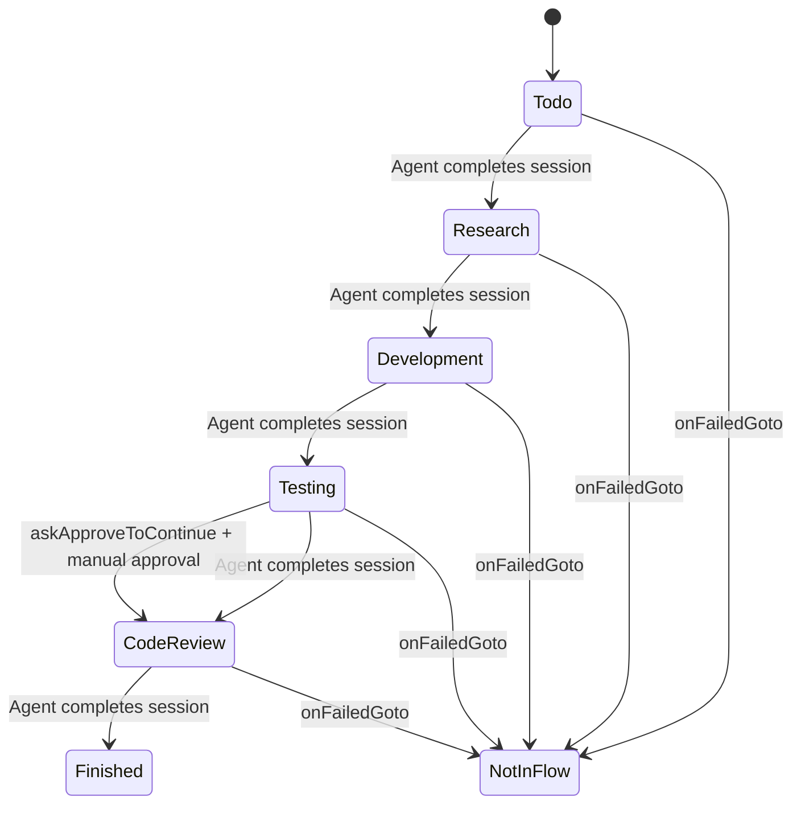

# ClawAgentHub Ticket System Design

## Overview
A comprehensive ticket/workflow management system integrated into ClawAgentHub with markdown editor, drag-and-drop status flows, agent integration, and audit logging.

---

## Database Schema Design

### 1. Extended Statuses Table (Migration)
The existing `statuses` table needs these additional columns for the flow system:

```sql
ALTER TABLE statuses ADD COLUMN priority INTEGER DEFAULT 0;
ALTER TABLE statuses ADD COLUMN agent_id TEXT;
ALTER TABLE statuses ADD COLUMN on_failed_goto TEXT; -- status_id to move to on failure
ALTER TABLE statuses ADD COLUMN is_flow_included INTEGER DEFAULT 1; -- boolean
ALTER TABLE statuses ADD COLUMN ask_approve_to_continue INTEGER DEFAULT 0; -- boolean
ALTER TABLE statuses ADD COLUMN instructions_override TEXT; -- markdown for agent override
ALTER TABLE statuses ADD COLUMN is_system_status INTEGER DEFAULT 0; -- for idle/online/finished/notinflow

CREATE INDEX idx_statuses_priority ON statuses(workspace_id, priority);
CREATE INDEX idx_statuses_agent_id ON statuses(agent_id);
```

### 2. New Tickets Table
```sql
CREATE TABLE IF NOT EXISTS tickets (
  id TEXT PRIMARY KEY,
  workspace_id TEXT NOT NULL,
  ticket_number INTEGER NOT NULL, -- sequential per workspace
  title TEXT NOT NULL,
  description TEXT, -- markdown content
  status_id TEXT NOT NULL,
  created_by TEXT NOT NULL, -- user_id
  assigned_to TEXT, -- user_id (optional)
  flow_enabled INTEGER DEFAULT 1, -- boolean - is this ticket in auto-flow?
  current_agent_session_id TEXT, -- links to active chat_session
  last_flow_check_at DATETIME, -- for idle timeout detection
  completed_at DATETIME,
  created_at DATETIME DEFAULT CURRENT_TIMESTAMP,
  updated_at DATETIME DEFAULT CURRENT_TIMESTAMP,
  FOREIGN KEY (workspace_id) REFERENCES workspaces(id) ON DELETE CASCADE,
  FOREIGN KEY (status_id) REFERENCES statuses(id),
  FOREIGN KEY (created_by) REFERENCES users(id),
  FOREIGN KEY (assigned_to) REFERENCES users(id),
  UNIQUE(workspace_id, ticket_number)
);

CREATE INDEX idx_tickets_workspace_number ON tickets(workspace_id, ticket_number);
CREATE INDEX idx_tickets_status_id ON tickets(status_id);
CREATE INDEX idx_tickets_created_by ON tickets(created_by);
CREATE INDEX idx_tickets_assigned_to ON tickets(assigned_to);
```

### 3. Workspace Ticket Sequences
```sql
CREATE TABLE IF NOT EXISTS workspace_ticket_sequences (
  workspace_id TEXT PRIMARY KEY,
  next_ticket_number INTEGER DEFAULT 1,
  FOREIGN KEY (workspace_id) REFERENCES workspaces(id) ON DELETE CASCADE
);
```

### 4. Ticket Comments Table
```sql
CREATE TABLE IF NOT EXISTS ticket_comments (
  id TEXT PRIMARY KEY,
  ticket_id TEXT NOT NULL,
  content TEXT NOT NULL, -- markdown content
  created_by TEXT NOT NULL, -- user_id
  created_at DATETIME DEFAULT CURRENT_TIMESTAMP,
  updated_at DATETIME DEFAULT CURRENT_TIMESTAMP,
  is_agent_completion_signal INTEGER DEFAULT 0, -- boolean - agent uses this to signal done
  FOREIGN KEY (ticket_id) REFERENCES tickets(id) ON DELETE CASCADE,
  FOREIGN KEY (created_by) REFERENCES users(id)
);

CREATE INDEX idx_ticket_comments_ticket_id ON ticket_comments(ticket_id);
CREATE INDEX idx_ticket_comments_created_at ON ticket_comments(created_at DESC);
```

### 5. Ticket Audit Log Table
```sql
CREATE TABLE IF NOT EXISTS ticket_audit_logs (
  id TEXT PRIMARY KEY,
  ticket_id TEXT NOT NULL,
  event_type TEXT NOT NULL, -- status_changed, created, updated, comment_added, flow_transition, agent_assigned, etc.
  actor_id TEXT NOT NULL, -- user_id or 'system'
  actor_type TEXT NOT NULL DEFAULT 'user', -- 'user', 'agent', 'system'
  old_value TEXT, -- JSON encoded
  new_value TEXT, -- JSON encoded
  metadata TEXT, -- JSON encoded - additional context
  created_at DATETIME DEFAULT CURRENT_TIMESTAMP,
  FOREIGN KEY (ticket_id) REFERENCES tickets(id) ON DELETE CASCADE,
  FOREIGN KEY (actor_id) REFERENCES users(id)
);

CREATE INDEX idx_ticket_audit_logs_ticket_id ON ticket_audit_logs(ticket_id);
CREATE INDEX idx_ticket_audit_logs_created_at ON ticket_audit_logs(created_at DESC);
CREATE INDEX idx_ticket_audit_logs_event_type ON ticket_audit_logs(event_type);
```

### 6. Ticket Flow History Table
```sql
CREATE TABLE IF NOT EXISTS ticket_flow_history (
  id TEXT PRIMARY KEY,
  ticket_id TEXT NOT NULL,
  from_status_id TEXT,
  to_status_id TEXT NOT NULL,
  agent_id TEXT, -- agent that processed this flow step
  session_id TEXT, -- chat_session id
  flow_result TEXT NOT NULL, -- 'success', 'failed', 'skipped', 'manual'
  failure_reason TEXT, -- if failed
  notes TEXT, -- markdown notes from agent or user
  started_at DATETIME NOT NULL,
  completed_at DATETIME,
  created_at DATETIME DEFAULT CURRENT_TIMESTAMP,
  FOREIGN KEY (ticket_id) REFERENCES tickets(id) ON DELETE CASCADE,
  FOREIGN KEY (from_status_id) REFERENCES statuses(id),
  FOREIGN KEY (to_status_id) REFERENCES statuses(id)
);

CREATE INDEX idx_ticket_flow_history_ticket_id ON ticket_flow_history(ticket_id);
CREATE INDEX idx_ticket_flow_history_created_at ON ticket_flow_history(created_at DESC);
```

---

## TypeScript Schema Extensions

```typescript
// lib/db/schema.ts additions

export interface Ticket {
  id: string
  workspace_id: string
  ticket_number: number
  title: string
  description: string | null
  status_id: string
  created_by: string
  assigned_to: string | null
  flow_enabled: boolean
  current_agent_session_id: string | null
  last_flow_check_at: string | null
  completed_at: string | null
  created_at: string
  updated_at: string
}

export interface TicketInsert {
  workspace_id: string
  ticket_number: number
  title: string
  description?: string | null
  status_id: string
  created_by: string
  assigned_to?: string | null
  flow_enabled?: boolean
}

export interface TicketComment {
  id: string
  ticket_id: string
  content: string
  created_by: string
  created_at: string
  updated_at: string
  is_agent_completion_signal: boolean
}

export interface TicketAuditLog {
  id: string
  ticket_id: string
  event_type: AuditEventType
  actor_id: string
  actor_type: 'user' | 'agent' | 'system'
  old_value: string | null
  new_value: string | null
  metadata: string | null
  created_at: string
}

export type AuditEventType =
  | 'status_changed'
  | 'created'
  | 'updated'
  | 'comment_added'
  | 'comment_updated'
  | 'comment_deleted'
  | 'flow_transition'
  | 'agent_assigned'
  | 'flow_started'
  | 'flow_completed'
  | 'flow_failed'
  | 'flow_restarted'

export interface TicketFlowHistory {
  id: string
  ticket_id: string
  from_status_id: string | null
  to_status_id: string
  agent_id: string | null
  session_id: string | null
  flow_result: 'success' | 'failed' | 'skipped' | 'manual'
  failure_reason: string | null
  notes: string | null
  started_at: string
  completed_at: string | null
  created_at: string
}

// Extended Status interface with flow properties
export interface StatusFlow {
  id: string
  name: string
  color: string
  description: string | null
  workspace_id: string
  priority: number
  agent_id: string | null
  on_failed_goto: string | null // status_id
  is_flow_included: boolean
  ask_approve_to_continue: boolean
  instructions_override: string | null
  is_system_status: boolean
  created_at: string
  updated_at: string
}

// System status constants
export const SYSTEM_STATUSES = {
  IDLE: 'idle',
  ONLINE: 'online',
  FINISHED: 'finished',
  NOT_IN_FLOW: 'notinflow'
} as const
```

---

## API Route Structure

### Ticket Routes
| Route | Method | Description |
|-------|--------|-------------|
| `/api/workspaces/{workspaceId}/tickets` | GET | List tickets (paginated, filter by status) |
| `/api/workspaces/{workspaceId}/tickets` | POST | Create new ticket |
| `/api/workspaces/{workspaceId}/tickets/{ticketId}` | GET | Get ticket details with audit log |
| `/api/workspaces/{workspaceId}/tickets/{ticketId}` | PATCH | Update ticket (title, description, assigned_to) |
| `/api/workspaces/{workspaceId}/tickets/{ticketId}` | DELETE | Delete ticket |
| `/api/workspaces/{workspaceId}/tickets/{ticketId}/status` | PATCH | Change ticket status |
| `/api/workspaces/{workspaceId}/tickets/{ticketId}/flow` | POST | Start/restart flow |
| `/api/workspaces/{workspaceId}/tickets/{ticketId}/flow` | PATCH | Update flow state (finished/failed) |

### Ticket Comments Routes
| Route | Method | Description |
|-------|--------|-------------|
| `/api/tickets/{ticketId}/comments` | GET | List comments |
| `/api/tickets/{ticketId}/comments` | POST | Add comment |
| `/api/tickets/{ticketId}/comments/{commentId}` | PATCH | Update comment |
| `/api/tickets/{ticketId}/comments/{commentId}` | DELETE | Delete comment |

### Status Flow Routes
| Route | Method | Description |
|-------|--------|-------------|
| `/api/workspaces/{workspaceId}/statuses` | GET | List statuses with flow config |
| `/api/workspaces/{workspaceId}/statuses` | POST | Create status |
| `/api/workspaces/{workspaceId}/statuses/{statusId}` | GET | Get status details |
| `/api/workspaces/{workspaceId}/statuses/{statusId}` | PATCH | Update status |
| `/api/workspaces/{workspaceId}/statuses/{statusId}` | DELETE | Delete status |
| `/api/workspaces/{workspaceId}/statuses/reorder` | POST | Reorder statuses (update priorities) |

### Audit Log Routes
| Route | Method | Description |
|-------|--------|-------------|
| `/api/tickets/{ticketId}/audit` | GET | Get audit log (paginated) |

---

## UI Component Hierarchy

```
app/
  workspaces/
    [workspaceId]/
      tickets/
        page.tsx                          # Ticket dashboard
        components/
          ticket-modal.tsx                # Create/edit modal (80vh x 80vw)
          ticket-list.tsx                 # Filterable list
          ticket-card.tsx                 # Individual ticket display
          status-flow-builder.tsx         # Drag-and-drop flow config
          markdown-editor.tsx             # Wrapper around @uiw/react-md-editor
          audit-log-panel.tsx             # GitHub-style activity timeline
          ticket-comments-section.tsx     # Comments with replies
      statuses/
        page.tsx                          # Status management
        components/
          status-list.tsx                 # Drag-and-drop sortable list
          status-form.tsx                 # Create/edit status
          status-flow-config.tsx          # Flow property editor
```

### Component Details

#### Ticket Modal (ticket-modal.tsx)
- **Size**: 80vh × 80vw
- **Mode**: Create or Edit
- **Fields**:
  1. Title (text input)
  2. Description (markdown editor)
  3. Flow toggle (enable/disable auto-flow)
  4. Status dropdown (for edit mode)
  5. Assignee dropdown

#### Status Flow Builder (status-flow-builder.tsx)
- **Features**:
  - Drag-and-drop status reordering with `@dnd-kit`
  - Each status card shows:
    - Name and color
    - Assigned agent
    - Flow properties (isFlowIncluded, onFailedGoto, askApproveToContinue)
  - Click to edit advanced options
  - Add new status button
  - Delete status button (with confirmation)
  - Visual indicator for system statuses

#### Markdown Editor (markdown-editor.tsx)
- **Library**: `@uiw/react-md-editor`
- **Features**:
  - Split view (edit/preview)
  - Toolbar with formatting options
  - Full-screen mode
  - Auto-save draft

#### Audit Log Panel (audit-log-panel.tsx)
- **Style**: GitHub Issues activity timeline
- **Event Types**:
  - 📝 Created ticket
  - ✏️ Edited ticket
  - 🔄 Status changed
  - 💬 Comment added
  - 🤖 Agent assigned
  - ➡️ Flow transition
  - ⚠️ Flow failed
  - ✅ Flow completed

---

## Flow System Logic

### Auto-Flow State Machine


### Idle Timeout Detection
- **Interval**: Check every 30 seconds
- **Threshold**: 2 minutes of no activity
- **Logic**:
  1. Query `chat_sessions` for ticket's `current_agent_session_id`
  2. Check `last_activity_at` timestamp
  3. If `now - last_activity_at > 2 minutes`:
     - Mark agent as finished
     - Call `/api/tickets/{id}/flow` with `finished` state
     - Move to next status in flow

### Agent Completion Signal
- Agents can add a comment with `is_agent_completion_signal: true`
- This signals they've completed their work
- Flow processor advances to next status

---

## Dependencies to Add

```json
{
  "dependencies": {
    "@uiw/react-md-editor": "^4.0.4",
    "@dnd-kit/core": "^6.1.0",
    "@dnd-kit/sortable": "^8.0.0",
    "@dnd-kit/utilities": "^3.2.2"
  }
}
```

---

## OpenClaw Agent Integration

### Agent Permissions
Based on openclaw/openclaw repo, agents need:
- `curl` permission for HTTP requests
- `searxng` permission for web search

### Agent Session Flow
1. Ticket enters status with assigned agent
2. Create `chat_session` with agent
3. Send session with:
   - Objective: From status `instructions_override` or ticket description
   - Tools: curl, searxng
   - Context: Ticket details, previous comments
4. Monitor session for idle timeout (2 min)
5. On completion, add comment and advance flow

### API Routes for Agent Tools
- `/api/agent/curl` - Proxy curl requests
- `/api/agent/searxng` - Proxy search requests
- Both routes validate agent permissions before executing

---

## Implementation Steps

1. **Database Migrations** (4 migrations)
   - Extend statuses table with flow columns
   - Create tickets table
   - Create ticket_comments table
   - Create ticket_audit_logs table
   - Create ticket_flow_history table
   - Create workspace_ticket_sequences table

2. **Schema Type Definitions**
   - Add TypeScript interfaces to `lib/db/schema.ts`

3. **Database Access Layer**
   - CRUD functions for tickets in `lib/db/tickets.ts`
   - CRUD functions for comments in `lib/db/ticket-comments.ts`
   - CRUD functions for audit logs in `lib/db/ticket-audit.ts`
   - Flow processing logic in `lib/db/ticket-flow.ts`

4. **API Routes**
   - Ticket CRUD routes
   - Comment CRUD routes
   - Flow control routes
   - Status management routes

5. **UI Components**
   - Markdown editor wrapper
   - Ticket modal
   - Status flow builder with drag-and-drop
   - Audit log timeline
   - Ticket dashboard

6. **Flow Processing Service**
   - Background job for idle timeout detection
   - Flow transition logic
   - Agent session integration

7. **Testing & Polish**
   - Unit tests for flow logic
   - E2E tests for critical paths
   - Error handling and edge cases
