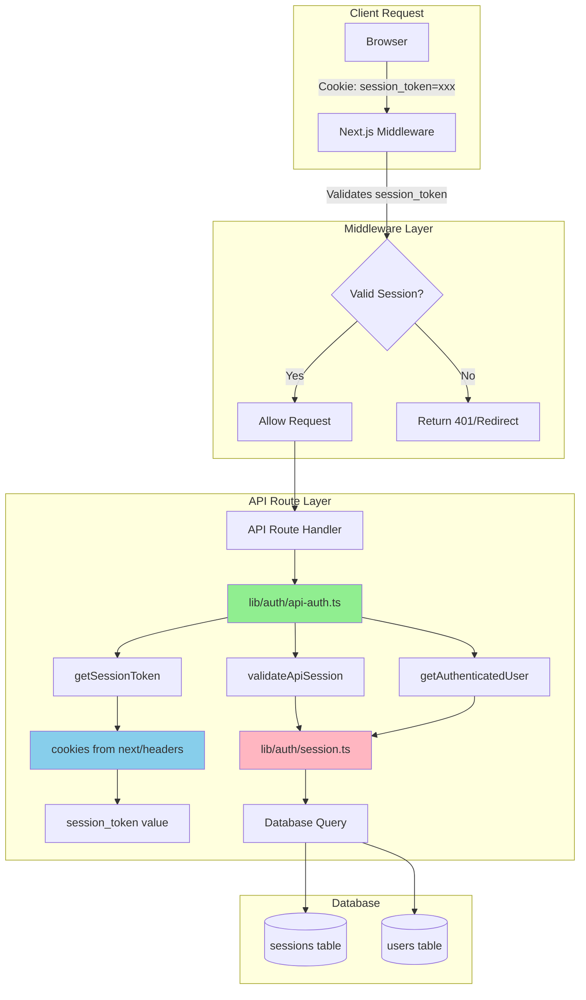

# Authentication Utilities Fix Plan

## Problem Analysis

### Current Issue
The application has an **authentication inconsistency** where:

1. **Middleware** and most API routes correctly use `session_token` as the cookie name
2. **Chat-related routes** incorrectly look for `session=` in manual cookie parsing
3. This causes 401 errors on chat endpoints despite valid authentication

### Evidence from Logs
```
🔒 [MIDDLEWARE] Request: GET /api/chat/agents
   ✅ Valid session found - User ID: SOX1Kz2wo0pWwybc
   ✅ Access granted to: /api/chat/agents

[API /api/chat/agents] Cookie header: {
  cookieHeader: 'session_token=cTxQ_P_UiJSk-cSKmPBloY4lnOZhVbT7'
}
[API /api/chat/agents] Session token: {
  hasToken: false  // ❌ Looking for 'session=' instead of 'session_token='
}
[API /api/chat/agents] No session token, returning 401
```

## Root Cause

### Affected Files
- [`app/api/chat/agents/route.ts`](../app/api/chat/agents/route.ts:21) - Line 21: `session=([^;]+)`
- [`app/api/chat/sessions/route.ts`](../app/api/chat/sessions/route.ts:20) - Line 20: `session=([^;]+)`
- [`app/api/chat/sessions/[id]/messages/route.ts`](../app/api/chat/sessions/[id]/messages/route.ts:16) - Line 16: `session=([^;]+)`

### Correct Implementation (Used by Other Routes)
```typescript
// ✅ Correct approach used in /api/auth/me, /api/workspaces, etc.
import { cookies } from 'next/headers'

const cookieStore = await cookies()
const sessionToken = cookieStore.get('session_token')?.value
```

### Incorrect Implementation (Used in Chat Routes)
```typescript
// ❌ Wrong approach - manual parsing with wrong cookie name
const sessionToken = request.headers.get('cookie')?.match(/session=([^;]+)/)?.[1]
```

## Solution Architecture

### 1. Create Global Authentication Utilities

Create a new utility module at [`lib/auth/api-auth.ts`](../lib/auth/api-auth.ts) that provides:

```typescript
/**
 * Global authentication utilities for API routes
 * Provides consistent session validation across all endpoints
 */

// Extract session token from cookies using Next.js helper
export async function getSessionToken(): Promise<string | null>

// Validate session and return session data
export async function validateApiSession(): Promise<Session | null>

// Get authenticated user from session
export async function getAuthenticatedUser(): Promise<User | null>

// Get user with workspace context
export async function getUserWithWorkspace(): Promise<{
  user: User
  session: Session
  workspaceId: string
} | null>

// Unified error responses
export function unauthorizedResponse(message?: string): NextResponse
export function forbiddenResponse(message?: string): NextResponse
```

### 2. Architecture Diagram



### 3. Implementation Steps

#### Step 1: Create Global Authentication Utility

**File:** [`lib/auth/api-auth.ts`](../lib/auth/api-auth.ts)

```typescript
import { cookies } from 'next/headers'
import { NextResponse } from 'next/server'
import { getUserFromSession, validateSession } from './session.js'
import { getDatabase } from '../db/index.js'
import type { User, Session } from '../db/schema.js'

/**
 * Cookie name used throughout the application
 */
export const SESSION_COOKIE_NAME = 'session_token'

/**
 * Extract session token from cookies using Next.js helper
 * This is the ONLY correct way to read cookies in API routes
 */
export async function getSessionToken(): Promise<string | null> {
  const cookieStore = await cookies()
  return cookieStore.get(SESSION_COOKIE_NAME)?.value || null
}

/**
 * Validate session and return session data
 */
export async function validateApiSession(): Promise<Session | null> {
  const token = await getSessionToken()
  if (!token) return null
  
  return validateSession(token)
}

/**
 * Get authenticated user from session
 */
export async function getAuthenticatedUser(): Promise<User | null> {
  const token = await getSessionToken()
  if (!token) return null
  
  return getUserFromSession(token)
}

/**
 * Get user with workspace context
 * Returns user, session, and current workspace ID
 */
export async function getUserWithWorkspace(): Promise<{
  user: User
  session: Session
  workspaceId: string
} | null> {
  const token = await getSessionToken()
  if (!token) return null
  
  const db = getDatabase()
  
  // Get session with workspace
  const session = db
    .prepare('SELECT * FROM sessions WHERE token = ? AND datetime(expires_at) > datetime("now")')
    .get(token) as Session | undefined
  
  if (!session || !session.current_workspace_id) return null
  
  // Get user
  const user = db
    .prepare('SELECT * FROM users WHERE id = ?')
    .get(session.user_id) as User | undefined
  
  if (!user) return null
  
  return {
    user,
    session,
    workspaceId: session.current_workspace_id
  }
}

/**
 * Unified unauthorized response
 */
export function unauthorizedResponse(message: string = 'Unauthorized'): NextResponse {
  return NextResponse.json({ error: message }, { status: 401 })
}

/**
 * Unified forbidden response
 */
export function forbiddenResponse(message: string = 'Forbidden'): NextResponse {
  return NextResponse.json({ error: message }, { status: 403 })
}

/**
 * Check if session cookie is present and correctly named
 * Useful for debugging authentication issues
 */
export async function debugSessionCookie(): Promise<{
  hasCookie: boolean
  cookieName: string
  tokenPreview?: string
}> {
  const token = await getSessionToken()
  return {
    hasCookie: !!token,
    cookieName: SESSION_COOKIE_NAME,
    tokenPreview: token ? `${token.substring(0, 10)}...` : undefined
  }
}
```

#### Step 2: Update Chat Agents Route

**File:** [`app/api/chat/agents/route.ts`](../app/api/chat/agents/route.ts)

**Changes:**
- Import authentication utilities
- Replace manual cookie parsing with `getUserWithWorkspace()`
- Remove redundant session validation code
- Use consistent error responses

```typescript
import { NextResponse } from 'next/server'
import { getDatabase } from '@/lib/db'
import { getGatewayManager } from '@/lib/gateway/manager'
import { getUserWithWorkspace, unauthorizedResponse } from '@/lib/auth/api-auth'
import type { AgentInfo } from '@/lib/db/schema'

export async function GET(request: Request) {
  console.log('[API /api/chat/agents] Starting request')
  
  try {
    // Use global auth utility - replaces 30+ lines of manual parsing
    const auth = await getUserWithWorkspace()
    
    if (!auth) {
      console.log('[API /api/chat/agents] No valid session or workspace')
      return unauthorizedResponse('Unauthorized or no workspace selected')
    }
    
    console.log('[API /api/chat/agents] Authenticated:', {
      userId: auth.user.id,
      workspaceId: auth.workspaceId
    })

    const db = getDatabase()
    const manager = getGatewayManager()

    // Get all gateways for the current workspace
    const gateways = db
      .prepare('SELECT * FROM gateways WHERE workspace_id = ? AND status = "connected"')
      .all(auth.workspaceId) as Array<{
        id: string
        name: string
        workspace_id: string
      }>

    // ... rest of the logic remains the same
  } catch (error) {
    console.error('[API /api/chat/agents] Fatal error:', error)
    return NextResponse.json(
      { error: 'Failed to fetch agents' },
      { status: 500 }
    )
  }
}
```

#### Step 3: Update Chat Sessions Route

**File:** [`app/api/chat/sessions/route.ts`](../app/api/chat/sessions/route.ts)

Apply same pattern to both GET and POST handlers.

#### Step 4: Update Chat Messages Route

**File:** [`app/api/chat/sessions/[id]/messages/route.ts`](../app/api/chat/sessions/[id]/messages/route.ts)

Apply same pattern to both GET and POST handlers.

### 4. Benefits of This Approach

1. **Consistency**: All routes use the same authentication method
2. **Maintainability**: Single source of truth for auth logic
3. **Type Safety**: TypeScript types for all auth responses
4. **Debugging**: Built-in debug utilities
5. **Best Practices**: Uses Next.js recommended `cookies()` helper
6. **DRY**: Eliminates code duplication across routes
7. **Error Handling**: Unified error responses

### 5. Testing Strategy

#### Manual Testing
1. Login to the application
2. Navigate to chat feature
3. Verify agents load successfully
4. Create a chat session
5. Send messages
6. Check browser DevTools for 401 errors (should be none)

#### Verification Points
- [ ] Middleware logs show valid session
- [ ] API routes log successful authentication
- [ ] No 401 errors in browser console
- [ ] Chat agents load correctly
- [ ] Chat sessions can be created
- [ ] Messages can be sent and received

### 6. Migration Checklist

- [ ] Create [`lib/auth/api-auth.ts`](../lib/auth/api-auth.ts)
- [ ] Update [`app/api/chat/agents/route.ts`](../app/api/chat/agents/route.ts)
- [ ] Update [`app/api/chat/sessions/route.ts`](../app/api/chat/sessions/route.ts)
- [ ] Update [`app/api/chat/sessions/[id]/messages/route.ts`](../app/api/chat/sessions/[id]/messages/route.ts)
- [ ] Test authentication flow
- [ ] Verify no regressions in other routes
- [ ] Update documentation

## Next Steps

After implementing this fix:

1. **Consider applying to other routes**: Review all API routes and migrate any that still use manual cookie parsing
2. **Add unit tests**: Create tests for the authentication utilities
3. **Add monitoring**: Log authentication failures for security monitoring
4. **Document patterns**: Update developer documentation with authentication best practices

## References

- [Next.js Cookies Documentation](https://nextjs.org/docs/app/api-reference/functions/cookies)
- [Next.js Authentication Guide](https://nextjs.org/docs/app/guides/authentication)
- Current middleware implementation: [`middleware.ts`](../middleware.ts)
- Session utilities: [`lib/auth/session.ts`](../lib/auth/session.ts)
