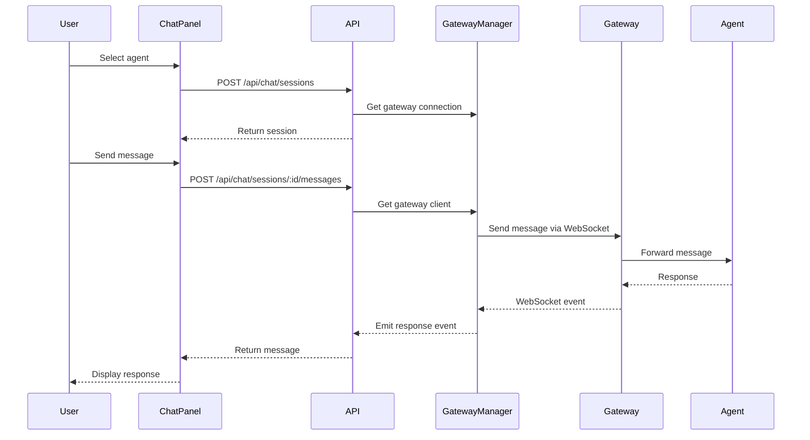

# Chat Feature Architecture Plan

## Overview
Add a chat panel on the right side of the dashboard that allows users to select and chat with agents from connected gateways using the OpenClaw Gateway protocol.

## Requirements
- Add a chat panel on the right side of the sidebar
- Display agent selector at the top showing agents in format: `gatewayname:agentname`
- Enable real-time chat with selected agent via WebSocket
- Persist chat history in database
- Support multiple concurrent chat sessions
- Follow OpenClaw agent communication protocol

## Research Findings

### OpenClaw Agent Communication Protocol
Based on analysis of `.openclaw/agents/coder/sessions/` and existing dashboards (Mission Control, Studio):

**Message Format:**
```typescript
{
  type: "message",
  id: string,
  parentId: string,
  timestamp: string,
  message: {
    role: "user" | "assistant" | "toolResult",
    content: Array<{
      type: "text" | "thinking" | "toolCall",
      text?: string,
      thinking?: string
    }>
  }
}
```

**Communication Flow:**
1. Browser → ClawAgentHub → Gateway (WebSocket)
2. Gateway → Agent (internal routing)
3. Agent → Gateway → ClawAgentHub → Browser (WebSocket events)

**Key Insights:**
- Agents are identified by their ID in the gateway
- Messages include sender metadata: `{ label: "openclaw-control-ui", id: "..." }`
- Sessions are stored as JSONL with sequential messages
- Real-time updates via WebSocket event listeners

## Architecture

### 1. Layout Structure

```
┌─────────────┬──────────────────────┬─────────────┐
│   Sidebar   │   Main Content       │ Chat Panel  │
│   (Left)    │   (Center)           │  (Right)    │
│             │                      │             │
│  - Dashboard│                      │ ┌─────────┐ │
│  - Gateways │                      │ │ Agent   │ │
│  - Settings │                      │ │ Selector│ │
│  - Profile  │                      │ └─────────┘ │
│             │                      │             │
│             │                      │ ┌─────────┐ │
│             │                      │ │ Chat    │ │
│             │                      │ │ Messages│ │
│             │                      │ │         │ │
│             │                      │ └─────────┘ │
│             │                      │             │
│             │                      │ ┌─────────┐ │
│             │                      │ │ Input   │ │
│             │                      │ └─────────┘ │
└─────────────┴──────────────────────┴─────────────┘
```

### 2. Component Structure

#### New Components
- [`ChatPanel`](components/chat/chat-panel.tsx) - Main container for chat UI
- [`AgentSelector`](components/chat/agent-selector.tsx) - Dropdown to select gateway:agent
- [`ChatMessages`](components/chat/chat-messages.tsx) - Display chat history
- [`ChatInput`](components/chat/chat-input.tsx) - Input field for sending messages
- [`ChatMessage`](components/chat/chat-message.tsx) - Individual message component

#### Modified Components
- [`DashboardLayout`](components/layout/dashboard-layout.tsx) - Add ChatPanel to layout

### 3. Database Schema

#### New Tables

**chat_sessions**
```sql
CREATE TABLE chat_sessions (
  id TEXT PRIMARY KEY,
  workspace_id TEXT NOT NULL,
  user_id TEXT NOT NULL,
  gateway_id TEXT NOT NULL,
  agent_id TEXT NOT NULL,
  agent_name TEXT NOT NULL,
  created_at TEXT NOT NULL,
  updated_at TEXT NOT NULL,
  FOREIGN KEY (workspace_id) REFERENCES workspaces(id),
  FOREIGN KEY (user_id) REFERENCES users(id),
  FOREIGN KEY (gateway_id) REFERENCES gateways(id)
);
```

**chat_messages**
```sql
CREATE TABLE chat_messages (
  id TEXT PRIMARY KEY,
  session_id TEXT NOT NULL,
  role TEXT NOT NULL CHECK(role IN ('user', 'agent', 'system')),
  content TEXT NOT NULL,
  metadata TEXT, -- JSON for additional data
  created_at TEXT NOT NULL,
  FOREIGN KEY (session_id) REFERENCES chat_sessions(id) ON DELETE CASCADE
);
```

### 4. API Endpoints

#### GET [`/api/chat/agents`](app/api/chat/agents/route.ts)
Fetch all available agents from connected gateways
- Response: `{ agents: Array<{ gatewayId, gatewayName, agentId, agentName }> }`

#### GET [`/api/chat/sessions`](app/api/chat/sessions/route.ts)
Get all chat sessions for current user/workspace
- Response: `{ sessions: ChatSession[] }`

#### POST [`/api/chat/sessions`](app/api/chat/sessions/route.ts)
Create a new chat session
- Body: `{ gatewayId, agentId, agentName }`
- Response: `{ session: ChatSession }`

#### GET [`/api/chat/sessions/[id]/messages`](app/api/chat/sessions/[id]/messages/route.ts)
Get messages for a specific session
- Response: `{ messages: ChatMessage[] }`

#### POST [`/api/chat/sessions/[id]/messages`](app/api/chat/sessions/[id]/messages/route.ts)
Send a message to an agent
- Body: `{ content: string }`
- Response: `{ message: ChatMessage }`

#### WebSocket Events
Use existing gateway WebSocket connection to receive agent responses in real-time

### 5. State Management

#### TanStack Query Hooks

**[`useAgents`](lib/query/hooks/useAgents.ts)**
```typescript
export function useAgents() {
  return useQuery({
    queryKey: ['chat', 'agents'],
    queryFn: async () => {
      const res = await fetch('/api/chat/agents')
      return res.json()
    },
    refetchInterval: 30000, // Refresh every 30s
  })
}
```

**[`useChatSession`](lib/query/hooks/useChatSession.ts)**
```typescript
export function useChatSession(sessionId: string | null) {
  return useQuery({
    queryKey: ['chat', 'session', sessionId],
    queryFn: async () => {
      if (!sessionId) return null
      const res = await fetch(`/api/chat/sessions/${sessionId}/messages`)
      return res.json()
    },
    enabled: !!sessionId,
  })
}
```

**[`useSendMessage`](lib/query/hooks/useSendMessage.ts)**
```typescript
export function useSendMessage() {
  const queryClient = useQueryClient()
  
  return useMutation({
    mutationFn: async ({ sessionId, content }: { sessionId: string, content: string }) => {
      const res = await fetch(`/api/chat/sessions/${sessionId}/messages`, {
        method: 'POST',
        headers: { 'Content-Type': 'application/json' },
        body: JSON.stringify({ content }),
      })
      return res.json()
    },
    onSuccess: (_, { sessionId }) => {
      queryClient.invalidateQueries({ queryKey: ['chat', 'session', sessionId] })
    },
  })
}
```

### 6. Gateway Integration

#### Agent Communication Flow



### 7. Implementation Steps

#### Phase 1: Database & Schema
1. Create migration file for chat tables
2. Update schema.ts with new types
3. Run migration script

#### Phase 2: Backend API
1. Create `/api/chat/agents` endpoint
2. Create `/api/chat/sessions` endpoints
3. Create `/api/chat/sessions/[id]/messages` endpoints
4. Add agent communication methods to GatewayClient
5. Implement WebSocket event handling for agent responses

#### Phase 3: Frontend Components
1. Create ChatPanel component structure
2. Create AgentSelector with gateway:agent format
3. Create ChatMessages display component
4. Create ChatInput component
5. Add TanStack Query hooks for chat

#### Phase 4: Integration
1. Update DashboardLayout to include ChatPanel
2. Wire up WebSocket events for real-time updates
3. Add error handling and loading states
4. Style components to match theme

#### Phase 5: Testing & Polish
1. Test with connected gateways
2. Test message sending/receiving
3. Test session persistence
4. Add loading indicators
5. Add error messages
6. Polish UI/UX

### 8. Technical Considerations

#### Agent Message Protocol
Based on OpenClaw protocol research from agent sessions and existing dashboards:

```typescript
// Send message to agent via sessions.send
await gatewayClient.call('sessions.send', {
  sessionKey: 'agent:agentId:main', // Format: agent:{agentId}:main
  message: {
    role: 'user',
    content: [
      {
        type: 'text',
        text: 'Hello agent!'
      }
    ]
  },
  metadata: {
    label: 'openclaw-control-ui',
    id: 'clawhub-dashboard'
  }
})
```

#### Real-time Updates
Listen for message events from agents:

```typescript
gatewayClient.onEvent('message', (data) => {
  // data structure:
  // {
  //   type: 'message',
  //   id: string,
  //   parentId: string,
  //   timestamp: string,
  //   message: {
  //     role: 'assistant' | 'user' | 'toolResult',
  //     content: Array<{
  //       type: 'text' | 'thinking' | 'toolCall',
  //       text?: string,
  //       thinking?: string
  //     }>
  //   }
  // }
  
  // Handle incoming agent message
  // Update chat UI with new message
})
```

**Protocol Notes:**
- Session keys follow format: `agent:{agentId}:main`
- Messages support multiple content types (text, thinking, toolCall)
- Include sender metadata for tracking
- Agent responses may include thinking traces

#### Session Management
- Each chat session is tied to a specific gateway and agent
- Sessions persist across page refreshes
- Users can have multiple active sessions
- Session history is stored in database

#### Error Handling
- Handle gateway disconnections gracefully
- Show error states when agent is unavailable
- Retry failed messages
- Display connection status

### 9. UI/UX Design

#### Chat Panel Width
- Default: 320px
- Collapsible: Yes (can hide/show)
- Resizable: Optional future enhancement

#### Agent Selector Format
```
Gateway Name: Agent Name
─────────────────────────
Gateway1: Agent1
Gateway1: Agent2
Gateway2: Agent1
Gateway2: Agent3
```

#### Message Display
- User messages: Right-aligned, blue background
- Agent messages: Left-aligned, gray background
- System messages: Centered, italic
- Timestamps: Small text below each message
- Auto-scroll to latest message

#### Theme Integration
- Use existing CSS variables for colors
- Match sidebar styling
- Support light/dark themes
- Consistent with existing UI components

### 10. Future Enhancements

- Multiple concurrent chat sessions (tabs)
- Chat history search
- Export chat transcripts
- File attachments
- Code syntax highlighting in messages
- Agent typing indicators
- Message reactions
- Chat session sharing
