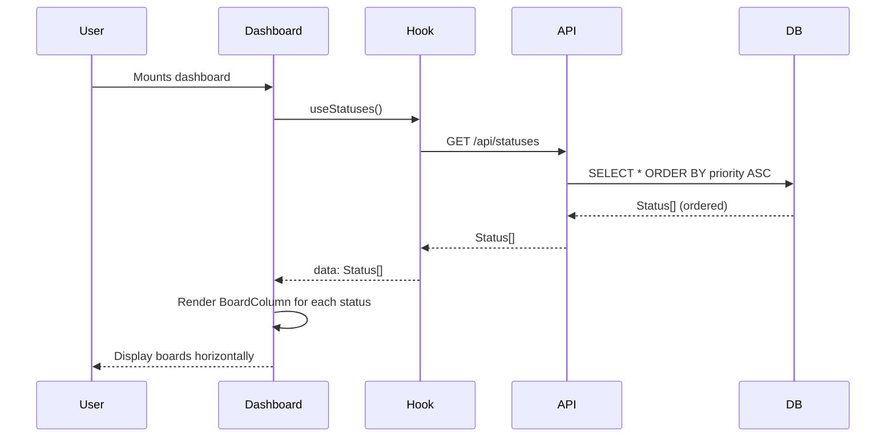

# Dashboard Status Boards Integration Plan

## Overview
This plan outlines the integration of status data into the dashboard, adding priority ordering, and implementing Trello-style horizontal overflow scrolling.

## Architecture Diagram

```mermaid
flowchart TB
    subgraph Database
        ST[statuses table]
        ST --> |id, name, color, description, workspace_id, priority| API1
    end

    subgraph API Layer
        API1[GET /api/statuses]
        API2[POST /api/statuses]
        API3[PUT /api/statuses/:id]
        API1 --> |Status[] ordered by priority ASC| HOOK
    end

    subgraph React Query Layer
        HOOK[useStatuses hook]
        HOOK --> |data: Status[]| DASH
        HOOK --> |createStatus, updateStatus| MODAL
    end

    subgraph Components
        DASH[DashboardPageContent]
        BOARD[BoardColumn]
        LIST[StatusList]
        CARD[StatusCard]
        MODAL[StatusModal]
        FORM[StatusForm]
    end

    DASH --> |renders| BOARD
    BOARD --> |displays| ST
    LIST --> |renders| CARD
    MODAL --> |contains| FORM
    FORM --> |submits to| API2
    FORM --> |submits to| API3

    style DASH fill:#e1f5fe
    style BOARD fill:#fff3e0
    style ST fill:#c8e6c9
```

## Current State Analysis

### Existing Dashboard (dashboard-content.tsx)
- Uses hardcoded board array: `[{ id: '1', title: 'To Do', color: '#ef4444' }, ...]`
- Supports drag-and-drop board reordering
- Has basic overflow-x-auto on container
- No connection to status data

### Existing Status Feature
- Database table: `statuses (id, name, color, description, workspace_id)`
- API routes: GET, POST, PUT, DELETE `/api/statuses`
- React Query hook: `useStatuses()`
- UI components: StatusList, StatusCard, StatusModal
- **Missing:** priority field for ordering

## Implementation Plan

### Phase 1: Database Schema Changes

#### 1.1 Create Migration: `016_add_status_priority.sql`
```sql
-- Add priority column to statuses table
-- Lower priority numbers appear first on the dashboard
ALTER TABLE statuses ADD COLUMN priority INTEGER DEFAULT 999;

-- Update existing statuses with sensible defaults
-- 'To Do' = 1, 'In Progress' = 2, 'Done' = 3, others = 999
UPDATE statuses SET priority = CASE 
    WHEN LOWER(name) = 'to do' THEN 1
    WHEN LOWER(name) = 'in progress' THEN 2
    WHEN LOWER(name) = 'done' THEN 3
    ELSE 999
END;

-- Create index for priority-based queries
CREATE INDEX IF NOT EXISTS idx_statuses_priority ON statuses(priority);
```

#### 1.2 Update Schema Types (lib/db/schema.ts)
- Add `priority: number` to `Status` interface
- Add `priority?: number` to `StatusInsert` interface
- Add `priority?: number` to `StatusUpdate` interface

### Phase 2: API Layer Updates

#### 2.1 Update GET /api/statuses Route
- Change `ORDER BY created_at ASC` to `ORDER BY priority ASC`

#### 2.2 Update POST /api/statuses Route
- Accept `priority` in request body
- Default to `999` if not provided (places new statuses at the end)
- Validate priority is a positive integer

#### 2.3 Update PUT /api/statuses/[id] Route
- Accept `priority` in request body
- Allow reordering by changing priority values

### Phase 3: React Query Hooks Updates

#### 3.1 Update useStatuses Hook (lib/query/hooks/useStatuses.ts)
- Add `priority?: number` to createStatus mutation parameters
- Add `priority?: number` to updateStatus mutation parameters

### Phase 4: Status Management UI Updates

#### 4.1 Update Seeder (lib/db/seeder.ts)
- Add priority to `DefaultStatus` interface
- Set priorities: To Do = 1, In Progress = 2, Done = 3

#### 4.2 Update StatusCard Component
- Display priority badge/indicator
- Show priority number for easy identification

#### 4.3 Update StatusForm Component
- Add priority input field (number input)
- Set default value to 999
- Add validation for positive integers

#### 4.4 Update StatusModal Component
- Pass priority to/from form
- Handle priority in edit mode

### Phase 5: Dashboard Integration

#### 5.1 Update DashboardPageContent (components/pages/dashboard-content.tsx)
Key changes:
1. Import and use `useStatuses` hook
2. Replace hardcoded `boards` state with statuses from query
3. Map `Status` type to board display properties
4. Add loading skeleton while fetching
5. Add error state with retry option

Before:
```typescript
const [boards, setBoards] = useState<Board[]>([
  { id: '1', title: 'To Do', color: '#ef4444' },
  ...
])
```

After:
```typescript
const { data: statuses = [], isLoading, error, refetch } = useStatuses()
// statuses is already ordered by priority ASC from API
```

#### 5.2 Horizontal Overflow Implementation (Trello-style)
Update the board container CSS:
```css
/* Container */
.boards-container {
  display: flex;
  gap: 1rem;
  overflow-x: auto;
  overflow-y: hidden;
  padding-bottom: 1rem; /* Space for scrollbar */
  min-height: 0; /* Allow flex child to shrink */
  /* Custom scrollbar styling */
  scrollbar-width: thin;
  scrollbar-color: rgb(var(--border-color)) transparent;
}

/* Webkit scrollbar */
.boards-container::-webkit-scrollbar {
  height: 8px;
}
.boards-container::-webkit-scrollbar-track {
  background: transparent;
}
.boards-container::-webkit-scrollbar-thumb {
  background-color: rgb(var(--border-color));
  border-radius: 4px;
}
```

### Phase 6: BoardColumn Component Updates

#### 6.1 Update BoardColumn Props
- Accept partial `Status` type instead of separate properties
- Or update to match new status structure

#### 6.2 Maintain Drag-and-Drop
- Ensure drag-reordering still works with overflow
- Test scroll behavior during drag operations

## Data Flow



## File Changes Summary

| File | Changes |
|------|---------|
| `lib/db/migrations/016_add_status_priority.sql` | NEW - Add priority column |
| `lib/db/schema.ts` | Add priority to Status, StatusInsert, StatusUpdate |
| `lib/db/index.ts` | Add 016 migration to runMigrations array |
| `lib/db/seeder.ts` | Add priority to DefaultStatus interface and values |
| `app/api/statuses/route.ts` | Handle priority in GET (ORDER BY) and POST |
| `app/api/statuses/[id]/route.ts` | Handle priority in PUT |
| `lib/query/hooks/useStatuses.ts` | Add priority to mutations |
| `components/status/status-card.tsx` | Display priority badge |
| `components/status/status-form.tsx` | Add priority input |
| `components/status/status-modal.tsx` | Pass priority to/from form |
| `components/pages/dashboard-content.tsx` | Use statuses instead of hardcoded boards |
| `components/board/board-column.tsx` | Update props if needed |

## CSS Changes for Horizontal Overflow

The key CSS classes needed for Trello-style horizontal scrolling:

```css
/* Parent container - full height */
.dashboard-boards-wrapper {
  height: 100%;
  display: flex;
  flex-direction: column;
}

/* Scrollable boards container */
.dashboard-boards {
  display: flex;
  gap: 1rem;
  overflow-x: auto;
  overflow-y: hidden;
  padding: 0.5rem 0.5rem 1rem 0.5rem; /* Bottom padding for scrollbar */
  min-height: 0; /* Important for flex scrolling */
  flex: 1;
}

/* Each board column */
.board-column {
  flex-shrink: 0; /* Don't shrink below width */
  width: 20rem; /* Fixed width like Trello */
}
```

## Edge Cases to Handle

1. **No statuses in workspace**: Show empty state with message
2. **Statuses with same priority**: Fall back to created_at for secondary sort
3. **Reordering boards**: Allow changing priority to reorder
4. **Overflow on small screens**: Ensure horizontal scroll works on mobile
5. **Drag with overflow**: Test that drag-drop still works with scrolled content

## Testing Checklist

- [ ] Migration runs successfully
- [ ] Existing statuses get correct priority values
- [ ] New statuses can be created with custom priority
- [ ] Status priority can be updated
- [ ] Dashboard displays boards ordered by priority
- [ ] Horizontal scroll appears when boards overflow
- [ ] Horizontal scroll works on mobile/touch devices
- [ ] Drag-drop reordering still works
- [ ] Loading state shows on dashboard
- [ ] Error state shows on dashboard with retry
- [ ] Custom scrollbar styling appears correctly
