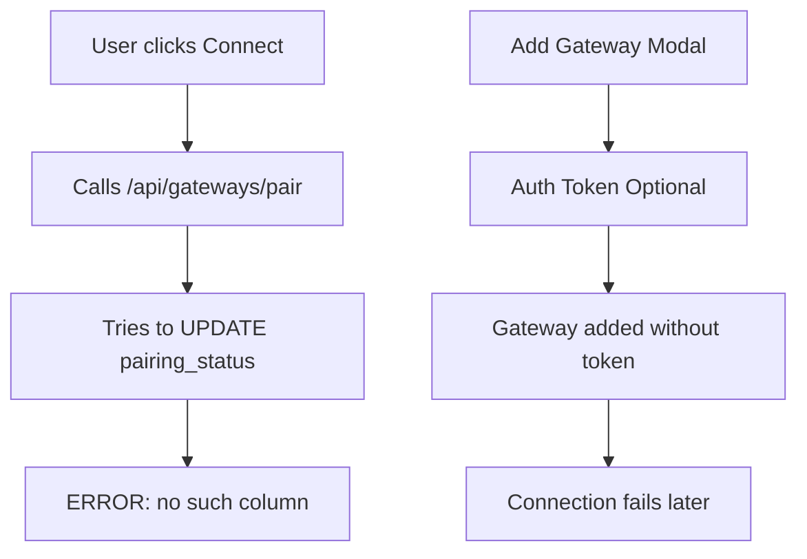
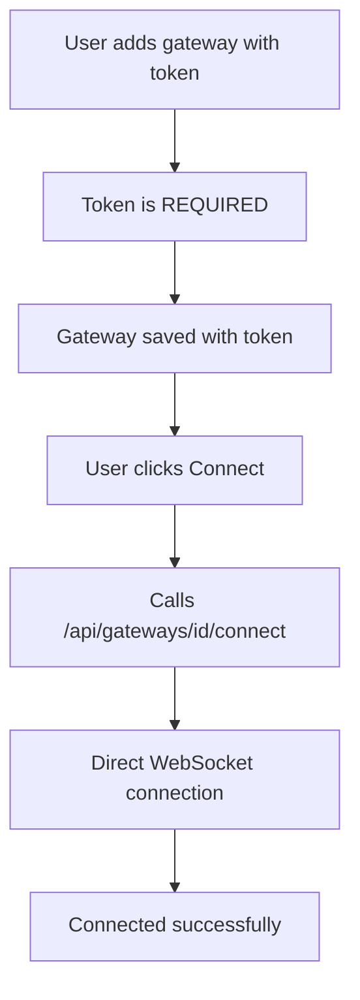

# Fix Gateway Connection Errors - Implementation Plan

## Problem Summary

The ClawAgentHub application is experiencing gateway connection errors due to:

1. **Database Schema Mismatch**: The code references `pairing_status` column that doesn't exist after migration 009
2. **Deprecated Pairing Flow**: The UI still shows the complex device pairing modal instead of simple token-based connection
3. **Optional Token Field**: The add gateway form makes auth token optional, but it should be required

### Error Message
```
Error: no such column: pairing_status
```

This occurs because:
- Migration 009 removed the `pairing_status` column
- Old API routes (`/api/gateways/pair`, `/api/gateways/connect-with-token`) still try to UPDATE this column
- The pairing modal polls `/api/gateways/[id]/pairing-status` which queries this column

---

## Current Architecture Issues



## Target Architecture



---

## Implementation Plan

### Phase 1: Database Migration ✅ (Already Created)

**Status**: Migration file exists but needs to be applied

**File**: [`lib/db/migrations/009_remove_device_pairing.sql`](../lib/db/migrations/009_remove_device_pairing.sql)

**Action Required**:
```bash
npm run script scripts/apply-migration-009.ts
```

This will:
- Remove `device_id`, `device_key`, `device_public_key`, `device_private_key`, `pairing_status` columns
- Keep only: `id`, `workspace_id`, `name`, `url`, `auth_token`, `status`, timestamps
- Set placeholder token for gateways without one

---

### Phase 2: Fix API Routes

#### 2.1 Fix `/api/gateways/pair/route.ts`

**Problem**: References `pairing_status` column (lines 94, 107)

**Solution**: Delete this file entirely - it's replaced by [`/api/gateways/[id]/connect/route.ts`](../app/api/gateways/[id]/connect/route.ts)

**File to delete**: `app/api/gateways/pair/route.ts`

#### 2.2 Fix `/api/gateways/connect-with-token/route.ts`

**Problem**: References `pairing_status` column (line 140)

**Solution**: Either delete or update to remove `pairing_status` reference

**Current code** (line 139-141):
```typescript
db.prepare(
  'UPDATE gateways SET status = ?, pairing_status = ?, last_connected_at = ?, last_error = NULL, updated_at = ? WHERE id = ?'
).run('connected', 'approved', new Date().toISOString(), new Date().toISOString(), gatewayId)
```

**Fixed code**:
```typescript
db.prepare(
  'UPDATE gateways SET status = ?, last_connected_at = ?, last_error = NULL, updated_at = ? WHERE id = ?'
).run('connected', new Date().toISOString(), new Date().toISOString(), gatewayId)
```

#### 2.3 Delete `/api/gateways/[id]/pairing-status/route.ts`

**Problem**: Queries `pairing_status` column (line 65)

**Solution**: Delete this file - no longer needed with token-only auth

**File to delete**: `app/api/gateways/[id]/pairing-status/route.ts`

#### 2.4 Verify `/api/gateways/[id]/connect/route.ts`

**Status**: ✅ Already correct - doesn't reference `pairing_status`

This is the new simplified endpoint that should be used.

---

### Phase 3: Update Frontend Components

#### 3.1 Update Add Gateway Modal

**File**: [`components/gateway/add-gateway-modal.tsx`](../components/gateway/add-gateway-modal.tsx)

**Changes**:

1. **Make auth token REQUIRED** (line 151):
```typescript
// BEFORE
<label htmlFor="auth-token" className="block text-sm font-medium text-gray-700 mb-1">
  Auth Token (Optional)
</label>
<Input
  id="auth-token"
  type="password"
  value={authToken}
  onChange={(e) => setAuthToken(e.target.value)}
  placeholder="Enter auth token if required"
  disabled={loading}
/>

// AFTER
<label htmlFor="auth-token" className="block text-sm font-medium text-gray-700 mb-1">
  Auth Token <span className="text-red-500">*</span>
</label>
<Input
  id="auth-token"
  type="password"
  value={authToken}
  onChange={(e) => setAuthToken(e.target.value)}
  placeholder="Enter gateway token"
  required
  disabled={loading}
/>
<p className="mt-1 text-xs text-gray-500">
  Find this in your OpenClaw config: <code className="bg-gray-100 px-1 rounded">gateway.auth.token</code>
</p>
```

2. **Update submit handler** (line 43):
```typescript
// BEFORE
authToken: authToken.trim() || null,

// AFTER
authToken: authToken.trim(),
```

3. **Add validation**:
```typescript
if (!authToken.trim()) {
  setError('Auth token is required')
  setLoading(false)
  return
}
```

#### 3.2 Update Gateways Page

**File**: [`app/gateways/page.tsx`](../app/gateways/page.tsx)

**Changes**:

1. **Update handleConnect function** (line 23-43):
```typescript
// BEFORE - calls /api/gateways/pair
const handleConnect = async (gateway: Gateway) => {
  try {
    const response = await fetch('/api/gateways/pair', {
      method: 'POST',
      headers: { 'Content-Type': 'application/json' },
      body: JSON.stringify({ gatewayId: gateway.id }),
    })

    const data = await response.json()

    if (response.ok && data.status === 'connected') {
      await refresh()
    } else {
      setPairingGateway(gateway)
    }
  } catch (error) {
    alert(error instanceof Error ? error.message : 'Failed to connect to gateway')
  }
}

// AFTER - calls /api/gateways/[id]/connect
const handleConnect = async (gateway: Gateway) => {
  try {
    const response = await fetch(`/api/gateways/${gateway.id}/connect`, {
      method: 'POST',
    })

    const data = await response.json()

    if (response.ok) {
      await refresh()
    } else {
      alert(data.message || 'Failed to connect to gateway')
    }
  } catch (error) {
    alert(error instanceof Error ? error.message : 'Failed to connect to gateway')
  }
}
```

2. **Remove pairing modal state** (line 21):
```typescript
// DELETE THIS LINE
const [pairingGateway, setPairingGateway] = useState<Gateway | null>(null)
```

3. **Remove pairing modal import** (line 7):
```typescript
// DELETE THIS LINE
import { PairingModal } from '@/components/gateway/pairing-modal'
```

4. **Remove pairing modal JSX** (lines 168-177):
```typescript
// DELETE THIS BLOCK
{pairingGateway && (
  <PairingModal
    isOpen={true}
    onClose={() => setPairingGateway(null)}
    gatewayName={pairingGateway.name}
    gatewayUrl={pairingGateway.url}
    gatewayId={pairingGateway.id}
    onSuccess={handlePairingSuccess}
  />
)}
```

5. **Remove handlePairingSuccess** (lines 55-58):
```typescript
// DELETE THIS FUNCTION
const handlePairingSuccess = () => {
  refresh()
}
```

#### 3.3 Deprecate Pairing Modal

**File**: [`components/gateway/pairing-modal.tsx`](../components/gateway/pairing-modal.tsx)

**Option 1**: Delete the file entirely (recommended)

**Option 2**: Keep for reference but add deprecation notice at top:
```typescript
/**
 * @deprecated This component is deprecated and should not be used.
 * Use direct token-based connection via /api/gateways/[id]/connect instead.
 * 
 * This file will be removed in a future version.
 */
```

---

### Phase 4: Delete Obsolete Files

#### Files to Delete:

1. **API Routes**:
   - `app/api/gateways/pair/route.ts` - Replaced by `[id]/connect`
   - `app/api/gateways/check-paired/route.ts` - No longer needed
   - `app/api/gateways/[id]/pairing-status/route.ts` - No longer needed
   - `app/api/gateways/connect-with-token/route.ts` - Functionality merged into `[id]/connect`

2. **Components**:
   - `components/gateway/pairing-modal.tsx` - No longer needed

3. **Migration Scripts** (old device identity related):
   - `scripts/migrate-device-identities.ts`
   - `scripts/fix-device-identity.ts`
   - `scripts/apply-migration-005.ts`
   - `scripts/apply-migration-006.ts`
   - `scripts/apply-migration-007.ts`

4. **Library Files**:
   - `lib/gateway/device-identity.ts` - Already removed in refactoring

---

### Phase 5: Testing

#### Test Checklist:

1. **Database Migration**:
   - [ ] Run migration script successfully
   - [ ] Verify `pairing_status` column removed
   - [ ] Verify existing gateways have tokens

2. **Add Gateway**:
   - [ ] Cannot submit without token
   - [ ] Token field shows as required
   - [ ] Gateway saved with token
   - [ ] No errors in console

3. **Connect Gateway**:
   - [ ] Click "Connect" button
   - [ ] No pairing modal appears
   - [ ] Direct connection attempt
   - [ ] Status updates to "connected"
   - [ ] No `pairing_status` errors

4. **Error Handling**:
   - [ ] Invalid token shows error
   - [ ] Connection timeout handled
   - [ ] Error message displayed to user

5. **Existing Gateways**:
   - [ ] Gateways with placeholder token show error
   - [ ] User can update token
   - [ ] Can connect after token update

---

## Migration Guide for Users

### For Existing Gateways

If you have existing gateways with placeholder tokens:

1. **Check current gateways**:
```bash
sqlite3 ~/.clawhub/clawhub.db "SELECT id, name, auth_token FROM gateways;"
```

2. **Update token for each gateway**:
```bash
sqlite3 ~/.clawhub/clawhub.db "UPDATE gateways SET auth_token = 'your-token-here' WHERE id = 'gateway-id';"
```

3. **Or delete and re-add** via UI with proper token

### OpenClaw Configuration Required

Your `.openclaw/openclaw.json` must have:

```json
{
  "gateway": {
    "auth": {
      "mode": "token",
      "token": "your-secret-token"
    },
    "controlUi": {
      "allowInsecureAuth": true,
      "allowedOrigins": [
        "http://localhost:7777"
      ]
    }
  }
}
```

---

## Benefits of This Fix

1. **Eliminates Errors**: No more `pairing_status` column errors
2. **Simpler UX**: Add gateway → Enter token → Connect (3 steps instead of 7)
3. **Faster**: Direct connection, no pairing approval needed
4. **Less Code**: Remove ~500 lines of pairing-related code
5. **Clearer**: Token auth is familiar to developers
6. **Maintainable**: Fewer edge cases and states to manage

---

## Rollback Plan

If issues arise:

1. **Database**: Keep backup before migration
2. **Code**: Git revert to previous commit
3. **Gradual**: Can keep old endpoints temporarily with feature flag

---

## Implementation Order

Execute in this order to avoid breaking changes:

1. ✅ Apply database migration
2. ✅ Fix/delete API routes (backend)
3. ✅ Update frontend components
4. ✅ Delete obsolete files
5. ✅ Test thoroughly
6. ✅ Update documentation

---

## Success Criteria

- [ ] No `pairing_status` errors in logs
- [ ] Can add gateway with required token
- [ ] Can connect directly without pairing modal
- [ ] Status updates correctly
- [ ] Error messages are clear
- [ ] All tests pass
- [ ] Documentation updated

---

## Next Steps

1. Review this plan
2. Confirm approach
3. Switch to Code mode to implement
4. Start with Phase 1 (apply migration)
5. Test each phase before proceeding
