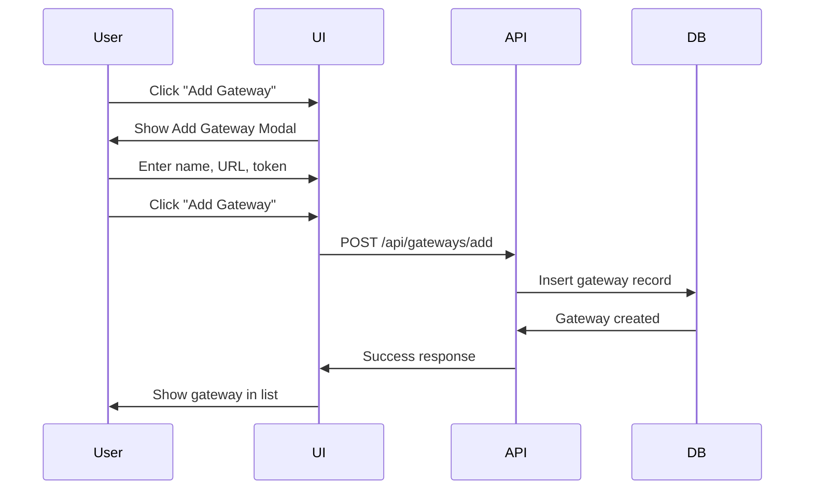
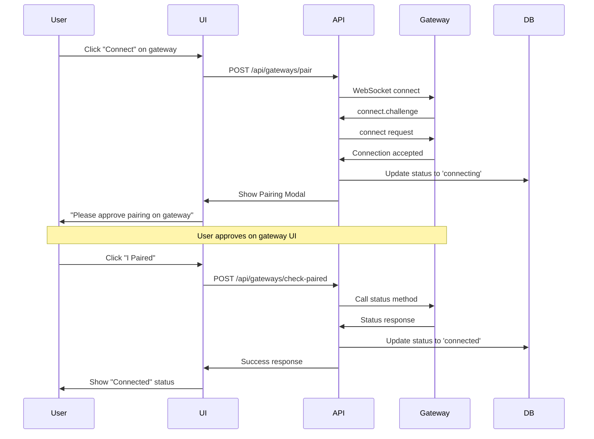

# Gateway Feature Architecture Plan

## Overview

Add OpenClaw Gateway management functionality to ClawAgentHub, allowing workspaces to connect, pair, and manage multiple gateways (localhost or remote).

## Research Summary

### OpenClaw Gateway Protocol
Based on research and Mission Control implementation:

**Connection Flow:**
1. WebSocket connection to gateway (default: `ws://127.0.0.1:18789`)
2. Server sends `connect.challenge` event with nonce
3. Client sends `connect` request with auth token and capabilities
4. Server responds with connection accepted
5. Client is authenticated and can make RPC calls

**Protocol Structure:**
```typescript
// Request frame
{ type: "req", id: string, method: string, params?: object }

// Response frame
{ type: "res", id: string, ok: boolean, payload?: object, error?: object }

// Event frame
{ type: "event", event: string, seq?: number, payload?: object }
```

**Key Methods:**
- `status` - Get gateway status
- `health` - Health check
- `agents.list` - List agents
- `chat.send` - Send message to agent
- `node.list` - List paired nodes

## Architecture Design

### 1. Database Schema

**New Migration: `004_add_gateways.sql`**

```sql
-- Gateways table
CREATE TABLE IF NOT EXISTS gateways (
  id TEXT PRIMARY KEY,
  workspace_id TEXT NOT NULL,
  name TEXT NOT NULL,
  url TEXT NOT NULL,
  auth_token TEXT,
  status TEXT DEFAULT 'disconnected', -- disconnected, connecting, connected, error
  last_connected_at DATETIME,
  last_error TEXT,
  created_at DATETIME DEFAULT CURRENT_TIMESTAMP,
  updated_at DATETIME DEFAULT CURRENT_TIMESTAMP,
  FOREIGN KEY (workspace_id) REFERENCES workspaces(id) ON DELETE CASCADE
);

CREATE INDEX idx_gateways_workspace_id ON gateways(workspace_id);

-- Gateway pairing requests (temporary storage for pairing flow)
CREATE TABLE IF NOT EXISTS gateway_pairing_requests (
  id TEXT PRIMARY KEY,
  gateway_id TEXT NOT NULL,
  request_id TEXT NOT NULL,
  status TEXT DEFAULT 'pending', -- pending, approved, rejected, expired
  created_at DATETIME DEFAULT CURRENT_TIMESTAMP,
  expires_at DATETIME,
  FOREIGN KEY (gateway_id) REFERENCES gateways(id) ON DELETE CASCADE
);

CREATE INDEX idx_gateway_pairing_requests_gateway_id ON gateway_pairing_requests(gateway_id);
```

**TypeScript Interfaces:**
```typescript
export interface Gateway {
  id: string
  workspace_id: string
  name: string
  url: string
  auth_token: string | null
  status: 'disconnected' | 'connecting' | 'connected' | 'error'
  last_connected_at: string | null
  last_error: string | null
  created_at: string
  updated_at: string
}

export interface GatewayPairingRequest {
  id: string
  gateway_id: string
  request_id: string
  status: 'pending' | 'approved' | 'rejected' | 'expired'
  created_at: string
  expires_at: string
}
```

### 2. Backend Components

#### A. Gateway Client Library
**File: `lib/gateway/client.ts`**

Adapted from Mission Control's openclaw-client.ts:
- WebSocket connection management
- Protocol frame handling
- Authentication flow
- RPC method calls
- Event listeners
- Auto-reconnect logic

```typescript
export class GatewayClient {
  constructor(url: string, authToken?: string)
  async connect(): Promise<void>
  disconnect(): void
  isConnected(): boolean
  async call(method: string, params?: unknown): Promise<unknown>
  onEvent(type: string, callback: EventCallback): () => void
  
  // Gateway-specific methods
  async status(): Promise<GatewayStatus>
  async health(): Promise<HealthStatus>
  async listAgents(): Promise<Agent[]>
  async sendMessage(sessionKey: string, message: string): Promise<void>
}
```

#### B. Gateway Manager
**File: `lib/gateway/manager.ts`**

Manages multiple gateway connections per workspace:
- Connection pool
- Status monitoring
- Automatic reconnection
- Connection lifecycle

```typescript
export class GatewayManager {
  private connections: Map<string, GatewayClient>
  
  async connectGateway(gateway: Gateway): Promise<void>
  disconnectGateway(gatewayId: string): void
  getConnection(gatewayId: string): GatewayClient | null
  getStatus(gatewayId: string): ConnectionStatus
  async testConnection(url: string, authToken?: string): Promise<boolean>
}
```

#### C. API Routes

**GET `/api/gateways`**
- List all gateways for current workspace
- Returns gateway info with connection status

**POST `/api/gateways/add`**
- Add new gateway to workspace
- Validates URL format
- Stores gateway configuration
- Does NOT connect yet (user initiates pairing)

**POST `/api/gateways/pair`**
- Initiate pairing with gateway
- Attempts connection
- Creates pairing request record
- Returns pairing status

**POST `/api/gateways/check-paired`**
- Check if gateway is connected and paired
- Updates gateway status in database
- Returns connection details

**DELETE `/api/gateways/:id`**
- Remove gateway from workspace
- Disconnects if connected
- Deletes from database

**GET `/api/gateways/:id/status`**
- Get real-time status of specific gateway
- Connection state, last error, etc.

**POST `/api/gateways/:id/test`**
- Test connection to gateway
- Returns health check result

### 3. Frontend Components

#### A. Gateway Management Page
**File: `app/gateways/page.tsx`**

Main gateway management interface:
- List of workspace gateways
- Add new gateway button
- Gateway cards showing:
  - Name
  - URL (localhost or remote)
  - Connection status (badge)
  - Last connected time
  - Actions (test, delete)

#### B. Add Gateway Modal
**File: `components/gateway/add-gateway-modal.tsx`**

Form to add new gateway:
- Gateway name input
- Connection type selector (localhost/remote)
- URL input (pre-filled for localhost: `ws://127.0.0.1:18789`)
- Auth token input (optional)
- "Add Gateway" button

#### C. Pairing Request Modal
**File: `components/gateway/pairing-modal.tsx`**

Modal shown during pairing process:
- Gateway name and URL display
- Pairing instructions:
  1. "Pairing request sent to gateway"
  2. "Please approve the pairing request on your gateway"
  3. "Check your gateway's UI or logs for the approval prompt"
- "I Paired" button at bottom
- Loading state while checking
- Success/error feedback

#### D. Gateway Card Component
**File: `components/gateway/gateway-card.tsx`**

Individual gateway display:
- Gateway icon
- Name and URL
- Status badge (connected/disconnected/error)
- Last connected timestamp
- Action buttons:
  - "Connect" (initiates pairing)
  - "Test Connection"
  - "Delete"

#### E. Gateway Status Badge
**File: `components/gateway/status-badge.tsx`**

Visual status indicator:
- Green: Connected
- Yellow: Connecting
- Red: Error
- Gray: Disconnected

### 4. User Flow

#### Adding a Gateway



#### Pairing Flow



### 5. Implementation Steps

#### Phase 1: Database & Schema
1. Create migration `004_add_gateways.sql`
2. Update `lib/db/schema.ts` with Gateway interfaces
3. Run migration
4. Test database structure

#### Phase 2: Gateway Client
1. Create `lib/gateway/client.ts` (adapt from Mission Control)
2. Implement WebSocket connection
3. Implement protocol handling
4. Add authentication flow
5. Add RPC methods
6. Test connection to local gateway

#### Phase 3: Gateway Manager
1. Create `lib/gateway/manager.ts`
2. Implement connection pool
3. Add status monitoring
4. Add reconnection logic
5. Test with multiple gateways

#### Phase 4: API Routes
1. Create `/api/gateways/route.ts` (GET list)
2. Create `/api/gateways/add/route.ts` (POST add)
3. Create `/api/gateways/pair/route.ts` (POST pair)
4. Create `/api/gateways/check-paired/route.ts` (POST check)
5. Create `/api/gateways/[id]/route.ts` (DELETE)
6. Create `/api/gateways/[id]/status/route.ts` (GET status)
7. Create `/api/gateways/[id]/test/route.ts` (POST test)
8. Test all endpoints

#### Phase 5: UI Components
1. Create `components/gateway/status-badge.tsx`
2. Create `components/gateway/gateway-card.tsx`
3. Create `components/gateway/add-gateway-modal.tsx`
4. Create `components/gateway/pairing-modal.tsx`
5. Create `app/gateways/page.tsx`
6. Add "Gateways" link to sidebar navigation
7. Test UI flow

#### Phase 6: Integration & Testing
1. Test adding localhost gateway
2. Test adding remote gateway
3. Test pairing flow
4. Test connection status updates
5. Test multiple gateways per workspace
6. Test workspace isolation (gateways per workspace)
7. Test error handling
8. Test reconnection logic

### 6. Technical Considerations

#### WebSocket in Next.js
- Client-side WebSocket connections only
- Use `useEffect` for connection lifecycle
- Handle reconnection on component mount
- Clean up connections on unmount

#### Connection Management
- Keep connections alive with heartbeat
- Auto-reconnect on disconnect
- Timeout handling (10s for initial connection)
- Error recovery

#### Security
- Validate gateway URLs (prevent SSRF)
- Secure auth token storage
- Workspace isolation (users can only access their workspace's gateways)
- Input validation on all forms

#### Performance
- Lazy connection (don't connect all gateways on page load)
- Connection pooling
- Efficient status polling
- Debounce status checks

### 7. Dependencies

**New Dependencies:**
```json
{
  "dependencies": {
    "ws": "^8.18.0"
  },
  "devDependencies": {
    "@types/ws": "^8.5.0"
  }
}
```

### 8. File Structure

```
githubprojects/clawhub/
├── lib/
│   ├── db/
│   │   ├── migrations/
│   │   │   └── 004_add_gateways.sql ✨ NEW
│   │   └── schema.ts ✏️ UPDATED
│   └── gateway/
│       ├── client.ts ✨ NEW
│       └── manager.ts ✨ NEW
├── components/
│   └── gateway/
│       ├── status-badge.tsx ✨ NEW
│       ├── gateway-card.tsx ✨ NEW
│       ├── add-gateway-modal.tsx ✨ NEW
│       └── pairing-modal.tsx ✨ NEW
├── app/
│   ├── gateways/
│   │   └── page.tsx ✨ NEW
│   └── api/
│       └── gateways/
│           ├── route.ts ✨ NEW (GET list)
│           ├── add/
│           │   └── route.ts ✨ NEW
│           ├── pair/
│           │   └── route.ts ✨ NEW
│           ├── check-paired/
│           │   └── route.ts ✨ NEW
│           └── [id]/
│               ├── route.ts ✨ NEW (DELETE)
│               ├── status/
│               │   └── route.ts ✨ NEW
│               └── test/
│                   └── route.ts ✨ NEW
└── components/
    └── layout/
        └── sidebar.tsx ✏️ UPDATED (add Gateways link)
```

### 9. Testing Checklist

- [ ] Database migration runs successfully
- [ ] Can add gateway with localhost URL
- [ ] Can add gateway with remote URL
- [ ] Pairing modal appears on connect
- [ ] "I Paired" button checks connection
- [ ] Connection status updates correctly
- [ ] Can delete gateway
- [ ] Multiple gateways per workspace work
- [ ] Workspace isolation works (can't see other workspace's gateways)
- [ ] Reconnection works after disconnect
- [ ] Error messages display correctly
- [ ] Auth token is stored securely
- [ ] URL validation prevents invalid URLs

### 10. Future Enhancements

- Gateway health monitoring dashboard
- Real-time event streaming from gateway
- Gateway logs viewer
- Agent management through gateway
- Chat interface with gateway agents
- Gateway metrics and usage stats
- Bulk gateway operations
- Gateway templates (common configurations)
- Gateway sharing between workspace members
- Gateway activity logs

## Summary

This architecture provides:
- ✅ Complete gateway management per workspace
- ✅ Support for localhost and remote gateways
- ✅ Intuitive pairing flow with modal
- ✅ Real-time connection status
- ✅ Secure authentication
- ✅ Scalable for multiple gateways
- ✅ Clean separation of concerns
- ✅ Follows ClawAgentHub patterns

The implementation follows ClawAgentHub's existing patterns (workspace-based, session auth, migration system) and integrates seamlessly with the current architecture.
