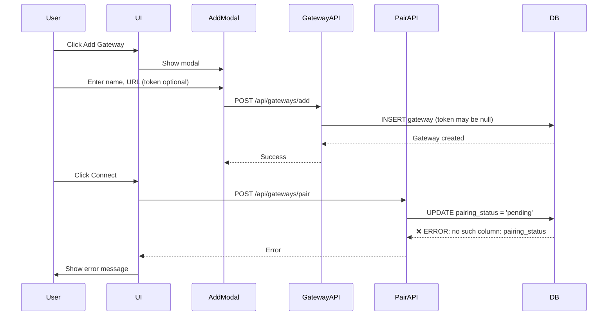
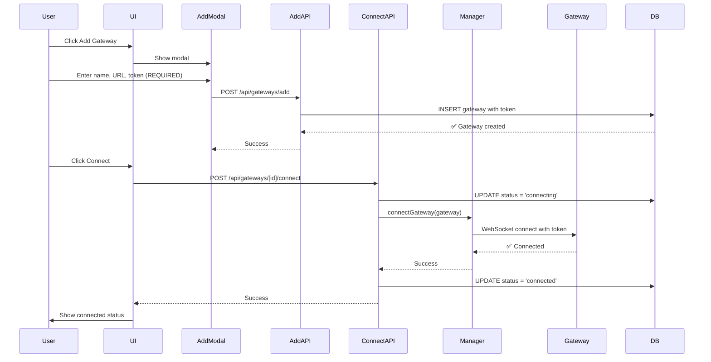

# Gateway Connection Fix - Visual Guide

## Current Broken Flow



## Fixed Simple Flow



## File Changes Overview

### Files to Modify

```
📝 MODIFY
├── components/gateway/add-gateway-modal.tsx
│   └── Make auth token REQUIRED
├── app/gateways/page.tsx
│   └── Use /api/gateways/[id]/connect endpoint
└── app/api/gateways/connect-with-token/route.ts
    └── Remove pairing_status reference

🗑️ DELETE
├── app/api/gateways/pair/route.ts
├── app/api/gateways/check-paired/route.ts
├── app/api/gateways/[id]/pairing-status/route.ts
├── components/gateway/pairing-modal.tsx
└── scripts/
    ├── migrate-device-identities.ts
    ├── fix-device-identity.ts
    ├── apply-migration-005.ts
    ├── apply-migration-006.ts
    └── apply-migration-007.ts

✅ KEEP (Already correct)
├── app/api/gateways/[id]/connect/route.ts
├── lib/gateway/client.ts
├── lib/gateway/manager.ts
└── lib/db/schema.ts
```

## Database Schema Change

### Before Migration 009

```sql
CREATE TABLE gateways (
  id TEXT PRIMARY KEY,
  workspace_id TEXT NOT NULL,
  name TEXT NOT NULL,
  url TEXT NOT NULL,
  auth_token TEXT,                    -- Optional
  device_id TEXT,                     -- ❌ Remove
  device_key TEXT,                    -- ❌ Remove
  device_public_key TEXT,             -- ❌ Remove
  device_private_key TEXT,            -- ❌ Remove
  pairing_status TEXT,                -- ❌ Remove (causing errors)
  status TEXT NOT NULL,
  last_connected_at TEXT,
  last_error TEXT,
  created_at TEXT NOT NULL,
  updated_at TEXT NOT NULL
);
```

### After Migration 009

```sql
CREATE TABLE gateways (
  id TEXT PRIMARY KEY,
  workspace_id TEXT NOT NULL,
  name TEXT NOT NULL,
  url TEXT NOT NULL,
  auth_token TEXT NOT NULL,           -- ✅ Required
  status TEXT NOT NULL,
  last_connected_at TEXT,
  last_error TEXT,
  created_at TEXT NOT NULL,
  updated_at TEXT NOT NULL
);
```

## UI Changes

### Add Gateway Modal - Before

```
┌─────────────────────────────────────┐
│ Add Gateway                    [X]  │
├─────────────────────────────────────┤
│                                     │
│ Gateway Name *                      │
│ [My Gateway              ]          │
│                                     │
│ Gateway URL *                       │
│ [ws://127.0.0.1:18789    ]          │
│                                     │
│ Auth Token (Optional)        ❌     │
│ [                        ]          │
│                                     │
│           [Cancel]  [Add Gateway]   │
└─────────────────────────────────────┘
```

### Add Gateway Modal - After

```
┌─────────────────────────────────────┐
│ Add Gateway                    [X]  │
├─────────────────────────────────────┤
│                                     │
│ Gateway Name *                      │
│ [My Gateway              ]          │
│                                     │
│ Gateway URL *                       │
│ [ws://127.0.0.1:18789    ]          │
│                                     │
│ Auth Token *                  ✅    │
│ [••••••••••••••••••••    ]          │
│ Find in OpenClaw config:            │
│ gateway.auth.token                  │
│                                     │
│           [Cancel]  [Add Gateway]   │
└─────────────────────────────────────┘
```

### Gateway Card - Before

```
┌─────────────────────────────────────┐
│ 🖥️  Localgateway                    │
│     ws://127.0.0.1:18789            │
│                                     │
│ Status: Disconnected                │
│ Pairing: Not Started          ❌    │
│                                     │
│                        [Connect]    │
│                        [Delete]     │
└─────────────────────────────────────┘
        ↓ Click Connect
┌─────────────────────────────────────┐
│ Device Pairing Modal          ❌    │
│                                     │
│ Instructions:                       │
│ 1. Open OpenClaw UI                 │
│ 2. Approve device                   │
│ 3. Click "I Paired"                 │
│                                     │
│           [Cancel]  [I Paired]      │
└─────────────────────────────────────┘
```

### Gateway Card - After

```
┌─────────────────────────────────────┐
│ 🖥️  Localgateway                    │
│     ws://127.0.0.1:18789            │
│                                     │
│ Status: Disconnected          ✅    │
│                                     │
│                        [Connect]    │
│                        [Delete]     │
└─────────────────────────────────────┘
        ↓ Click Connect (Direct!)
┌─────────────────────────────────────┐
│ 🖥️  Localgateway                    │
│     ws://127.0.0.1:18789            │
│                                     │
│ Status: Connected ✅          ✅    │
│ Last connected: Just now            │
│                                     │
│                      [Disconnect]   │
│                        [Delete]     │
└─────────────────────────────────────┘
```

## API Endpoints

### Before (Complex)

```
POST /api/gateways/add
  ├── Creates gateway (token optional)
  └── Generates device keys ❌

POST /api/gateways/pair
  ├── Initiates pairing ❌
  ├── Updates pairing_status ❌
  └── Shows pairing modal ❌

GET /api/gateways/[id]/pairing-status
  ├── Polls for approval ❌
  └── Queries pairing_status ❌

POST /api/gateways/check-paired
  └── Checks if paired ❌

POST /api/gateways/connect-with-token
  ├── Alternative connection ❌
  └── Updates pairing_status ❌
```

### After (Simple)

```
POST /api/gateways/add
  ├── Creates gateway
  └── Token REQUIRED ✅

POST /api/gateways/[id]/connect
  ├── Direct connection ✅
  ├── Uses token auth ✅
  └── Updates status only ✅

DELETE /api/gateways/[id]
  └── Deletes gateway ✅
```

## Error Resolution

### Current Error

```
Error: no such column: pairing_status

Stack trace:
  at /api/gateways/pair (line 94)
  at /api/gateways/connect-with-token (line 140)
  at /api/gateways/[id]/pairing-status (line 65)
```

### After Fix

```
✅ No errors
✅ Direct connection
✅ Clear error messages
✅ Simple flow
```

## Testing Scenarios

### Scenario 1: Add New Gateway

```
1. Click "Add Gateway"
2. Enter name: "Test Gateway"
3. Enter URL: "ws://127.0.0.1:18789"
4. Enter token: "YOUR_GATEWAY_TOKEN"
5. Click "Add Gateway"
   ✅ Gateway created
   ✅ No errors
```

### Scenario 2: Connect Gateway

```
1. Click "Connect" on gateway card
   ✅ Status changes to "Connecting..."
   ✅ WebSocket connection initiated
   ✅ Status changes to "Connected"
   ✅ No pairing modal
   ✅ No errors
```

### Scenario 3: Invalid Token

```
1. Add gateway with wrong token
2. Click "Connect"
   ✅ Status changes to "Error"
   ✅ Error message displayed
   ✅ User can update token
```

## Migration Steps

### Step 1: Apply Database Migration

```bash
cd githubprojects/clawhub
npm run script scripts/apply-migration-009.ts
```

Expected output:
```
Applying migration 009_remove_device_pairing...
✅ Migration 009_remove_device_pairing applied successfully
```

### Step 2: Update Existing Gateways

```bash
# Check current gateways
sqlite3 ~/.clawhub/clawhub.db "SELECT id, name, auth_token FROM gateways;"

# Update token if needed
sqlite3 ~/.clawhub/clawhub.db "UPDATE gateways SET auth_token = 'YOUR_GATEWAY_TOKEN' WHERE id = 'gateway-id';"
```

### Step 3: Restart Application

```bash
npm run dev
```

### Step 4: Test

1. Add new gateway with token
2. Connect to gateway
3. Verify no errors in console
4. Check database schema

---

## Summary

### What's Being Fixed

1. ❌ **Database Error**: Remove `pairing_status` column references
2. ❌ **Complex Flow**: Remove device pairing modal
3. ❌ **Optional Token**: Make auth token required
4. ❌ **Multiple Endpoints**: Consolidate to single connect endpoint

### What You Get

1. ✅ **No Errors**: Clean database queries
2. ✅ **Simple Flow**: Add → Connect → Done
3. ✅ **Required Token**: Clear expectations
4. ✅ **Single Endpoint**: Easy to understand

### Code Reduction

- **Remove**: ~500 lines of pairing code
- **Remove**: 4 API endpoints
- **Remove**: 1 complex modal component
- **Remove**: 5 migration scripts
- **Simplify**: 2 components
- **Result**: Cleaner, faster, more maintainable
