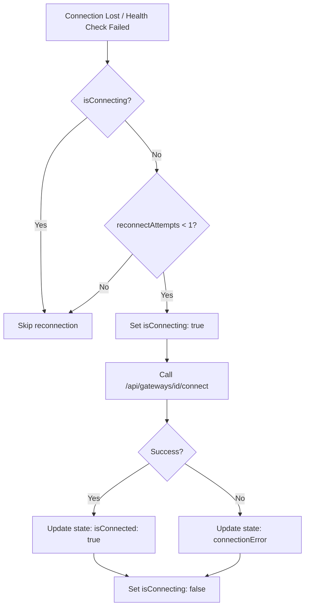

# GatewayService Singleton Implementation Plan

## Overview
Create a frontend GatewayService singleton that acts as a client proxy through existing API routes, managing gateway state with event emitters and React hooks.

## Architecture

### Components

```
┌─────────────────────────────────────────────────────────────────┐
│                         Frontend Layer                          │
│  ┌──────────────────────────────────────────────────────────┐  │
│  │                    React Components                       │  │
│  │  - EnhancedChatScreen                                    │  │
│  │  - NewChatPanel                                          │  │
│  │  - GatewayStatusIndicator                                │  │
│  └──────────────────────────────────────────────────────────┘  │
│                             │                                  │
│                             ▼                                  │
│  ┌──────────────────────────────────────────────────────────┐  │
│  │                  React Hooks Layer                        │  │
│  │  - useGatewayService()                                    │  │
│  │  - useGatewayServiceValue(selector)                       │  │
│  │  - useSetGatewayService()                                 │  │
│  └──────────────────────────────────────────────────────────┘  │
│                             │                                  │
│                             ▼                                  │
│  ┌──────────────────────────────────────────────────────────┐  │
│  │              ServiceEventEmitter                          │  │
│  │  - Event-based state propagation                          │  │
│  │  - Subscription management                                │  │
│  └──────────────────────────────────────────────────────────┘  │
│                             │                                  │
│                             ▼                                  │
│  ┌──────────────────────────────────────────────────────────┐  │
│  │                 GatewayService                            │  │
│  │  - Singleton instance                                     │  │
│  │  - State management                                       │  │
│  │  - Auto-reconnection logic                                │  │
│  │  - API route proxy calls                                  │  │
│  └──────────────────────────────────────────────────────────┘  │
└─────────────────────────────────────────────────────────────────┘
                              │
                              ▼
┌─────────────────────────────────────────────────────────────────┐
│                      Backend API Routes                          │
│  - GET  /api/gateways          (List gateways)                  │
│  - GET  /api/chat/agents       (Get agents)                     │
│  - POST /api/gateways/[id]/health (Health check)                │
│  - POST /api/gateways/[id]/connect (Connect gateway)            │
└─────────────────────────────────────────────────────────────────┘
                              │
                              ▼
┌─────────────────────────────────────────────────────────────────┐
│                   GatewayManager (Server)                        │
│  - Manages WebSocket connections to gateways                    │
│  - GatewayClient instances per gateway                          │
└─────────────────────────────────────────────────────────────────┘
```

## File Structure

```
lib/
├── services/
│   ├── service-event-emitter.ts    # Event emitter utility
│   └── gateway-service.ts          # GatewayService singleton
├── hooks/
│   └── useGatewayService.ts        # React hooks for GatewayService
```

## Implementation Details

### 1. ServiceEventEmitter (`lib/services/service-event-emitter.ts`)

A lightweight event emitter for reactive state updates.

```typescript
interface ServiceEventEmitter<T> {
  subscribe(listener: (state: T) => void): () => void
  emit(state: T): void
  get(): T
  set(state: T | ((prev: T) => T)): void
}
```

**Features:**
- Subscribe/notify pattern
- Immutable state updates
- Unsubscribe capability
- Getter/setter for state

### 2. GatewayService (`lib/services/gateway-service.ts`)

Singleton service for managing gateway state and connections.

**State Interface:**
```typescript
interface GatewayServiceState {
  // Loading states
  isLoading: boolean
  isConnecting: boolean
  
  // Connection status
  isConnected: boolean
  connectionError: string | null
  
  // Gateway data
  gateways: Gateway[]
  activeGatewayId: string | null
  
  // Agents data
  agents: AgentInfo[]
  isLoadingAgents: boolean
  
  // Reconnection state
  reconnectAttempts: number
  lastReconnectAttempt: number | null
}
```

**Methods:**
| Method | Description |
|--------|-------------|
| `getInstance()` | Get singleton instance |
| `initialize()` | Initialize service, fetch gateways |
| `connectGateway(gatewayId)` | Connect to a specific gateway |
| `disconnectGateway(gatewayId)` | Disconnect from gateway |
| `refreshGateways()` | Refetch gateways from API |
| `refreshAgents()` | Fetch agents from connected gateways |
| `checkHealth(gatewayId)` | Check gateway health |
| `tryReconnect()` | Attempt reconnection once |
| `getState()` | Get current state |
| `subscribe()` | Subscribe to state changes |

**Events Emitted:**
| Event | Payload | Description |
|-------|---------|-------------|
| `state:change` | `GatewayServiceState` | Any state change |
| `gateway:connecting` | `{ gatewayId }` | Gateway connection started |
| `gateway:connected` | `{ gatewayId, gateway }` | Gateway connected successfully |
| `gateway:disconnected` | `{ gatewayId }` | Gateway disconnected |
| `gateway:error` | `{ gatewayId, error }` | Gateway error occurred |
| `agents:loading` | - | Started loading agents |
| `agents:loaded` | `{ agents }` | Agents loaded successfully |
| `agents:error` | `{ error }` | Failed to load agents |

### 3. React Hooks (`lib/hooks/useGatewayService.ts`)

**`useGatewayService()`**
- Returns the entire GatewayService state
- Subscribes to state changes
- Triggers re-render on state updates

**`useGatewayServiceValue<T>(selector)`**
- Selects a subset of state using a selector function
- Only re-renders when selected value changes
- Memoized for performance

**`useSetGatewayService()`**
- Returns actions to modify gateway state
- Methods: `connectGateway`, `disconnectGateway`, `refresh`, `tryReconnect`

## Auto-Reconnection Logic

The auto-reconnection feature follows these rules:

1. **Trigger Conditions:**
   - Gateway health check fails
   - Gateway connection is lost
   - Explicit call to `tryReconnect()`

2. **Reconnection Behavior:**
   - Only attempts **once** (no retry loop)
   - Only attempts when gateway is **not loading** (`isConnecting: false`)
   - Resets connection error on success
   - Increments `reconnectAttempts` counter

3. **Flow:**


## API Integration

The GatewayService will proxy calls through existing API routes:

| Service Method | API Route | Purpose |
|----------------|-----------|---------|
| `refreshGateways()` | `GET /api/gateways` | Fetch gateways list |
| `connectGateway()` | `POST /api/gateways/[id]/connect` | Connect to gateway |
| `disconnectGateway()` | `DELETE /api/gateways/[id]` | Disconnect gateway |
| `checkHealth()` | `POST /api/gateways/[id]/health` | Check gateway health |
| `refreshAgents()` | `GET /api/chat/agents` | Fetch available agents |

## Usage Examples

### In a React Component

```typescript
'use client'

import { useGatewayService, useSetGatewayService } from '@/lib/hooks/useGatewayService'

export function GatewayStatusIndicator() {
  const { isConnected, isLoading, connectionError, activeGatewayId } = useGatewayService()
  const { tryReconnect } = useSetGatewayService()

  if (isLoading) return <div>Loading gateway...</div>
  
  if (!isConnected) {
    return (
      <div>
        <span>Gateway disconnected: {connectionError}</span>
        <button onClick={tryReconnect}>Reconnect</button>
      </div>
    )
  }

  return <div>Connected to: {activeGatewayId}</div>
}
```

### In Chat Screen

```typescript
'use client'

import { useGatewayServiceValue } from '@/lib/hooks/useGatewayService'

export function NewChatPanel() {
  const agents = useGatewayServiceValue(state => state.agents)
  const isLoadingAgents = useGatewayServiceValue(state => state.isLoadingAgents)

  if (isLoadingAgents) return <AgentSkeleton />

  return (
    <div>
      {agents.map(agent => (
        <AgentCard key={agent.agentId} agent={agent} />
      ))}
    </div>
  )
}
```

## Implementation Order

1. **ServiceEventEmitter** - Core event system
2. **GatewayService** - Main service logic with API integration
3. **React Hooks** - Interface for React components
4. **Integration** - Update existing components to use GatewayService
5. **Testing** - Verify auto-reconnection and state management

## Notes

- GatewayService is **browser-only** (marked with `'use client'` or checked via `typeof window`)
- State is persisted in memory only (not localStorage)
- Reconnection is **single attempt only** (as per user requirement)
- Service gracefully handles API failures with error states
