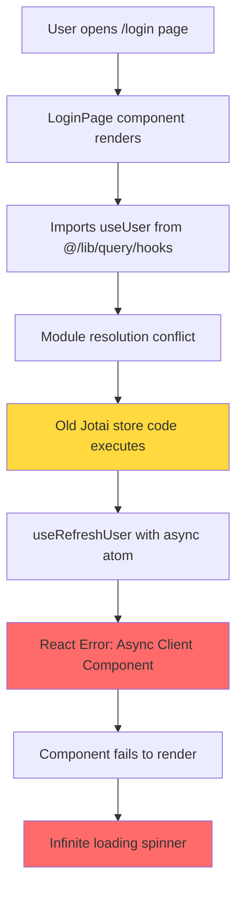
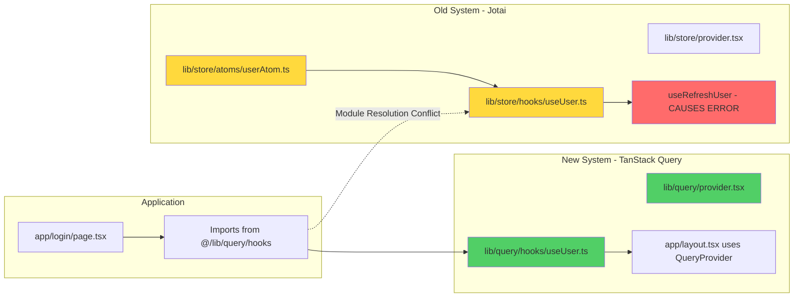
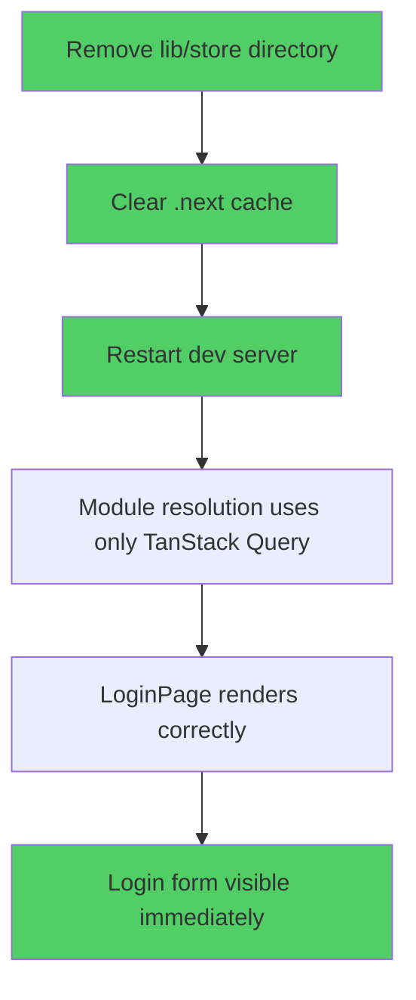
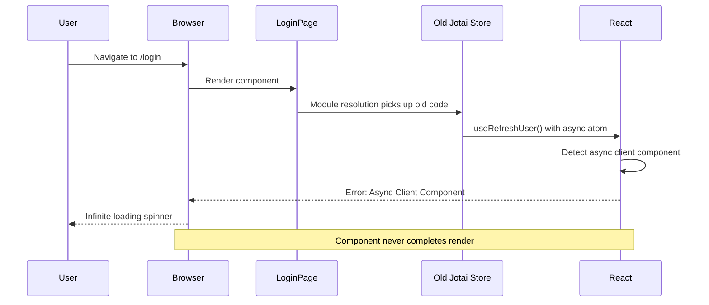
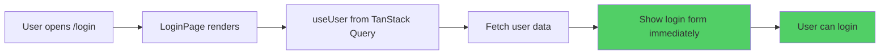

# Login Loading Issue - Visual Explanation

## Current Problem Flow



## Root Cause: Dual State Management Systems



## The Fix



## Before vs After

### Before (Current State)
```
lib/
├── query/          ✅ New TanStack Query (in use)
│   ├── hooks/
│   │   └── useUser.ts
│   └── provider.tsx
└── store/          ❌ Old Jotai (causing conflict)
    ├── atoms/
    │   └── userAtom.ts (async atom)
    ├── hooks/
    │   └── useUser.ts (useRefreshUser error)
    └── provider.tsx
```

### After (Fixed State)
```
lib/
└── query/          ✅ Only TanStack Query
    ├── hooks/
    │   └── useUser.ts
    └── provider.tsx
```

## Error Chain



## Solution Steps

1. **Archive old code**: `mv lib/store lib/store.old`
2. **Clear cache**: `rm -rf .next`
3. **Restart**: `npm run dev`
4. **Test**: Open http://localhost:3001/login

## Expected Result


