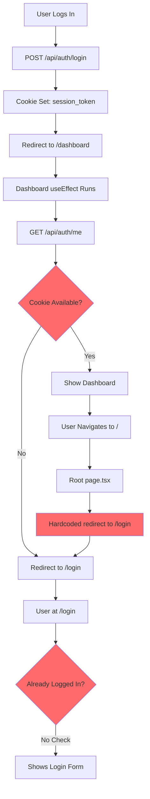

# Login Redirect Loop - Root Cause Analysis & Fix Plan

## 🔍 Problem Summary

After successful login, users are redirected to the dashboard but then immediately redirected back to the login screen, creating an infinite redirect loop. The session token/cookie is not being properly validated during navigation.

## 🐛 Root Causes Identified

### 1. **Missing Next.js Middleware for Route Protection**
- **Issue**: No `middleware.ts` file exists at the project root
- **Impact**: No server-side authentication checks before pages render
- **Location**: Should be at `githubprojects/clawhub/middleware.ts`

### 2. **Root Page Always Redirects to Login**
- **Issue**: [`app/page.tsx`](../app/page.tsx:5) has hardcoded redirect without auth check
```typescript
export default function HomePage() {
  // In a real app, check authentication here  ← This comment shows it's incomplete!
  redirect('/login')
}
```
- **Impact**: Any navigation to `/` immediately sends users to login, even if authenticated

### 3. **Client-Side Only Authentication**
- **Issue**: [`app/dashboard/page.tsx`](../app/dashboard/page.tsx:23-49) only checks auth in `useEffect`
- **Impact**: Race conditions and timing issues during page load
- **Problem**: Client-side checks happen AFTER the page starts rendering

### 4. **Missing Cookie Credentials in Fetch Requests**
- **Issue**: [`app/login/page.tsx`](../app/login/page.tsx:11-15) doesn't include `credentials: 'include'`
```typescript
const response = await fetch('/api/auth/login', {
  method: 'POST',
  headers: { 'Content-Type': 'application/json' },
  body: JSON.stringify({ email, password }),
  // Missing: credentials: 'include'
})
```
- **Impact**: Cookies might not be sent/received properly in some browsers

### 5. **No Router Refresh After Login**
- **Issue**: After setting cookie, the router doesn't refresh to pick up the new auth state
- **Impact**: The client-side router cache might have stale authentication state

## 🎯 Authentication Flow Issues



## ✅ Comprehensive Fix Plan

### Fix 1: Create Next.js Middleware for Route Protection

**File**: `githubprojects/clawhub/middleware.ts` (NEW)

**Purpose**: Intercept all requests and handle authentication server-side

**Implementation**:
```typescript
import { NextResponse } from 'next/server'
import type { NextRequest } from 'next/server'

// Public routes that don't require authentication
const publicRoutes = ['/login', '/setup', '/api/setup/check', '/api/setup/create']

// API routes that require authentication
const protectedApiRoutes = ['/api/auth/me', '/api/auth/logout', '/api/auth/change-password']

export async function middleware(request: NextRequest) {
  const { pathname } = request.nextUrl
  
  // Allow public routes
  if (publicRoutes.some(route => pathname.startsWith(route))) {
    return NextResponse.next()
  }
  
  // Check for session token
  const sessionToken = request.cookies.get('session_token')?.value
  
  // If no session token, redirect to login
  if (!sessionToken) {
    if (pathname.startsWith('/api/')) {
      return NextResponse.json({ message: 'Unauthorized' }, { status: 401 })
    }
    return NextResponse.redirect(new URL('/login', request.url))
  }
  
  // If has session token and trying to access login, redirect to dashboard
  if (pathname === '/login' && sessionToken) {
    return NextResponse.redirect(new URL('/dashboard', request.url))
  }
  
  return NextResponse.next()
}

export const config = {
  matcher: [
    '/((?!_next/static|_next/image|favicon.ico).*)',
  ],
}
```

### Fix 2: Update Root Page to Redirect to Dashboard

**File**: [`app/page.tsx`](../app/page.tsx)

**Change**:
```typescript
import { redirect } from 'next/navigation'

export default function HomePage() {
  // Redirect to dashboard - middleware will handle auth check
  redirect('/dashboard')
}
```

### Fix 3: Add Credentials to Login Fetch

**File**: [`app/login/page.tsx`](../app/login/page.tsx:10-23)

**Change**:
```typescript
const handleLogin = async (email: string, password: string) => {
  const response = await fetch('/api/auth/login', {
    method: 'POST',
    headers: { 'Content-Type': 'application/json' },
    body: JSON.stringify({ email, password }),
    credentials: 'include', // ← ADD THIS
  })

  if (!response.ok) {
    const error = await response.json()
    throw new Error(error.message || 'Login failed')
  }

  // Refresh router to pick up new auth state
  router.refresh() // ← ADD THIS
  router.push('/dashboard')
}
```

### Fix 4: Add Credentials to Dashboard Auth Check

**File**: [`app/dashboard/page.tsx`](../app/dashboard/page.tsx:27)

**Change**:
```typescript
const response = await fetch('/api/auth/me', {
  credentials: 'include' // ← ADD THIS
})
```

### Fix 5: Improve Cookie Settings

**File**: [`app/api/auth/login/route.ts`](../app/api/auth/login/route.ts:68-74)

**Review**: Cookie settings look correct, but ensure:
- `httpOnly: true` ✓ (prevents XSS)
- `secure: true` in production ✓
- `sameSite: 'lax'` ✓ (allows navigation)
- `path: '/'` ✓ (available everywhere)

**Optional Enhancement**: Add domain if needed for subdomains

### Fix 6: Add Session Validation to Middleware

**Enhancement**: Validate session token in middleware (optional but recommended)

```typescript
// In middleware.ts, add actual session validation
import { validateSession } from '@/lib/auth/session'

// Inside middleware function:
if (sessionToken) {
  const session = validateSession(sessionToken)
  if (!session) {
    // Invalid/expired session - clear cookie and redirect
    const response = NextResponse.redirect(new URL('/login', request.url))
    response.cookies.delete('session_token')
    return response
  }
}
```

## 🔧 Implementation Order

1. **Create `middleware.ts`** - This is the most critical fix
2. **Update `app/page.tsx`** - Change redirect target
3. **Update `app/login/page.tsx`** - Add credentials and router.refresh()
4. **Update `app/dashboard/page.tsx`** - Add credentials to fetch
5. **Test the complete flow** - Login → Dashboard → Navigate → Logout

## 🧪 Testing Checklist

After implementing fixes, test:

- [ ] Login with valid credentials → Should reach dashboard
- [ ] Refresh dashboard page → Should stay on dashboard
- [ ] Navigate to `/` → Should redirect to dashboard (if logged in)
- [ ] Navigate to `/login` while logged in → Should redirect to dashboard
- [ ] Logout → Should redirect to login
- [ ] Try to access `/dashboard` without login → Should redirect to login
- [ ] Check browser DevTools → Cookie should be set after login
- [ ] Check Network tab → `/api/auth/me` should return 200 with user data

## 🎓 Why This Happens

The redirect loop occurs because:

1. User logs in successfully ✓
2. Cookie is set ✓
3. User is redirected to `/dashboard` ✓
4. Dashboard loads and checks auth client-side ✓
5. **BUT**: If user navigates to `/` or refreshes, there's no server-side check
6. Root page always redirects to `/login` regardless of auth status ✗
7. Login page doesn't check if user is already logged in ✗
8. Creates a loop: Dashboard → Root → Login → (user confused)

## 🔐 Security Considerations

- Middleware runs on every request - keep it lightweight
- Session validation in middleware adds overhead but improves security
- Consider caching session validation results
- Always use `httpOnly` cookies to prevent XSS attacks
- Use `secure: true` in production to prevent MITM attacks

## 📊 Performance Impact

- Middleware adds ~5-10ms per request (minimal)
- Session validation adds ~1-2ms (database query)
- Client-side auth checks are eliminated (faster page loads)
- Overall: Better UX and security with minimal performance cost

## 🚀 Next Steps

1. Implement the fixes in order
2. Test thoroughly in development
3. Check browser console for any errors
4. Verify cookies are set correctly
5. Test in different browsers (Chrome, Firefox, Safari)
6. Deploy to production after successful testing
