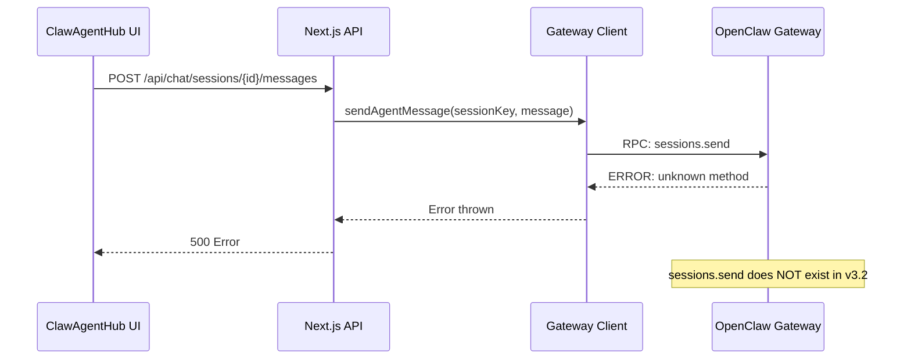
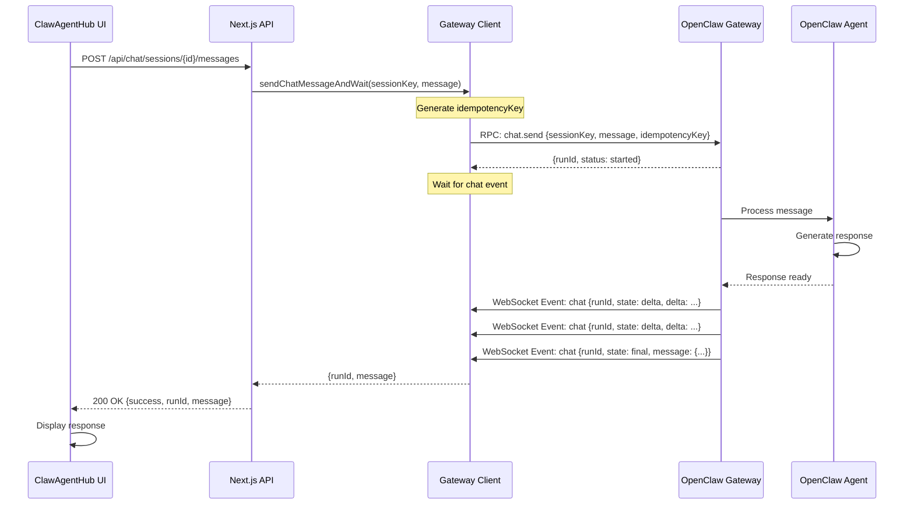
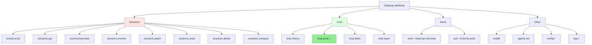
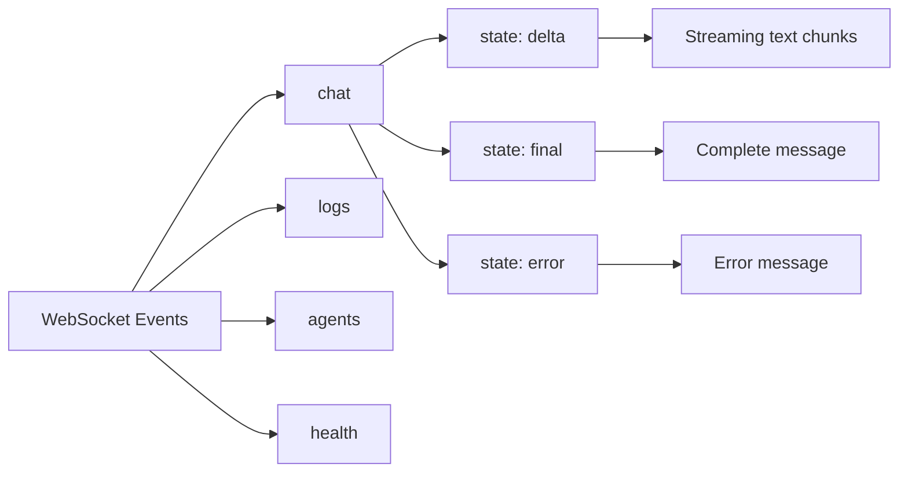
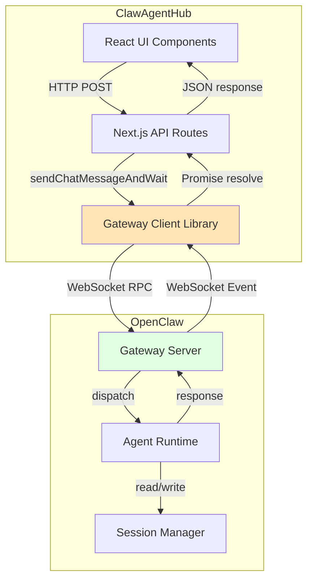

# OpenClaw Chat Send Flow Diagram

## Current (Broken) Flow



## Fixed Flow (Correct Implementation)



## Method Comparison

### Old (Incorrect) Method: sessions.send

```typescript
// Does NOT exist in OpenClaw v3.2
await gateway.call('sessions.send', {
  sessionKey: 'main',
  message: 'Hello',
  metadata: { label: 'clawhub' }  // Not supported
})
```

**Result**: `unknown method: sessions.send`

### New (Correct) Method: chat.send

```typescript
// Correct method for OpenClaw v3.2
await gateway.call('chat.send', {
  sessionKey: 'main',
  message: 'Hello',
  idempotencyKey: '550e8400-e29b-41d4-a716-446655440000',  // Required
  deliver: false,        // Optional
  thinking: undefined,   // Optional
  timeoutMs: 120000     // Optional
})
```

**Result**: `{runId: '550e8400...', status: 'started'}`

Then listen for events:
```typescript
gateway.onEvent('chat', (event) => {
  if (event.runId === '550e8400...') {
    if (event.state === 'final') {
      console.log('Response:', event.message)
    }
  }
})
```

## Available Gateway Methods (OpenClaw v3.2)



## Event Types



## Implementation Architecture



## Key Differences

| Aspect | Old (sessions.send) | New (chat.send) |
|--------|-------------------|-----------------|
| **Exists?** | ❌ No | ✅ Yes |
| **Method** | `sessions.send` | `chat.send` |
| **idempotencyKey** | ❌ Not used | ✅ Required |
| **metadata** | ✅ Sent (ignored) | ❌ Not supported |
| **Response** | N/A (error) | `{runId, status}` |
| **Async** | N/A | ✅ Events via WebSocket |
| **Streaming** | N/A | ✅ Supported (delta events) |

## Migration Path

```mermaid
graph LR
    A[Current Code] -->|1. Update method name| B[Use chat.send]
    B -->|2. Add idempotencyKey| C[Generate UUID]
    C -->|3. Remove metadata| D[Clean params]
    D -->|4. Handle async| E[Listen for events]
    E -->|5. Test| F[Verify with gateway]
    F -->|6. Deploy| G[Production]
    
    style A fill:#FFB6C1
    style G fill:#90EE90
```


