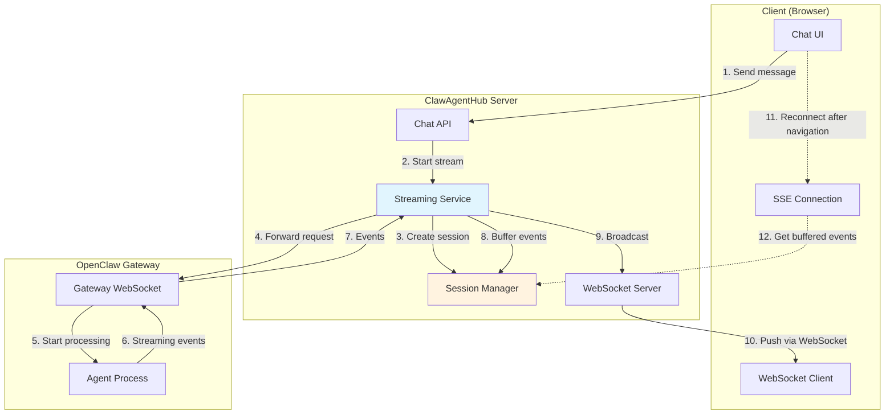
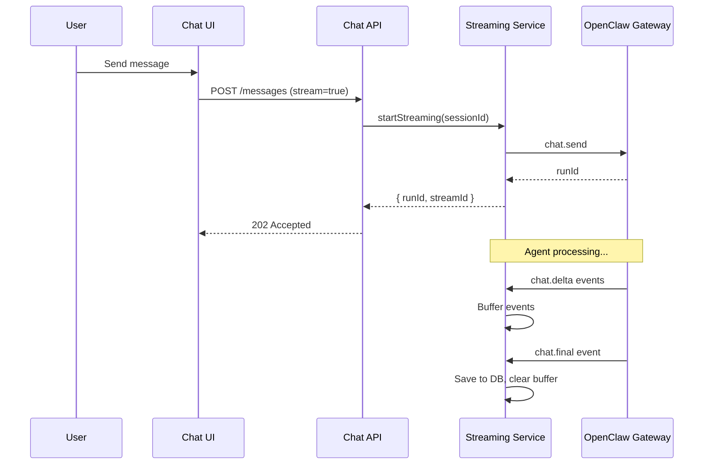
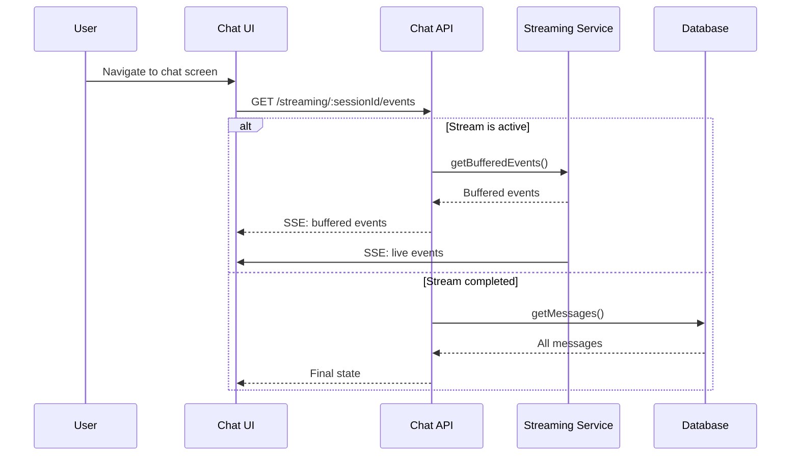
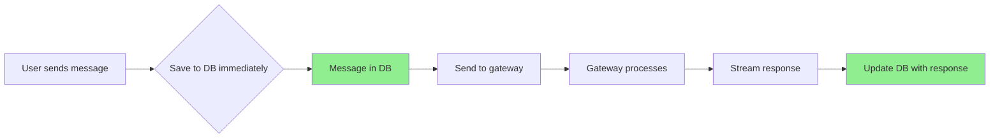

# Server-Side Streaming Chat Architecture

## Problem Statement

The current chat implementation has several critical issues:

1. **useEffect Infinite Loop**: When writing to chat screen then clicking sessions tab, it returns to chat streaming tab again
2. **Streaming Stops on Navigation**: When chatting and navigating to other pages, the chat stream stops because streaming is client-side only
3. **Last Messages Not Saved**: When entering a prompt and navigating away, the last messages are not persisted

## Root Cause Analysis

### Issue 1: useEffect Infinite Loop

The issue is in `enhanced-chat-container.tsx`:

```tsx
useEffect(() => {
  if (activeTab === 'sessions' && previousTabRef.current !== 'sessions') {
    console.log('[EnhancedChatContainer] Switching to sessions tab - refetching sessions')
    queryClient.invalidateQueries({ queryKey: ['chat', 'sessions'] })
  }
  previousTabRef.current = activeTab
}, [activeTab, queryClient])
```

The `queryClient` dependency causes re-renders when queries update, which triggers the effect again.

### Issue 2: Streaming Stops on Navigation

Current flow:
- Client connects to WebSocket for streaming
- When user navigates away, component unmounts
- WebSocket connection is closed
- Gateway continues processing but client has no way to reconnect

The streaming state is client-side only in `useStreamingChat` hook. When the component unmounts, the streaming state is lost.

### Issue 3: Messages Not Saved

In streaming mode, the API returns 202 Accepted immediately without saving the user message to the database. The message is only saved when:
1. The gateway responds (in legacy mode)
2. Or the stream completes (via WebSocket event)

If the user navigates away before the stream completes, the message is lost.

## Proposed Architecture

### Server-Side Streaming Service

Create a service that manages active chat sessions on the server side:



### Key Components

#### 1. StreamingChatService (`lib/streaming/chat-service.ts`)

```typescript
class StreamingChatService {
  // Active streaming sessions
  private sessions: Map<string, StreamingSession>
  
  // Start streaming for a session
  startStreaming(sessionId: string, sessionKey: string): Promise<string>
  
  // Get buffered events for a session (for reconnection)
  getBufferedEvents(sessionId: string): StreamEvent[]
  
  // Check if session is actively streaming
  isStreaming(sessionId: string): boolean
  
  // Stop streaming for a session
  stopStreaming(sessionId: string): void
  
  // Get status of all active streams
  getActiveStreams(): StreamStatus[]
}

interface StreamingSession {
  sessionId: string
  sessionKey: string
  runId: string
  status: 'starting' | 'streaming' | 'error' | 'stopped'
  startedAt: number
  lastActivityAt: number
  bufferedEvents: StreamEvent[]
  clientCount: number
}
```

#### 2. API Routes

##### POST /api/chat/streaming
Start streaming for a session (returns stream ID)

##### GET /api/chat/streaming
Get status of all active streaming sessions

##### DELETE /api/chat/streaming/:sessionId
Stop streaming for a session

##### GET /api/chat/streaming/:sessionId/events
SSE endpoint for receiving streaming events (supports reconnection)

##### GET /api/chat/gateway/messages?sessionId=xxx
Pull messages from gateway (chat.history) and deep merge with local messages

### Data Flow

#### Starting a Stream



#### Reconnecting After Navigation



### Implementation Plan

#### Phase 1: Fix useEffect Loops (Immediate)

**File: `components/chat/enhanced-chat-container.tsx`**
- Remove `queryClient` from dependency array
- Use `useRef` for queryClient or use `useCallback` for invalidation

**File: `lib/hooks/useChatWebSocket.ts`**
- Fix the dependency issue in `useEffect` that causes reconnection
- Memoize the `connect` callback properly

**File: `lib/hooks/useSessionStatus.ts`**
- The hook is already properly implemented, but we should verify no loops

#### Phase 2: Server-Side Streaming Service

**New file: `lib/streaming/chat-service.ts`**
- Create `StreamingChatService` class
- Implement session management
- Implement event buffering
- Integrate with existing GatewayManager

**New file: `app/api/chat/streaming/route.ts`**
- POST: Start streaming
- GET: List active streams
- DELETE: Stop streaming

**New file: `app/api/chat/streaming/[sessionId]/events/route.ts`**
- SSE endpoint for streaming events
- Supports reconnection with `Last-Event-ID` header

#### Phase 3: Messages Gateway API

**New file: `app/api/chat/gateway/messages/route.ts`**
- GET: Pull messages from gateway
- Deep merge with local messages
- Deduplication logic

**Update: `lib/query/hooks/useChat.ts`**
- Add `useGatewayMessages` hook
- Add `useChatMessagesWithGateway` hook (merges both sources)

#### Phase 4: Client-Side Integration

**Update: `lib/hooks/useStreamingChat.ts`**
- Add reconnection logic
- Handle SSE fallback if WebSocket is closed

**Update: `components/chat/enhanced-chat-screen.tsx`**
- Save messages to DB immediately on send (optimistic)
- Handle reconnection to active streams

### Message Persistence Strategy



All user messages should be saved to the database **immediately** when sent, not after the stream completes. This ensures messages are never lost.

### Deep Merge Strategy

When pulling messages from gateway:

```typescript
function mergeMessages(
  localMessages: ChatMessage[],
  gatewayMessages: SessionMessage[]
): ChatMessage[] {
  const merged = new Map<string, ChatMessage>()
  
  // Add local messages first
  for (const msg of localMessages) {
    merged.set(msg.id, msg)
  }
  
  // Add gateway messages
  for (const gmsg of gatewayMessages) {
    const key = gmsg.id || `${gmsg.timestamp}-${gmsg.role}`
    if (!merged.has(key)) {
      merged.set(key, {
        id: key,
        session_id: sessionId,
        role: gmsg.role,
        content: JSON.stringify([{ type: 'text', text: gmsg.content }]),
        created_at: gmsg.timestamp || new Date().toISOString()
      })
    }
  }
  
  // Sort by timestamp
  return Array.from(merged.values())
    .sort((a, b) => new Date(a.created_at).getTime() - new Date(b.created_at).getTime())
}
```

## Configuration

Add to application settings:

```typescript
interface StreamingConfig {
  enabled: boolean
  bufferSize: number        // Max events to buffer per session (default: 1000)
  bufferTTL: number         // How long to keep buffered events (default: 3600000ms)
  reconnectionTimeout: number // How long to wait for reconnection (default: 300000ms)
  saveImmediately: boolean  // Save user messages to DB immediately (default: true)
}
```

## Migration Strategy

1. **Feature flag** the server-side streaming
2. **Dual mode operation**: Keep client-side streaming as fallback
3. **Gradual rollout**:
   - Phase 1: Fix useEffect loops
   - Phase 2: Implement server-side streaming service
   - Phase 3: Add messages gateway API
   - Phase 4: Full integration with optimistic updates
4. **Monitoring**: Add metrics for streaming reconnections

## Success Metrics

- **Navigation resilience**: Chat continues streaming after page navigation
- **Message persistence**: No messages lost when navigating away
- **Reconnection time**: <1 second to reconnect to active stream
- **Message merge**: No duplicate messages when pulling from gateway
