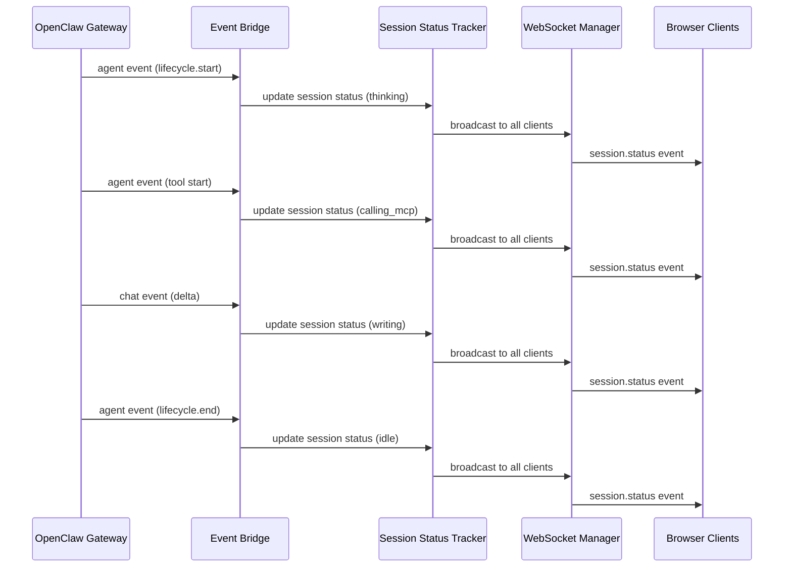
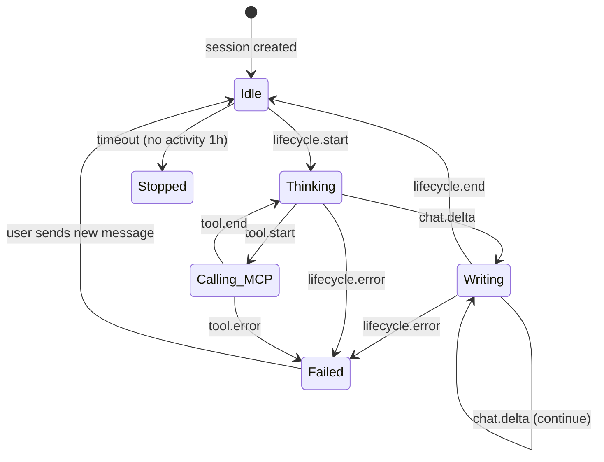

# Real-Time Session Status Tracking Implementation Plan

## Overview

This plan implements real-time session status indicators on the sessions tab, showing what each session is currently doing (thinking, writing, idle, stopped, failed). The implementation follows OpenClaw's lifecycle event pattern.

## OpenClaw Event Reference

Based on research of `openclaw/openclaw` repository:

### Agent Event Streams
- **`lifecycle`**: Emits `phase: "start" | "end" | "error"` - indicates agent run lifecycle
- **`tool`**: Emits `phase: "start" | "update" | "result"` - indicates tool execution
- **`assistant`**: Streaming deltas from the model

### Chat Event States
- **`delta`**: Streaming text chunks
- **`final`**: Complete message with stopReason
- **`error`**: Error occurred
- **`aborted`**: Run was aborted

### Event Structure
```typescript
interface AgentEventPayload {
  runId: string;
  seq: number;
  stream: "lifecycle" | "tool" | "assistant" | "error";
  ts: number;
  data: Record<string, unknown>;
  sessionKey?: string;
}
```

## Architecture Diagram



## Session Status States



## Implementation Steps

### 1. Create Session Status Tracker (Server-Side)

**File: `lib/session/status-tracker.ts`**

In-memory state manager that tracks session activity status.

```typescript
interface SessionStatus {
  sessionId: string
  sessionKey: string
  status: 'idle' | 'thinking' | 'calling_mcp' | 'writing' | 'stopped' | 'failed'
  runId?: string
  lastActivity: number
  toolName?: string
}

class SessionStatusTracker {
  private status: Map<string, SessionStatus>
  private readonly TIMEOUT_MS = 3600000 // 1 hour

  updateStatus(sessionId: string, updates: Partial<SessionStatus>)
  getStatus(sessionId: string): SessionStatus | undefined
  getAllStatuses(): SessionStatus[]
  cleanupExpiredSessions()
  markSessionStopped(sessionId: string)
}
```

**Features:**
- Thread-safe Map-based storage
- Automatic cleanup of stale sessions
- Broadcast capabilities via WebSocket manager
- Status timeout handling

### 2. Extend Event Bridge for Session Status

**File: `lib/gateway/event-bridge.ts`** (modify)

Add lifecycle event handling to track session status.

```typescript
private handleAgentEvent = (event: any) => {
  // Existing code...

  // NEW: Track session status based on lifecycle events
  if (streamType === 'lifecycle') {
    const phase = payload.data?.phase
    const statusTracker = getSessionStatusTracker()

    if (phase === 'start') {
      statusTracker.updateStatus(sessionId, {
        status: 'thinking',
        runId: payload.runId,
        lastActivity: Date.now()
      })
      this.broadcastSessionStatus(sessionId)
    }
    else if (phase === 'end') {
      statusTracker.updateStatus(sessionId, {
        status: 'idle',
        lastActivity: Date.now()
      })
      this.broadcastSessionStatus(sessionId)
    }
    else if (phase === 'error') {
      statusTracker.updateStatus(sessionId, {
        status: 'failed',
        lastActivity: Date.now()
      })
      this.broadcastSessionStatus(sessionId)
    }
  }
}
```

**Add tool tracking:**
```typescript
if (streamType === 'tool') {
  const phase = payload.data?.phase
  const statusTracker = getSessionStatusTracker()

  if (phase === 'start') {
    statusTracker.updateStatus(sessionId, {
      status: 'calling_mcp',
      toolName: payload.data?.name,
      lastActivity: Date.now()
    })
    this.broadcastSessionStatus(sessionId)
  }
  else if (phase === 'end' || phase === 'result') {
    statusTracker.updateStatus(sessionId, {
      status: 'thinking', // Back to thinking after tool
      lastActivity: Date.now()
    })
    this.broadcastSessionStatus(sessionId)
  }
}
```

**Add chat delta tracking:**
```typescript
private handleChatEvent = (event: any) => {
  // Existing code...

  const statusTracker = getSessionStatusTracker()

  if (payload.state === 'delta') {
    statusTracker.updateStatus(sessionId, {
      status: 'writing',
      runId: payload.runId,
      lastActivity: Date.now()
    })
    this.broadcastSessionStatus(sessionId)
  }
}
```

**Broadcast helper:**
```typescript
private broadcastSessionStatus(sessionId: string) {
  const statusTracker = getSessionStatusTracker()
  const status = statusTracker.getStatus(sessionId)

  if (!status) return

  const wsManager = getWebSocketManager()
  wsManager.broadcast('sessions', { // Broadcast to sessions channel
    type: 'session.status',
    data: status
  })
}
```

### 3. Create useSessionStatus Hook (Client-Side)

**File: `lib/hooks/useSessionStatus.ts`**

React hook for subscribing to session status updates.

```typescript
interface SessionStatusData {
  sessionId: string
  status: 'idle' | 'thinking' | 'calling_mcp' | 'writing' | 'stopped' | 'failed'
  toolName?: string
  lastActivity: number
}

export function useSessionStatus() {
  const [statuses, setStatuses] = useState<Map<string, SessionStatusData>>(new Map())

  useEffect(() => {
    // Subscribe to session.status events via WebSocket
    const ws = getWebSocketClient()
    const unsub = ws.subscribe('sessions', (event) => {
      if (event.type === 'session.status') {
        setStatuses(prev => new Map(prev).set(event.data.sessionId, event.data))
      }
    })

    return unsub
  }, [])

  const getStatus = (sessionId: string) => statuses.get(sessionId)

  return { statuses, getStatus }
}
```

### 4. Create Session Status Indicator Component

**File: `components/chat/session-status-indicator.tsx`**

Visual component showing current session status.

```typescript
interface SessionStatusIndicatorProps {
  status: 'idle' | 'thinking' | 'calling_mcp' | 'writing' | 'stopped' | 'failed'
  toolName?: string
  compact?: boolean
}

const STATUS_CONFIG = {
  idle: { icon: '💤', label: 'Idle', color: 'gray' },
  thinking: { icon: '🧠', label: 'Thinking', color: 'blue', animated: true },
  calling_mcp: { icon: '🔧', label: 'Calling', color: 'purple', animated: true },
  writing: { icon: '✍️', label: 'Writing', color: 'green', animated: true },
  stopped: { icon: '⏸️', label: 'Stopped', color: 'gray' },
  failed: { icon: '❌', label: 'Failed', color: 'red' }
}

export function SessionStatusIndicator({ status, toolName, compact }: SessionStatusIndicatorProps) {
  const config = STATUS_CONFIG[status]

  if (compact) {
    return (
      <div className={`flex items-center gap-1.5 ${config.animated ? 'animate-pulse' : ''}`}>
        <span className="text-sm">{config.icon}</span>
        <span className="text-xs" style={{ color: `var(--color-${config.color})` }}>
          {config.label}
        </span>
      </div>
    )
  }

  return (
    <div className={`flex items-center gap-2 px-2 py-1 rounded-full ${
      config.animated ? 'animate-pulse' : ''
    }`}
      style={{ backgroundColor: `var(--bg-${config.color})` }}
    >
      <span>{config.icon}</span>
      <span className="text-xs font-medium">
        {config.label}
        {toolName && status === 'calling_mcp' && ` ${toolName}`}
      </span>
    </div>
  )
}
```

### 5. Update Enhanced Sessions Panel

**File: `components/chat/enhanced-sessions-panel.tsx`** (modify)

Add real-time status to session cards.

```typescript
export function EnhancedSessionsPanel({ ... }) {
  const { getStatus } = useSessionStatus()

  // In EnhancedSessionCard:
  const status = getStatus(session.id)
  const displayStatus = status?.status || session.status

  return (
    <EnhancedSessionCard
      session={session}
      realTimeStatus={status}
      onClick={...}
    />
  )
}
```

**Update EnhancedSessionCard:**

```typescript
interface EnhancedSessionCardProps {
  session: ChatSession
  realTimeStatus?: SessionStatusData
  isActive: boolean
  onClick: () => void
}

function EnhancedSessionCard({ session, realTimeStatus, ... }) {
  const status = realTimeStatus?.status || session.status

  return (
    <div className="...">
      {/* Add status indicator */}
      <SessionStatusIndicator
        status={status}
        toolName={realTimeStatus?.toolName}
        compact
      />
    </div>
  )
}
```

### 6. Add 1-Hour Filter

**File: `components/chat/enhanced-sessions-panel.tsx`** (modify)

Add toggle for "Last 1 Hour" filter.

```typescript
const [showOnlyRecent, setShowOnlyRecent] = useState(false)

const filteredSessions = useMemo(() => {
  let result = sessions

  // Apply 1-hour filter
  if (showOnlyRecent) {
    const oneHourAgo = Date.now() - 3600000
    result = result.filter(s => {
      const lastActivity = realTimeStatus?.lastActivity
        ? realTimeStatus.lastActivity
        : new Date(s.updated_at).getTime()
      return lastActivity > oneHourAgo
    })
  }

  // Apply search...
}, [sessions, searchQuery, showOnlyRecent, realTimeStatuses])

return (
  <div className="...">
    {/* Toggle */}
    <label className="flex items-center gap-2">
      <input
        type="checkbox"
        checked={showOnlyRecent}
        onChange={(e) => setShowOnlyRecent(e.target.checked)}
      />
      <span className="text-sm">Last 1 hour only</span>
    </label>
  </div>
)
```

### 7. Status Timeout Handling

**File: `lib/session/status-tracker.ts`**

Add periodic cleanup task.

```typescript
private startCleanupTimer() {
  setInterval(() => {
    this.cleanupExpiredSessions()
  }, 60000) // Check every minute
}

cleanupExpiredSessions() {
  const now = Date.now()
  for (const [sessionId, status] of this.status.entries()) {
    if (status.status !== 'stopped' && now - status.lastActivity > this.TIMEOUT_MS) {
      this.markSessionStopped(sessionId)
      this.broadcastSessionStatus(sessionId)
    }
  }
}
```

### 8. WebSocket Sessions Channel

**File: `app/api/chat/ws/route.ts`** (modify)

Add support for "sessions" channel subscription.

```typescript
case 'subscribe':
  if (message.channel === 'sessions') {
    // Subscribe to all session status updates
    ws.sessions = true
    // Send current statuses
    const tracker = getSessionStatusTracker()
    const statuses = tracker.getAllStatuses()
    ws.send(JSON.stringify({
      type: 'session.statuses',
      data: statuses
    }))
  }
  break
```

## Summary of Files to Create/Modify

### New Files:
1. `lib/session/status-tracker.ts` - Session status state manager
2. `lib/hooks/useSessionStatus.ts` - React hook for status updates
3. `components/chat/session-status-indicator.tsx` - Status display component

### Modified Files:
1. `lib/gateway/event-bridge.ts` - Add status tracking and broadcasting
2. `components/chat/enhanced-sessions-panel.tsx` - Add live status indicators and 1-hour filter
3. `app/api/chat/ws/route.ts` - Add sessions channel support

## Testing Checklist

- [ ] Status updates when agent starts thinking
- [ ] Status updates during tool calls
- [ ] Status updates during text streaming
- [ ] Status returns to idle after completion
- [ ] Status shows error on failure
- [ ] Status marks as stopped after 1 hour of inactivity
- [ ] Multiple browser tabs see same status updates
- [ ] 1-hour filter shows correct sessions
- [ ] Status indicator animations work correctly
