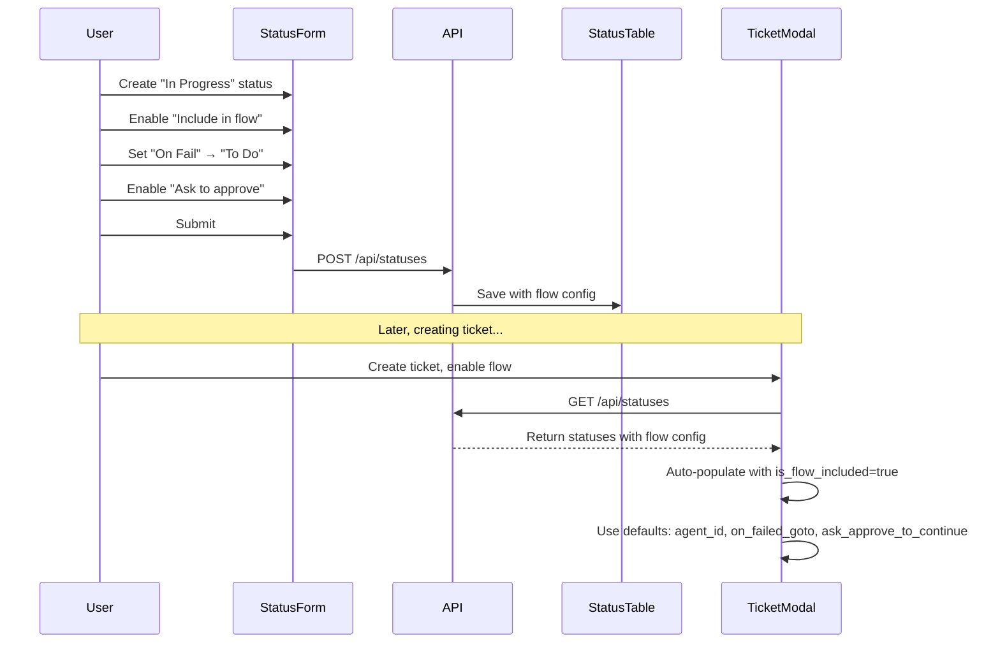

# Status Flow Configuration Enhancement Plan

## Overview
Add flow configuration options to the status creation/editing screen so that when creating a ticket and enabling flow, the statuses are pre-configured with their default agents and flow settings.

## Current State
- Status form has: Name, Priority, Color, Description, Assigned Agent
- Status table already has flow-related columns: `is_flow_included`, `on_failed_goto`, `ask_approve_to_continue`
- These fields exist but are not exposed in the UI

## Changes Required

### 1. StatusForm Component Enhancement

#### Add Flow Configuration Section (Collapsible)
```
┌─────────────────────────────────────────────┐
│ Flow Configuration                    [▶]    │
├─────────────────────────────────────────────┤
│ Include in default flow     [Toggle]       │
│                                             │
│ On Failed Goto            [Dropdown ▼]     │
│                         + None             │
│                         + To Do            │
│                         + In Progress      │
│                         + Done             │
│                                             │
│ Ask to approve            [Toggle]         │
└─────────────────────────────────────────────┘
```

#### New Fields
- `is_flow_included`: boolean - Whether this status is included in default ticket flows
- `on_failed_goto`: string | null - Which status to transition to if this status fails
- `ask_approve_to_continue`: boolean - Whether to require user approval before proceeding from this status

### 2. StatusCard Component Enhancement

#### Display Flow Configuration Badges
```
┌──────────────────────────────────────────┐
│ 🔵 In Progress     [Priority: 2]         │
│                                            │
│ [In Flow] [On Fail → Done] [Approval]    │
│                                            │
│ Work is currently being done              │
│                                            │
│ [Edit] [Delete]                           │
└──────────────────────────────────────────┘
```

#### Badges to Show
- "In Flow" - gray badge when `is_flow_included = true`
- "On Fail → [Status Name]" - orange badge when `on_failed_goto` is set
- "Approval" - yellow badge when `ask_approve_to_continue = true`

### 3. StatusModal Component Update
- Accept new initial values for flow configuration
- Pass through to StatusForm

### 4. API Updates
- Update status creation/update API to accept flow configuration fields
- Already exists in schema, just need to ensure API routes handle them

### 5. Flow Builder Auto-Populate Fix
- When flow is enabled in ticket modal, only include statuses where `is_flow_included = true`
- Use each status's default values:
  - `agent_id` from status
  - `on_failed_goto` from status
  - `ask_approve_to_continue` from status

## Implementation Order

1. Update StatusForm component with flow configuration section
2. Update StatusModal to pass flow configuration props
3. Update StatusCard to display flow badges
4. Update useStatuses hook to ensure flow fields are returned
5. Verify API routes handle flow configuration fields
6. Test flow builder auto-population

## Status Flow Diagram



## Form Layout Mockup

```
┌──────────────────────────────────────────────────────┐
│ Create Status                                         │
├──────────────────────────────────────────────────────┤
│                                                       │
│ Name *                                               │
│ [In Progress                          ] 11/50        │
│                                                       │
│ Priority                                             │
│ [2                                    ]              │
│ Lower numbers appear first on dashboard              │
│                                                       │
│ Color *                                              │
│ [🔴][🟠][🟡][🟢][🔵][🟣]                           │
│ [Custom Color] [#000000                 ]            │
│                                                       │
│ Description                                          │
│ [Work is actively being done...        ]             │
│                                                       │
│ Assigned Agent (Optional)                            │
│ [None                               ▼]               │
│                                                       │
│ ┌─────────────────────────────────────────────────┐ │
│ │ Flow Configuration                        [▼]   │ │
│ │                                                 │ │
│ │ Include in default flow                [ON]    │ │
│ │                                                 │ │
│ │ On Failed Goto                      [To Do ▼] │ │
│ │ Which status to go to if this fails           │ │
│ │                                                 │ │
│ │ Ask to approve                       [ON]     │ │
│ │ Require approval before proceeding            │ │
│ └─────────────────────────────────────────────────┘ │
│                                                       │
│ Preview: 🔵 In Progress 2                            │
│          Work is actively being done...              │
│                                                       │
│ [Cancel]                              [Create Status]│
└──────────────────────────────────────────────────────┘
```

## Status Card with Flow Badges

```
┌────────────────────────────────────────────────────┐
│ 🔵 In Progress                    [2]               │
│                                                     │
│ [In Flow] [On Fail → To Do] [Requires Approval]   │
│                                                     │
│ Work is actively being done on this task           │
│                                                     │
│ [Edit] [Delete]                                     │
└────────────────────────────────────────────────────┘
```

## Notes
- The database schema already supports these fields (from migration 018)
- Just need to expose them in the UI
- Default values: `is_flow_included = false`, `on_failed_goto = null`, `ask_approve_to_continue = false`
