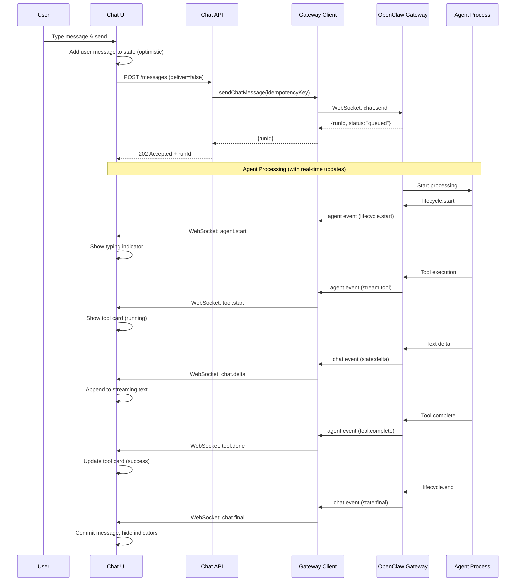

# Streaming Chat Architecture Design

## Problem Statement

The current chat experience in ClawAgentHub has significant latency and UX issues:

1. **Slow message display**: User messages take ~2 seconds to appear on screen
2. **No visual feedback**: No typing/processing indicators while agent processes
3. **Blocking request-response**: API waits for full agent response before returning
4. **No streaming effects**: Messages "pop" up after completion without gradual appearance

## Current Flow Analysis

```
User sends message
    │
    ├─> HTTP POST to /api/chat/sessions/[id]/messages
    │       │
    │       ├─> Save user message to DB
    │       ├─> Send to gateway via sendChatMessageAndWait()
    │       │       │
    │       │       ├─> Gateway processes agent request
    │       │       └─> Waits for FULL response (up to 120s timeout)
    │       │
    │       └─> Returns user + assistant messages
    │
    └─> Client updates UI with both messages (2-3 seconds later)
```

**Issues:**
- `sendChatMessageAndWait()` blocks until agent completes
- No optimistic UI updates (user message doesn't appear immediately)
- WebSocket events exist but aren't used for streaming
- No typing indicators during agent processing

## OpenClaw Reference Implementation Analysis

Based on research of `openclaw/openclaw` repository:

### 1. Chat Events Protocol

OpenClaw gateway emits streaming chat events via WebSocket:

```typescript
// Delta event - streaming text chunks
{
  runId: string,
  sessionKey: string,
  state: "delta",
  message: {
    role: "assistant",
    content: [{ type: "text", text: "partial content..." }]
  }
}

// Final event - complete message
{
  runId: string,
  sessionKey: string,
  state: "final",
  message: {
    role: "assistant",
    content: [{ type: "text", text: "complete message" }]
  }
}
```

### 2. Agent Events for Typing Indicators

```typescript
// Tool execution event
{
  stream: "tool",
  data: {
    phase: "start",
    name: "mcp__server__tool"
  }
}

// Assistant text generation event
{
  stream: "assistant",
  data: {
    delta: "text chunk"
  }
}
```

### 3. Client-Side Streaming Pattern

From `ui/src/ui/controllers/chat.ts`:
- User message is added to state **immediately** (optimistic update)
- Streaming text is stored separately (`chatStream`)
- Delta events append to stream buffer
- Final event commits stream to messages array

## Proposed Architecture

### Architecture Overview

```mermaid
flowchart TB
    subgraph Client["Client (Browser)"]
        UI["Chat UI"]
        State["Local State"]
        WS["WebSocket Client"]
    end
    
    subgraph Server["ClawAgentHub Server"]
        API["Chat API"]
        WS_Server["WebSocket Server"]
        Gateway["Gateway Client"]
    end
    
    subgraph OpenClaw["OpenClaw Gateway"]
        OC_WS["WebSocket Server"]
        Agent["Agent Process"]
    end
    
    UI -->|1. Send message| API
    UI -->|2. Optimistic update| State
    API -->|3. chat.send (non-blocking)| Gateway
    Gateway -->|4. Forward request| OC_WS
    OC_WS -->|5. Start processing| Agent
    
    Agent -->|6. Streaming events| OC_WS
    OC_WS -->|7. chat/agent events| Gateway
    Gateway -->|8. Broadcast to clients| WS_Server
    WS_Server -->|9. Push to browser| WS
    WS -->|10. Update state| State
    State -->|11. Re-render| UI
    
    style API fill:#e1f5fe
    style WS_Server fill:#e1f5fe
    style WS fill:#fff3e0
    style State fill:#fff3e0
```

### Data Flow



## Implementation Plan

### Phase 1: Optimistic UI Updates

**Goal**: Show user message immediately without waiting for server response

1. **Client-side optimistic update**
   - Add user message to local state immediately on send
   - Generate temporary client-side ID
   - Show "sending" indicator

2. **API modification**
   - Change `POST /messages` to return immediately after queuing
   - Return `202 Accepted` with `runId`
   - Don't wait for agent response

3. **Message synchronization**
   - On `chat.final` event, replace optimistic message with server version
   - Handle error cases (remove optimistic message if failed)

### Phase 2: WebSocket Streaming

**Goal**: Stream agent responses in real-time

1. **Gateway event forwarding**
   - Subscribe to `chat` events on gateway client
   - Forward events to connected WebSocket clients
   - Filter by session ID

2. **Client-side streaming**
   - Create `useStreamingChat` hook
   - Manage stream buffer state
   - Handle delta/final events

3. **UI components**
   - Streaming message component with cursor
   - Smooth text transitions
   - Auto-scroll during streaming

### Phase 3: Typing Indicators

**Goal**: Show visual feedback during agent processing

1. **Activity states**
   ```
   idle → thinking → calling_mcp → writing → done
   ```

2. **Agent event handlers**
   - `lifecycle.start` → Show "Thinking..."
   - `stream:tool` + `phase:start` → Show "Using [tool]..."
   - `stream:assistant` → Show "Writing..."
   - `lifecycle.end` → Hide indicators

3. **Tool call cards**
   - Show when tool starts
   - Update status (running → success/error)
   - Display result summary

### Phase 4: Error Handling & Edge Cases

1. **Network failures**
   - Detect disconnection during stream
   - Show retry option
   - Preserve partial stream

2. **Timeout handling**
   - Configurable timeout per message
   - Graceful degradation
   - User can cancel/abort

3. **Concurrent messages**
   - Queue multiple messages
   - Show pending message count
   - Handle out-of-order responses

## Component Changes

### New Components

```
components/chat/
├── streaming-message.tsx       # Display streaming text with cursor
├── typing-indicator.tsx        # Animated typing indicator
├── tool-call-card.tsx          # Enhanced tool execution card
└── chat-stream-provider.tsx    # Context provider for streaming state
```

### New Hooks

```
lib/hooks/
├── useStreamingChat.ts         # Main streaming chat hook
├── useChatOptimistic.ts        # Optimistic update management
└── useChatActivity.ts          # Activity state from agent events
```

### Modified Components

```
components/chat/
├── enhanced-chat-screen.tsx    # Integrate streaming
└── chat-messages.tsx           # Render streaming messages
```

### API Changes

```
app/api/chat/sessions/[id]/
├── messages/route.ts           # Change to async response
└── stream/route.ts             # New: SSE fallback for streaming
```

## Database Schema Changes

No schema changes required - existing `chat_messages` table supports the flow.

## Configuration

Add to application settings:

```typescript
interface ChatStreamingConfig {
  enabled: boolean              // Enable streaming
  timeoutMs: number            // Default timeout (120s)
  typingIndicatorDelay: number // Delay before showing typing (500ms)
  streamThrottleMs: number     // Throttle delta events (150ms)
  enableOptimistic: boolean    // Enable optimistic updates
  fallbackToPolling: boolean   // Fallback if WebSocket fails
}
```

## Migration Strategy

1. **Feature flag** the streaming functionality
2. **Gradual rollout**:
   - Week 1: Optimistic updates only
   - Week 2: Add WebSocket streaming
   - Week 3: Add typing indicators
   - Week 4: Full release

3. **Fallback behavior**:
   - If WebSocket fails, fall back to HTTP polling
   - If streaming fails, show loading spinner instead
   - Always maintain message persistence

## Success Metrics

- **Latency**: User message appears in <100ms (currently ~2000ms)
- **Perceived speed**: First text chunk appears in <500ms
- **Engagement**: Increased message completion rate
- **Error rate**: <1% message failures

## Open Questions

1. Should we support SSE (Server-Sent Events) as fallback?
2. How to handle very long streaming responses (memory)?
3. Should we implement message queuing for rapid sends?
4. Do we need persistent storage for partial streams?
