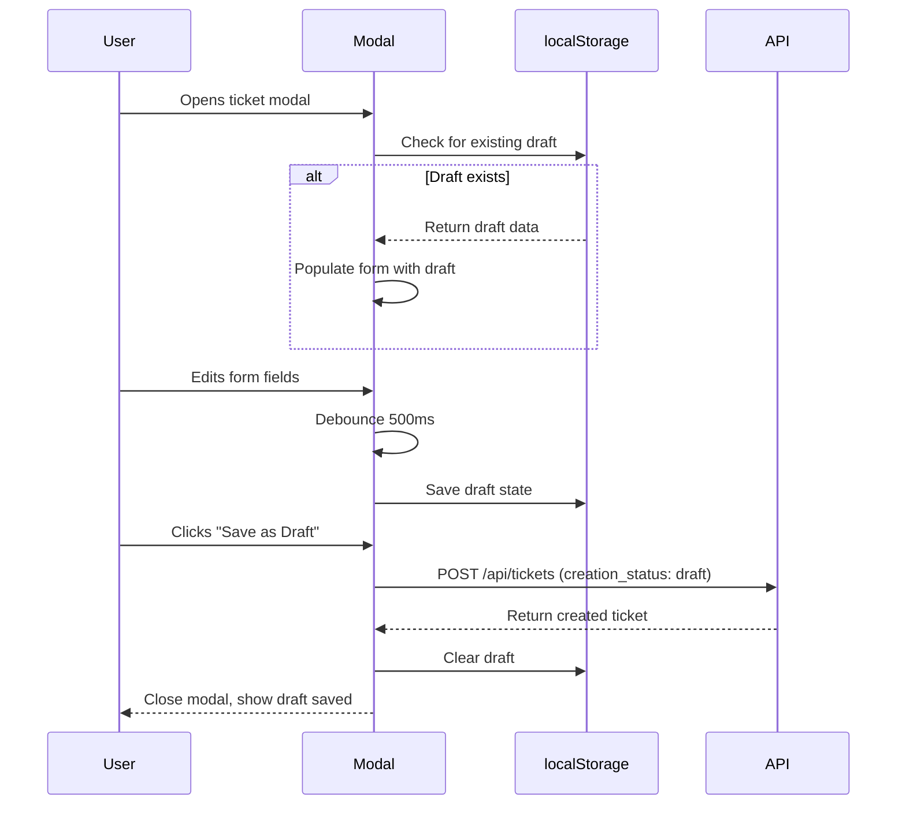
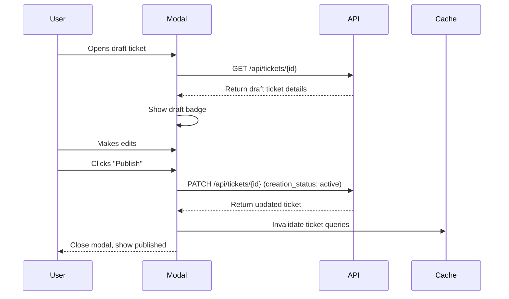
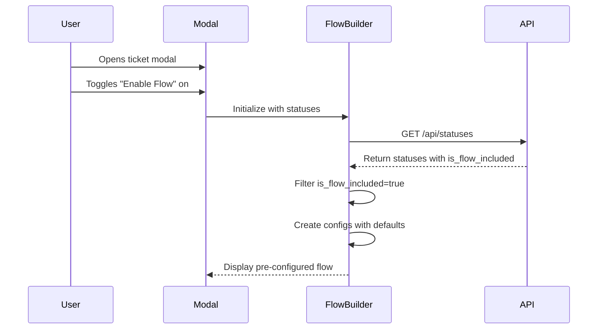

# Ticket Draft & Flow Status Improvements Plan

## Overview
This plan outlines improvements to the ticket creation system including draft functionality, auto-save, and flow builder fixes.

## Dashboard UI Changes

### Header Layout (with Show Drafts Toggle)
```
┌─────────────────────────────────────────────────────────────────────────────┐
│  Dashboard                                                                    │
│  Manage your boards and organize your work                                    │
│                                                                              │
│  [Show Drafts: OFF]                                            [+ Add Ticket] │
└─────────────────────────────────────────────────────────────────────────────┘
```

### Header Layout (Drafts Visible)
```
┌─────────────────────────────────────────────────────────────────────────────┐
│  Dashboard                                                                    │
│  Manage your boards and organize your work                                    │
│                                                                              │
│  [Show Drafts: ON 📝]                                        [+ Add Ticket] │
└─────────────────────────────────────────────────────────────────────────────┘
```

### Draft Ticket in Board Column
Draft tickets will have:
- Gray dashed border
- "DRAFT" badge in corner
- Slightly dimmed appearance

```
┌────────────────────────────┐
│ #123 Fix login issue 📝     │
├────────────────────────────┤
│ Users can't login whe...   │
│                            │
│ John Doe • 2 hours ago     │
└────────────────────────────┘
```

## Changes Required

### 1. Database Schema Changes

#### Add `creation_status` column to tickets table
- **File**: `lib/db/migrations/025_add_ticket_creation_status.sql`
- **Column**: `creation_status TEXT DEFAULT 'active'`
- **Values**: `'draft'` | `'active'`
- **Purpose**: Distinguish between draft and published tickets

```sql
ALTER TABLE tickets ADD COLUMN creation_status TEXT DEFAULT 'active' CHECK(creation_status IN ('draft', 'active'));
CREATE INDEX idx_tickets_creation_status ON tickets(creation_status);
```

#### Update schema types
- **File**: `lib/db/schema.ts`
- Add `creation_status` to `Ticket`, `TicketInsert`, `TicketUpdate` interfaces

### 2. Ticket Modal Enhancements

#### Auto-save to localStorage
- **File**: `components/tickets/ticket-modal.tsx`
- Save form state on every change (debounced)
- Key: `ticket-draft-{workspaceId}`
- Fields to save: title, description, status_id, assigned_to, flow_enabled, flow_configs

#### Dual action buttons
- Replace single "Create Ticket" button with:
  - **"Save as Draft"** - creates draft ticket (`creation_status: 'draft'`)
  - **"Publish"** - creates active ticket (`creation_status: 'active'`)
- Show draft badge when editing a draft ticket
- Add confirmation when switching from draft to active

### 3. Flow Builder Improvements

#### Auto-populate default statuses
- **File**: `components/tickets/status-flow-builder.tsx`
- When flow toggle is enabled, auto-add statuses where `status.is_flow_included = true`
- Load default values from each status:
  - `agent_id` → config.agent_id
  - `on_failed_goto` → config.on_failed_goto
  - `ask_approve_to_continue` → config.ask_approve_to_continue

#### Fix action button validation issue
- **Problem**: Remove/delete buttons trigger form validation (require title)
- **Solution**: Ensure all action buttons have `type="button"` attribute
- Affected buttons: expand toggle, remove button, drag handle

### 4. API Changes

#### POST /api/tickets
- Accept `creation_status` parameter (default: `'active'`)
- Draft tickets are created but not shown in default queries

#### PATCH /api/tickets/[id]
- Allow updating `creation_status` from `'draft'` to `'active'` (publish)
- Allow updating from `'active'` to `'draft'` (unpublish, optional)

#### GET /api/tickets
- Add `include_drafts` query parameter (default: `false`)
- When `include_drafts=true`, return both draft and active tickets
- Filter out drafts by default

### 5. TanStack Query Hooks

#### New hooks in `lib/query/hooks/useTickets.ts`:
```typescript
export function useCreateDraftTicket() { /* ... */ }
export function usePublishDraftTicket() { /* ... */ }
export function useDraftTickets() { /* ... */ }
```

#### Update existing hooks:
- `useTickets()` - add `include_drafts` filter option
- `useCreateTicket()` - accept `creation_status` parameter
- `useUpdateTicket()` - accept `creation_status` parameter

### 6. Query Keys & Cache Management

#### New query key patterns:
```typescript
['draft-tickets'] // For draft tickets list
['tickets', { include_drafts: true }] // Combined list
```

#### Cache invalidation:
- Invalidate both active and draft caches when:
  - Creating a draft
  - Publishing a draft
  - Deleting a ticket

## Implementation Order

1. Database migration
2. Schema type updates
3. API endpoint changes
4. Query hooks updates
5. Ticket modal auto-save
6. Dual action buttons
7. Flow builder auto-populate
8. Flow builder button fix
9. Cache invalidation

## UI Flow Diagrams

### Draft Creation Flow


### Publish Flow


### Flow Builder Auto-Populate


## Testing Checklist

- [ ] Draft is saved to localStorage on field changes
- [ ] Draft is restored when reopening modal
- [ ] Draft is cleared after successful creation
- [ ] "Save as Draft" creates draft ticket
- [ ] "Publish" creates active ticket
- [ ] Draft tickets are hidden from default board view
- [ ] Draft tickets can be edited and published
- [ ] Flow builder auto-populates with flow-included statuses
- [ ] Flow builder action buttons don't trigger validation
- [ ] Remove button works without requiring title
- [ ] Expand/collapse works without validation errors
