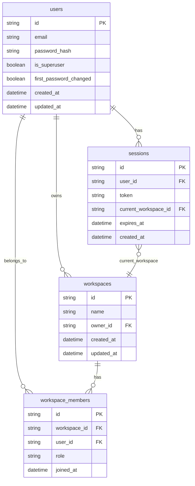
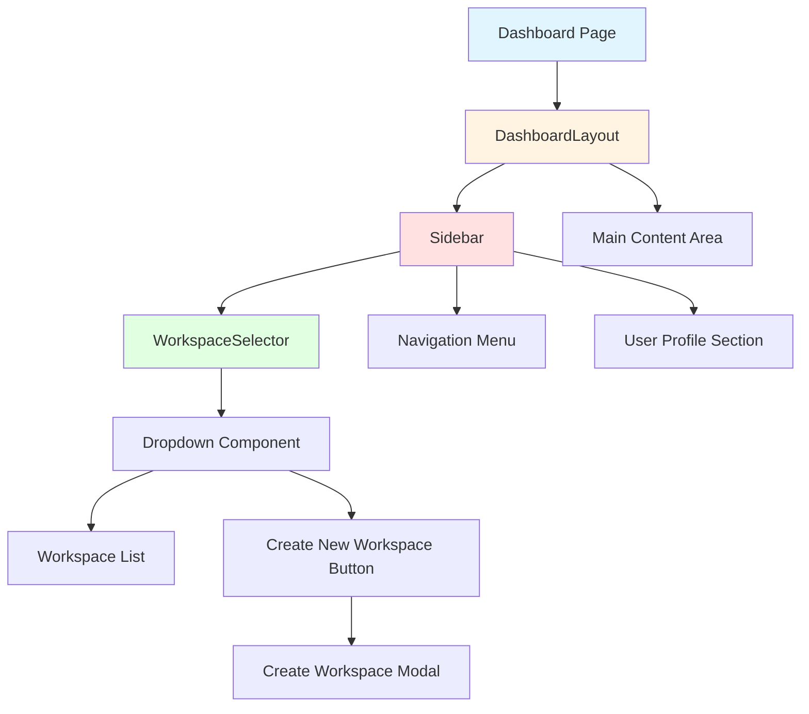
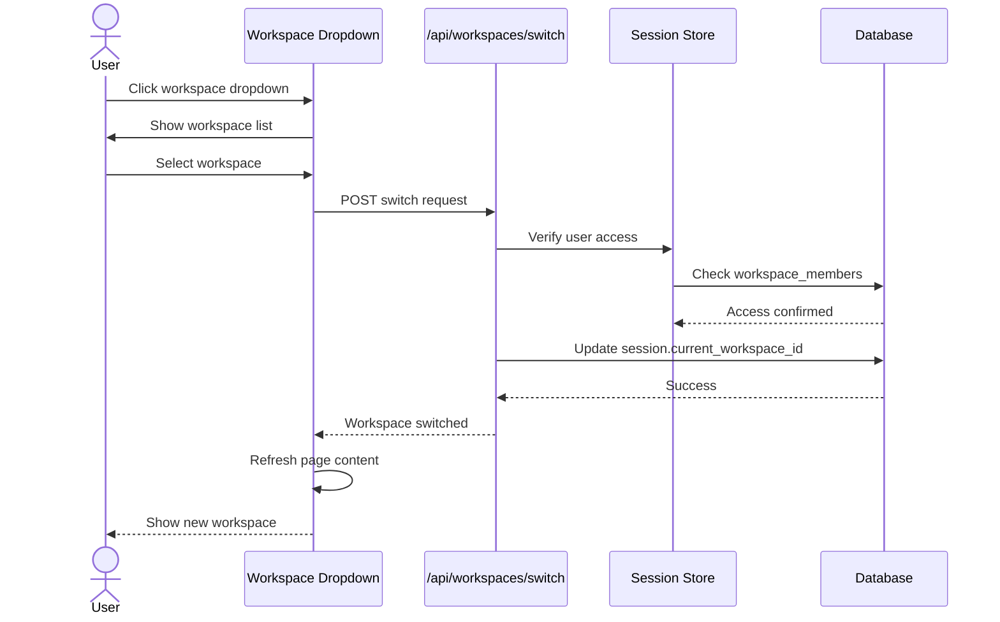
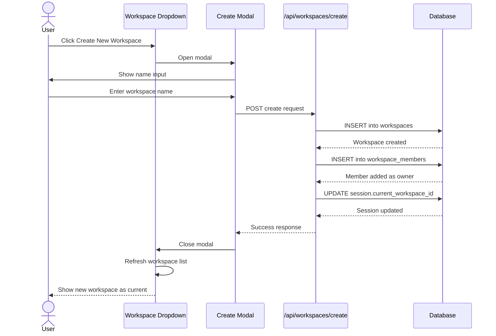
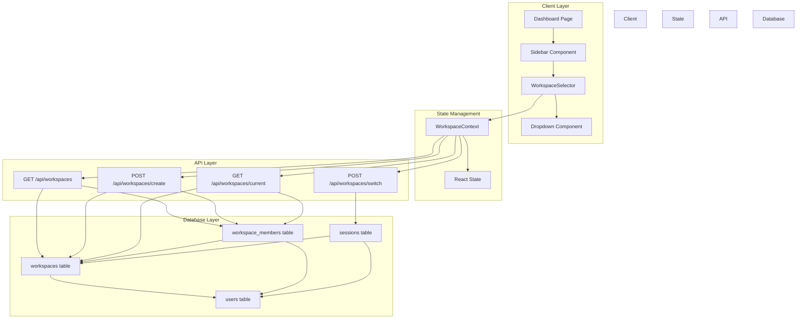
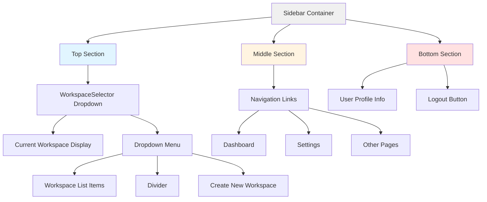
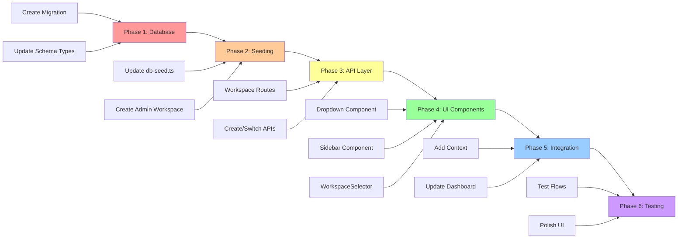

# Workspaces Feature - Architecture Diagrams

## Database Schema Relationships

## Component Hierarchy

## User Flow - Workspace Switching

## User Flow - Create Workspace

## Application Architecture Layers

## Sidebar Layout Structure

## Implementation Flow

